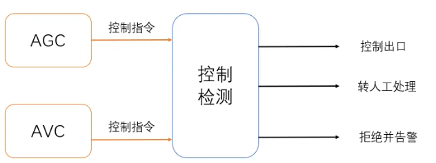

# C++优化技术

<div class="article-meta" style="margin:-4px 0 24px;color:#667085;font-size:.9rem;display:flex;gap:8px 18px;flex-wrap:wrap;"><span>作者：邹德虎</span><span>更新时间：2026-03-26</span></div>
本文主要讨论C++高性能编程（属于极致性能需求），以及提高编程质量的经验。按照本人的粗浅认识，应该已经覆盖了绝大多数技术要点，但缺点是不够详细。

## 1 总体论述

C/C++的重要性，在于它们仍广泛用于操作系统内核、驱动、嵌入式设备、高性能计算和大量基础设施软件。现代内核也在逐步引入Rust等语言，但C仍占据重要位置。C++在保持接近硬件的控制能力同时提供零开销抽象、泛型和大型软件工程能力，因此在低延迟、硬实时和高性能数值计算等场景中仍然非常重要。不过，高性能系统并不存在“唯一语言”：Fortran、Rust、CUDA/HIP、SYCL以及面向特定加速器的编程模型，都可能在不同任务中更合适。

下面简略谈一下别的编程语言。

Fortran 在数值计算领域的历史要早于 C，至今仍活跃于气象、计算流体、数值线性代数等高性能计算领域。现代工程系统经常通过 C/C++ 接口调用 Fortran 库，或反过来形成混合语言系统。就我个人经历而言，早期接触过的部分 Fortran 工程代码后来逐步转向 C++，但这不能外推为整个科学计算生态都在用 C++ 替代 Fortran。

Julia 是专为高性能数值计算而设计的编程语言，比较适合科研。Julia 比较适合对性能有较高要求，同时不熟悉计算机体系结构的科学家或工程师使用（比如物理学、电气工程、气象工程、经济学等非计算专业）。本文讨论的是极致性能需求，和较高性能要求还是有本质区别的。

Rust同样兼顾较底层的系统控制能力与高级抽象，并通过所有权、借用检查等机制强化内存安全。C++与Rust各有生态和适用范围：C++在既有工业代码、数值计算和硬件生态中积累深厚，Rust则在内存安全和现代工具链方面具有明显优势。对工程项目而言，比“谁取代谁”更重要的是结合实时性、生态、团队经验、供应链和长期维护成本来选型。

Java和Python都是主流语言，但不能用固定的“慢10倍”来概括与C++的性能差距。Java的JIT、垃圾回收、运行时配置和具体工作负载都会显著影响性能；在硬实时或极低延迟场景中，更需要关注延迟尾部和运行时可预测性。Python通常适合作为建模、编排和分析层，热点计算往往下沉到C/C++、Fortran、CUDA、Rust等原生库。评价语言性能时，应区分控制层、数据处理层和真正占用计算时间的内核。

高性能编程需要有一个总体、历史的视角。2000年代中期以后，真正明显放缓的是依靠电压缩放和主频提升获得“免费性能”的路径，也就是常说的Dennard scaling结束和频率墙，而不能简单说摩尔定律在2006年前后失效。此后处理器性能更多依赖多核、向量化、更深的缓存层次、微架构改进和专用加速器。对应用程序而言，这意味着仅靠硬件换代获得的单线程性能增长变慢，需要更加主动地利用并行性、局部性和硬件特性。

相对于CPU，其它硬件设备进步反而更大。比如说网卡，从 1Gbps 的速度（2000年左右）到 10Gbps、25Gbps 甚至 100Gbps(2014年左右)，网卡的传输速度得到了显著的提升。甚至网络协议中的部分校验功能，也可由网络硬件来实现了。比如说GPU的最新发展，其浮点计算能力几乎超过CPU的10倍以上；还有FPGA、ASIC芯片的发展，很多特定的功能可以交给硬件实现。当然，非CPU设备专门用于特定任务，通用编程仍然是CPU完成的。因此，C/C++的编程，越来越像是“指挥官”的角色，把各种各样的硬件协调好、发挥最大功效。因此，真正高性能的系统一定是软硬件结合的。

对于传统的纯CPU程序，高性能优化的主要方向是多核并行（或者是用户空间上下文的快速切换例如协程技术），这同样需要深入的计算机组成原理的知识，比如存储的层次结构、多核下缓存的一致性问题、函数的汇编实现等。

传统上来说，“指挥官”的角色是由操作系统内核来承担的。即使是计算机专业的毕业生，也少有人对操作系统内核十分熟悉。我听说很多高校的操作系统课程是以讲授理论为主，很少有学生能深入真实的操作系统内核进行编程和调试的。这个现状已经越来越难以适应高性能技术的发展了。

下面再谈一下若干纯技术问题。

1.  时钟测试：这一点非常重要，性能优化不能凭主观感受。根据Amdahl定律，应先通过profiling找出真正占时间的路径，再决定并行化或微优化的投入。Linux用户态通常可使用 `clock_gettime(CLOCK_MONOTONIC[_RAW])`，C++中也可使用 `std::chrono::steady_clock`；在很多系统上这些调用会通过vDSO避免传统系统调用开销。`RDTSC/RDTSCP`适合更细粒度的周期计数，但现代处理器普遍采用invariant TSC，TSC频率不一定等于核心当前运行频率，因此不能简单用“计数差/CPU当前主频”换算时间。精确使用时还需考虑指令乱序、序列化、跨核一致性、调度迁移和测量本身的开销。对于硬实时或低抖动测试，CPU亲和性、隔离中断、锁定内存和控制电源管理策略都可能有帮助，但是否关闭动态调频应通过目标平台的实时性测试决定，而不是一概而论。

2.  高性能指标的矛盾：实时性是为了在给定的时间约束内完成特定的工作。例如，硬实时系统必须在固定的时间内响应，否则可能会导致系统崩溃或其他不良后果。吞吐量是系统在单位时间内可以处理的工作量。为了确保任务在固定的时间内完成，可能需要预留更多的计算资源（例如把特定的CPU核独占），这可能会降低系统的总体吞吐量。反之，为了最大化吞吐量，可能需要允许某些任务的完成时间超出其理想的时间范围。具体优先优化何种指标，需要根据实际的需求来定。还有一些其它的矛盾指标，例如功耗与性能、价格与性能等等。

## 2 高性能网络编程

大多数实时的需求都建立在与外界通信基础上，比如说工业控制、量化交易、硬件在环仿真等。毕竟数字世界与真实世界交互，网络是最常用的交互方式。其它的接口，例如RS-485工业总线，在通信速度方面可能弱于以太网，但抗干扰能力远强于以太网。在电力系统我接触的范围，硬实时都是通过以太网或者无源光纤接口实现的。因此，本文的高性能网络编程默认为以太网网卡（或者光口）。

前面说过，传统上网络编程任务全部交给内核。但内核是通用的，对于高性能网络通信任务是不擅长的。内核socket的各种系统调用、上下文切换、内存拷贝等，没有专门的高性能优化，这些都会增加延迟并减少吞吐量。假设我们把内核比作大山，山上确实有非常多的风景，但我们的目的并不是欣赏风景，而是快速通过。那么无非是两种方法：一是打隧道，也就是进行内核编程；二是修路从山旁边绕过去，也就是By-pass 技术，绕过操作系统的传统网络堆栈，直接在用户空间中处理网络数据包。

内核编程方面，Linux内核的新版本已经有很多改进，例如零拷贝(Zero-Copy)，传统的数据传输需要多次的内存拷贝，这会消耗大量的CPU资源。零拷贝技术通过减少或消除这些拷贝操作来提高性能。还有非阻塞I/O、I/O多路复用，例如select、poll和epoll，它们可以让单一的线程监视多个文件描述符，有效地管理大量的并发连接。对于上层的应用程序，我们一般不直接调用socket，而是使用封装的网络库，例如boost::asio库，是非常好的工具。但充分发挥库能力的前提是对内核处理网络通信的过程，不能一无所知。

在嵌入式开发需求方面，即使是升级后的Linux内核都不能胜任了，我们可以进行内核裁剪、编程，自己增加特定的系统调用（或者驱动）。我所知的，有人把IEC 61850的实现放在内核中完成。其实IEC 61850实现本身并没有复杂到哪里去，主要是内核的开发调试需要掌握的知识点非常多。

另外一个技术路径是By-pass 技术，在用户空间中处理报文，减少上下文切换，避免不必要的内存拷贝。许多 by-pass 解决方案使用轮询模式来检测新的数据包，而不是依赖中断。这可以减少中断的开销，尤其是在高流量环境中。还有一点是很关键的（但是从未看到别人提到）：用户态程序开发调试的麻烦程度是比内核小太多了，可能小10倍都不止。

DPDK是By-pass 技术的典型代表，最近一段时间我一直在调试DPDK，充分感受到DPDK的博大精深，它的性能强到让人吃惊的地步。DPDK使用大页内存和高效的缓冲区管理，以及零拷贝、轮询等技术，能够快速地处理和转发数据包。DPDK的典型PMD模式会把网卡队列交由用户态轮询，从而绕过传统内核网络数据路径；应用因此往往需要承担更多报文解析、缓冲管理和协议处理职责。但具体架构可以结合SR-IOV、内核控制面或用户态协议栈等多种方案，并不等于所有场景都必须“完全接管网卡、从零重写全部协议栈”。

## 3 高性能数值计算

前面提到，数值计算方面在GPU的推动下，“异构”已经是主流编程方式了。首先，高度并行的、计算密集型的部分适合 GPU，而 I/O 密集型、分支密集型或需要复杂数据结构的部分适合 CPU。很显然，不是所有的任务都适合GPU来做。除此以外，CPU 和 GPU 之间的数据传输可能会成为瓶颈。尽量减少数据传输的次数，尤其是在频繁的计算迭代中。使用异步数据传输，允许 CPU 和 GPU 同时工作，而不是等待数据传输完成。当deadline进入微秒级并且对最坏执行时间和抖动有严格约束时，GPU的任务调度、数据搬移和共享资源干扰可能成为限制；FPGA或其他专用硬件通常更容易获得确定性。但GPU是否合适仍取决于算法并行度、批量大小、数据驻留方式和平台架构，不能只按“微秒级”这一单一指标判断。另外，多利用成熟的库，如 CUDA、cuBLAS、cuDNN 等，它们经过优化，可以提供很好的性能。

对于纯粹基于CPU的高性能计算任务，优先采用高性能的库。例如，MATLAB的底层矩阵库就是MKL（稠密矩阵）/SuiteSparse(稀疏矩阵)。这些高性能库千锤百炼，有大量的优化甚至汇编优化、大概率比你自己写的计算程序要好。只有在极其狭窄的功能或者场合，自己写的库要更好些。比如我自己写的稀疏矩阵加法的性能比Eigen略好一些。

我自己用过这些数值计算库：MKL（但是其稀疏矩阵的计算性能比较让人失望）；SuiteSparse（Tim Davis教授的经典库，稀疏矩阵，最近增加了图计算库）；Eigen（比较好的C++矩阵库）；OpenBLAS(张先轶的作品，朋友圈有他)；GLPK(优化算法库)；fftw（快速傅里叶分析）。

如果是非常大型的高性能计算，需要动用数据中心的力量，甚至是不同城市的许多数据中心。这就是分布式系统架构的概念了，例如OpenAI公司已经使用Kubernetes训练自然语言大模型。

## 4 常规高性能需求

对于常规高性能需求，主要是日常编程的时候有些技术准则要遵循。《深入理解计算机系统》（第三版）这本书已经总结的很不错了，主要包括：循环的时候要注意流水线问题（第4章），减少分支预测失败，排好序的循环性能会提高很多；充分利用编译器（第5章），包括尽让编译器实现SIMD并行与循环展开、减少不必要的内存操作、减少过程调用；理解存储的层次结构（第6章），充分利用局部性原理和缓存命中，这点可能是对常规软件影响最大的方面，JAVA无法像C/C++那样控制内存分布，这就导致进行不了这么深入的优化。这本书后面还讨论了系统调用、IO、网络编程等内容，都对高性能编程有很好的参考价值。《深入理解计算机系统》写的非常好，也很基础。这本书完全掌握后，才谈得上对高性能编程有些概念（可能还算不上入门）。

对于C++编程，还有一些准则需要遵循。这方面可以寻找专门C++的专著来看。C++的特殊之处是编译器可能在程序员背后做很多事情，有时候会让程序员大吃一惊。特别是C++中的字符串、vector等标准库设施，在内存申请之前一定要reserve；还有避免不必要的复制，这在初始化、函数传参等方面都要注意，可以适当使用移动语义。C++的并发编程也一直是很难的问题，稍微不仔细就会遇到性能损失或者漏洞，可以谨慎的使用原子操作和无锁数据结构。

当然，数据结构和算法还是很重要的，但这已经不属于“极致优化”，而属于程序员的常识了。我经常看到同事写多重循环，每个循环都要从头到尾遍历一遍，每当看到这样的代码都感觉有些心痛，大量的CPU周期和数据中心电力都这样被浪费了，而且确实遇到过算法复杂性没做好导致的现场问题。C++的标准库在数据结构和算法是非常经典的，这点无可置疑。另外，还有一些库是对C++标准库的进一步优化，例如folly库。

本文最后写出几个常数，希望对大家有启发作用：

1.  3GHz的CPU时钟周期是0.3纳秒，而光在真空中跑这么久，只能前进10cm，只有一个手掌的长度。（缓存一致性的协议可能比你想的复杂，特别是涉及ccNUMA缓存一致性非均匀内存访问机器）；

2.  寄存器、L1、L2缓存都可以在10ns以内完成操作；L3可能需要20ns，内存至少需要100ns甚至更多。缓存的优化非常重要。

3.  数据中心到你家的时间延迟，大概是10ms以上，这看起来比较长，但这是物理规律决定的。任何优化，都不能超越物理。硬盘的IO读写延迟为500ms，所以尽量不要动用硬盘，实在没办法，我们可以用内存当做缓存，这就是Redis的用法。

## 5 提高C++程序质量的经验

电力系统的核心应用程序，目前以C++为主流。电力系统需要不间断运行，因此其控制和分析计算程序必须具备极高的可靠性。这些程序需要在各种极端条件下（如高负载、设备故障等）保持稳定运行。在某种程度上，这些核心程序产生bug（误控或者计算结果错误），甚至是停止运行超过预定时间（例如服务端关键进程coredump、界面闪退/不刷新）都属于安全生产责任事故，是要被严厉追责的。程序员大多数来自于互联网行业，电力行业软件开发人员受互联网行业影响很大。但是互联网行业的软件可靠性标准低于电力系统的工业级标准，这点被很多人忽视。本文是经验总结，介绍了一些提高C++程序质量的方法。

### 代码格式化与代码审查

需要使用代码格式化工具（如ClangFormat）确保代码风格一致性。甚至我认为代码风格一致性是开展代码审查的前提，否则效率就太低了。ClangFormat 提供了一些默认的代码风格，我使用的是WebKit风格，这种风格比较紧凑，很多C++著作也是这种风格。例子如下：

``` C++
#include <iostream>
#include <vector>
#include <string>

class WebKitExample {
public:
    WebKitExample(const std::string& name) : m_name(name) {}
    void addValue(int value) {
        m_values.push_back(value);
    }
    void printValues() const {
        std::cout << "Values for " << m_name << ": ";
        for (const auto& value : m_values) {
            std::cout << value << " ";
        }
        std::cout << std::endl;
    }
private:
    std::string m_name;
    std::vector<int> m_values;
};

int main() {
    WebKitExample example("Example1");
    example.addValue(1);
    example.printValues();
    return 0;
}
```

代码审查是提高代码质量的重要手段。在代码提交到代码库之前，应该由团队中的其他成员进行审查。代码审查的好处包括：发现潜在的错误和漏洞；确保代码遵循团队的编码规范；促进知识共享和团队成员之间的相互学习。我发现，有的程序员连自己写的代码都看不懂，更讲不明白；有的函数或者类动辄成千上万行。这些代码就不能进入代码库，否则会有很大的隐患，到时候消缺的成本都要远大于代码开发成本。

### 编译器设置与代码检测

编译器设置对于捕捉代码中的潜在问题至关重要。通过开启编译器警告和错误选项，可以在编译阶段发现许多常见问题。常见的编译器选项包括：

-Wall：启用所有常见的警告。

-Wextra：启用额外的警告。

-Werror：将警告视为错误，强制开发者修复所有警告。

例如，在GCC编译器中，可以通过以下方式启用这些选项：

    g++ -Wall -Wextra -Werror your_code.cpp -o your_program

静态代码分析工具可以检测代码中的潜在问题，是非常有益的。这些工具通过分析代码的结构和语法来发现潜在的错误和代码异常。常用的静态分析工具包括：Cppcheck（开源的C/C++代码静态分析工具）；Clang Static Analyzer（基于Clang的静态分析工具）。

我个人的经验是：通过编译器和静态代码分析工具，可以检测出大概30%的bug，这些bug大多数并不复杂，但要是全部混入代码库，后面再想找出来就太困难了。

在代码动态检测方面，可以通过Valgrind检查是否存在内存泄漏、内存越界等。程序执行中如果出现显著的内存错误，Linux系统会产生段错误，将程序终止，并将内存、当前寄存器等信息都存储到 core文件上，可以通过gdb工具分析core文件。

对于C++项目构建，推荐使用CMake，CMake几乎已经是通行做法了。前段时间我下了很大决心，把项目全部迁移到CMake构建，确实大幅度简化了依赖关系。

在版本管理方面使用Git，特别是分支管理方面，需要有master分支、develop分支、发布分支（release branches）和修复生产环境问题分支（hotfix branches）。

### 代码规范

C++代码规范首选参考C++ Core Guidelines规范，这是一个开源项目，可以到GitHub去下载，另外也有纸质书籍出版。（可参考《C++ Core Guidelines 解析》）。C++ Core Guidelines 是由C++创始人Bjarne Stroustrup和Herb Sutter等人发起的一系列编码规范，旨在帮助开发者编写更安全、性能更好、可维护性更高的C++代码。

C++编程规范可以借鉴Rust语言的理念，因为Rust语言在内存安全性方面相对于C++改进很大。比如说，在动态内存方面，使用右值引用和移动语义来避免不必要的拷贝；在所有权方面，优先使用std::unique_ptr来管理动态内存，确保内存的唯一所有权，避免内存泄漏；Rust在默认情况下，认为所有变量都是不可变的，只有显式声明为可变时才允许修改，鼓励数据的不变性以减少错误，在C++编程中，可以多使用const修饰符，以及采用constexpr关键字在编译期执行函数；在并发编程方面，Rust鼓励无共享的并发编程，通过消息传递和数据移动来避免数据竞争，这对于C++编程，可编写基于原子操作的消息队列作为并发基础设施。

每一个领域都需要制定编程规范，根据团队成员的组成、编程技能、业务需求进行剪裁。编程规范是没法直接拿过来用的，特别是变量命名、类与函数命名、注释的格式等细节。另外，中文需要采用UTF-8编码，这一点在很多规范中都忽略了，其实很重要（C++权威专家基本都是外国人，他们不太关注中文字符的问题）。

### 单元测试与黑盒测试

单元测试是针对代码中的最小可测试单元（如函数或类）进行测试。单元测试的主要目标是验证每个单元的功能是否正确。常用的单元测试框架包括：Google Test（功能强大且易于使用的C++单元测试框架）；Boost.Test （ Boost 库的一部分，提供了功能强大的单元测试框架）。

关于电力系统关键程序，测试驱动开发的思路是值得参考的。但是测试驱动并不一定非要追求单元测试的覆盖率，毕竟很多代码是起到辅助作用，关键代码在项目里面只是小部分。我见到比较好的做法是：每个电力系统进程，都包含2到3个测试算例，算例就是典型的电网模型。每次修改代码，测试算例都自动跑一遍。

关于黑盒测试，目前电力行业的普遍做法是：研发单位自己有测试部门，在出厂前进行测试；项目都有第三方测试，用于出具报告；中国电科院，以及省级电科院有入网测试，用于正式投运前把关。但我想指出的是，无论有多少轮测试，测试只起到兜底的作用。99%以上的bug，必须是开发团队自己发现并处理，这也是软件开发人员最基本的责任。

除了建立比较完善的仿真环境、加强测试之外，我借鉴对抗式AI的思路，提出一种提高实时控制软件可靠性的方法：通过两个互相独立且目标对立的团队同时工作，一方专注于生成控制策略，另一方则专注于找出控制策略中的潜在问题，一旦发现可疑指令，检测程序将触发警报或将问题指令转交给人工处理，具体可见下图。



对于C++高可靠性的需求，软件架构、设计，以及项目管理的作用可能更大，但这超出了本文的范围。在这里简单提一些：1）模块化和分层设计是高可靠性软件架构的基础。将系统分解为独立的模块和层次，可以有效隔离变化和故障，增强系统的可维护性和可扩展性。2）健壮的错误处理机制可以提高系统的可靠性。应当在设计阶段考虑到所有可能的错误情况，并制定相应的处理策略。同时还需要完善的日志系统。3）在管理方面，详细的文档和严格的代码审查是高可靠性系统的重要保障。持续集成（CI）和持续部署（CD）可以提高开发效率和代码质量。
