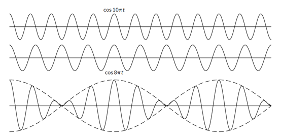
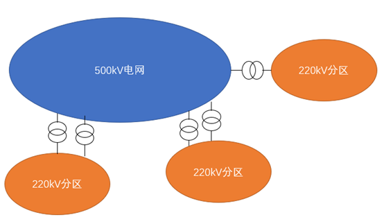
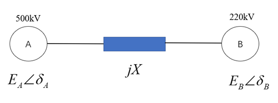

# 从音乐到电力系统一次调频

作者：邹德虎更新时间：2026-03-26

这篇文章之所以从音乐谈起，并不是为了故作轻松，而是因为“频率”这个概念在音乐里极其直观，在电力系统里却又极其关键。音乐中，极小的频差能被耳朵直接感知为“拍”；电力系统中，极小的频率偏差则对应着有功失衡、功角变化以及调速系统动作。两者当然不是同一种物理系统，但音乐这个切口能够帮助我们先建立对“频率”这一概念的直觉，再回到一次调频的严格分析框架。

## 1 拍、和声与调音：为什么音乐适合作为切入点

在物理学中，两个频率接近的简谐量叠加，会出现经典的“拍”现象。若两个振动振幅相同，且为了书写简洁取相同初相位，则有

$$
\begin{aligned}
x(t) &= A\cos(\omega_1 t + \varphi) + A\cos(\omega_2 t + \varphi) \\
     &= 2A\cos\left(\frac{\omega_1-\omega_2}{2}t\right)\cos\left(\frac{\omega_1+\omega_2}{2}t+\varphi\right)
\end{aligned}
$$

这个式子很有意思。右侧第二个余弦项决定“主要在振什么”，它的频率接近两个原始频率的平均值；而第一个余弦项变化更慢，决定合成信号振幅的周期性起伏，也就是我们听到的“忽强忽弱”。若用赫兹表示频率，记 $f_i=\omega_i/(2\pi)$，则听感上通常说的拍频为

$$
f_{\text{beat}} = |f_1-f_2|
$$

例如，若两个音分别为 440 Hz 和 446 Hz，那么拍频约为 6 Hz，也就是每秒会听到 6 次明显的强弱起伏。调音师之所以能靠耳朵“把音调准”，本质上正是因为当两个音越来越接近时，拍会越来越慢；当拍基本消失时，两个音的频率也就几乎一致了。

音乐中的和谐还不只与“拍”有关，也与频率比和谐波重合有关。早期乐理非常强调简单整数比，例如八度对应 $2:1$，纯五度对应 $3:2$。这些简单整数比之所以听起来更协和，是因为它们的谐波更容易重合。以 A4=440 Hz 与 A5=880 Hz 为例，二者的谐波会在 880 Hz、1760 Hz 等位置重叠，因此听感稳定而协调。

不过，现代音乐普遍采用十二平均律。它的优点不是“最纯”，而是“最方便转调”：每升高一个半音，频率乘以$2^{1/12}$。这样升高 12 个半音恰好得到一个八度，即频率乘以 2。代价则是，许多音程不再严格等于简单整数比，而是在不同调式之间做了一种折衷。也就是说，**音乐的美感，一方面来自频率关系足够规整，另一方面也来自现实系统对“纯粹理论”的适当妥协。**

这和工程其实很像。工程系统往往也不是在追求某个理论上的“绝对最优”，而是在多种约束下寻找可运行、可协调、可推广的平衡点。一次调频同样如此：它不是为了在瞬间把一切都调到最理想，而是先用最快、最稳妥的方式把系统从失衡边缘拉回来。

## 2 从音乐回到电力系统：类比能说明什么，不能说明什么

上面的音乐讨论，并不是为了把电力系统等同于声波叠加，而是为了说明一个更容易被忽略的事实：**频率并不总是一个“全网各处在任意时刻都完全一样”的简单标量。**

在稳态下，我们当然可以说同步交流电网的频率处处相同；这是同步运行的基本定义之一。但在扰动后的短时动态过程中，不同位置测得的局部频率并不一定完全相同。对一个没有直接连接同步机的母线而言，它看到的电压相角变化，本质上是整个网络机电动态共同作用的结果。从直观上看，这确实有一点类似于：多个振源通过网络耦合后，在某一点“共同塑造”了局部所看到的频率变化。

但这里必须立即加一句限制：**这只是帮助形成直觉的类比，不是严格模型。** 电力系统的动态不是简单的正弦波叠加，而是同步机转子运动方程、调速器控制方程以及网络代数方程共同决定的结果。音乐中的“拍”可以帮助我们理解“局部观测值会有差异”“频差会引起明显效果”这些直觉，但不能直接替代对同步电网的数学分析。

## 3 类比的边界：同步电网不是一个长期“拍频系统”

如果两台同步电源在并列运行时长期保持不同工频，设其电角速度分别为 $\omega_1$ 与 $\omega_2$，则两者功角差满足

$$
\frac{d\delta}{dt} = \omega_1 - \omega_2
$$

只要 $\omega_1 \neq \omega_2$ 持续存在，$\delta$ 就会不断漂移。功角持续漂移意味着联络线功率也会持续变化，系统将不再处于严格意义上的同步稳态。因此，在**长期稳态**里，不能把不同机组理解成像两个长期保留微小频差的音叉那样一直“拍”下去。

所以，更严谨的表述应当是：

1.  在同步电网的稳态附近，系统频率几乎统一；
2.  在扰动后的短时动态过程中，局部频率具有空间分布性；
3.  这种空间分布性可以借助“拍”来帮助理解，但不能把它当成稳态结论。

这几句话合在一起，才可建立音乐与电力系统的概念类比。

## 4 电力系统中的“频率”究竟是什么

对某一母线的局部电压相量，可写为

$$
\underline V_i(t)=V_i(t)e^{j\theta_i(t)}
$$

则该母线的局部瞬时角频率定义为

$$
\omega_i(t)=\frac{d\theta_i(t)}{dt}
$$

若把系统额定角频率记为 $\omega_0$，并写成 $\theta_i(t)=\omega_0 t + \delta_i(t)$，则有

$$
\omega_i(t)=\omega_0+\frac{d\delta_i(t)}{dt}
$$

相应的频率写成赫兹为

$$
f_i(t)=f_0+\frac{1}{2\pi}\frac{d\delta_i(t)}{dt}
$$

这一定义非常重要，因为它告诉我们：**频率本质上是相角对时间的导数。** 既然不同地点的相角动态可能不同，那么不同地点估计出来的局部频率也可能不同。

在系统层面，工程上还常引入惯量中心频率（center-of-inertia, COI）

$$
\omega_{\mathrm{COI}} = \frac{\sum_i M_i\omega_i}{\sum_i M_i}
$$

其中 $M_i$ 是与机组惯性相关的权重，常可写成与 $H_iS_i$ 成比例的形式。COI 频率反映的是整个同步机群的平均转动状态，而某个储能站、本地母线或某个测控装置看到的频率，则是局部量。**“系统频率”与“本地测得频率”有关联，但并不等价。**

这也是很多现场争论的根源之一：有人说“全网频率就一个，怎么会这里动作、那里不动作”；而另一部分工程师看到的却是不同站点频率记录确有差异。其实双方各抓住了一半事实——前者说的是稳态和系统平均意义下的频率，后者看到的是动态和局部测量意义下的频率。

## 5 一次调频的本质：下垂控制，而不是无差调节

讲清楚频率之后，就必须把一次调频本身说准确。一次调频的核心不是“积分消差”，而是**下垂控制（droop control）**。以第 $i$ 台机组为例，若将调速系统简化为一阶模型，可写为

$$
T_{Gi}\frac{d\,\Delta P_{mi}}{dt}+\Delta P_{mi}=-\frac{1}{R_i}\Delta f_i
$$

在拉普拉斯域中，上式为

$$
\Delta P_{mi}(s)=-\frac{1}{R_i}\frac{1}{1+T_{Gi}s}\Delta f_i(s)
$$

这里 $R_i$ 是调差系数，$T_{Gi}$ 是调速系统等值时间常数。这个模型表达的物理意义很清楚：频率跌得越多，机械功率给得越多；但这个调节是按下垂特性分配的，不是通过积分把频差在一次控制层面强行压到零。

若系统发生净负荷增加，记有功缺额为 $\Delta P_L>0$，并用

$$
\Delta P_D = D\Delta f
$$

描述负荷的频率特性，那么只考虑一次调频、忽略二次调频时，新的稳态功率平衡应满足

$$
\sum_i \Delta P_{mi} = \Delta P_L + D\Delta f_\infty
$$

又因为稳态时下垂关系为

$$
\Delta P_{mi} = -\frac{1}{R_i}\Delta f_\infty
$$

代入得

$$
-\sum_i\frac{1}{R_i}\Delta f_\infty = \Delta P_L + D\Delta f_\infty
$$

于是得到

$$
\Delta f_\infty = -\frac{\Delta P_L}{D+\sum_i(1/R_i)}
$$

这个结果说明得很清楚：**一次调频可以建立新的功率平衡、阻止频率继续恶化，但一般不能把稳态频差消除到零。** 真正负责把频率拉回额定值的，是二次调频与 AGC，而不是一次调频本身。

一次调频实际上还常带有死区、限幅、速率限制、阀门非线性或储能功率边界，这些因素都会影响动作次数和实际效果。

## 6 新能源与储能参与一次调频时，为什么不同接入点会看到不同现象

下面回到原文中最有工程价值的问题：**在某些实际系统中，为什么参数完全一致的一次调频装置，接在500 kV骨干网与220 kV局部区域时会出现明显不同的动作次数？** 这里的差异不能简单归因于“电压等级高低”，更关键的是接入位置对应的系统强度、惯量与一次调频资源分布、联络阻抗、扰动传播路径以及测频算法。

考虑一个典型省级电网：500 kV 骨干网电源集中、系统强、惯量大；而 220 kV 及以下网络往往分区运行，本地负荷波动、新能源波动更直接地作用在局部区域。示意如下：

将 500 kV 骨干网等值为区域 A，将某个 220 kV 分区等值为区域 B，可得一个经典的两区域模型：

在线性化条件下，联络线功率增量可写成

$$
\Delta P_{\text{tie}} = K_s(\delta_A-\delta_B)
$$

于是两区域的摆动方程可写为

$$
\begin{aligned}
M_A \frac{d\Delta\omega_A}{dt} &= \Delta P_{mA}-\Delta P_{LA}-D_A\Delta\omega_A-\Delta P_{\text{tie}} \\
M_B \frac{d\Delta\omega_B}{dt} &= \Delta P_{mB}-\Delta P_{LB}-D_B\Delta\omega_B+\Delta P_{\text{tie}}
\end{aligned}
$$

其中 $M_A,M_B$ 为等值惯量，$D_A,D_B$ 为频率阻尼系数。通常对这类系统，500 kV 骨干网的等值惯量显著大于某个 220 kV 分区，即常有

$$
M_A \gg M_B
$$

若扰动首先发生在 B 区，例如局部新能源出力突降、负荷突增，设有功失衡为 $\Delta P>0$。在扰动刚发生的瞬间，功角 $\delta_A,\delta_B$ 还来不及突变，因此

$$
\Delta P_{\text{tie}}(0^+) = 0
$$

于是可得到瞬时频率变化率近似为

$$
\left.\frac{d\Delta\omega_B}{dt}\right|_{0^+} \approx -\frac{\Delta P}{M_B},
\qquad
\left.\frac{d\Delta\omega_A}{dt}\right|_{0^+} \approx 0
$$

这个结论很有力量。它说明扰动刚发生时，最先“感到疼”的往往是本地弱区域；如果该区域惯量又小，那么它的频率变化率（ROCOF）就会更大。随后，随着功角差形成、联络线功率重分配、阻尼和调速系统共同作用，A、B 两区的频率才会逐渐拉近，并最终表现为更一致的系统级变化。

所以，若多个储能电站的一次调频参数完全一致，但接入点不同，那么它们看到的本地频率轨迹本来就可能不同。220 kV 侧储能更容易出现以下现象：

1.  局部频率偏差更容易跨越死区；
2.  频率曲线更尖锐，触发动作的次数更多；
3.  局部波动更密集，装置更容易反复启停或反复调节。

而 500 kV 侧由于系统更强、惯量更大、联络更丰富，本地频率通常更“钝”、更平滑，因而一次调频动作次数反而可能更少。

这并不违背“交流电网同步运行”的基本事实；它只是说明：**同步运行不等于扰动初期所有测点的局部频率曲线完全一致。**

## 7 还要考虑一个经常被忽略的因素：频率是“被测出来”的

现场装置动作，不只取决于真实物理过程，也取决于频率测量算法本身。不同厂家、不同装置、不同控制器可能采用锁相环（PLL）、离散傅里叶、滑动窗估计或其他滤波方法。面对同一个母线电压波形，不同算法得到的频率估计值本来就可能不同，尤其是在以下场景中更明显：

- 频率快速变化时；
- 电压波形畸变较重时；
- 电压跌落或相位跳变时；
- 测量窗口较长、滤波较重时。

因此，讨论一次调频动作次数，至少要同时看三件事：**接入位置、系统强弱、测量算法。** 只比较调差率、死区和时间常数，往往还不够。

## 8 补充讨论

为了抛砖引玉，我把原文末尾想追问的几个问题保留下来，并稍作收束。

最后补充几点边界认识。

第一，文中用“拍”来引入局部频率差异，只是帮助形成直觉。严格的电力系统动态应由网络代数方程与机电微分方程联立描述，而不是简单的正弦叠加模型。

第二，对于构网型变流器，频率的定义和形成机制又会比同步机系统更复杂。构网控制器可以主动构造电压相位和频率，其动态行为与传统跟网型变流器并不相同，不能简单套用“同步机直觉”。

第三，若讨论尺度从几秒扩展到几十秒甚至分钟，二次调频、联络线功率调节、负荷恢复特性以及控制死区等都会主导系统行为，本文的局部短时分析就不够了。

另外，以下几点可以进一步思考：

第一，频率变化时，继电保护、测控装置、PMU、故障录波器以及电能表的很多算法都会受到影响。频率测量本身就存在多种实现路径：锁相环、零交越、DFT、卡尔曼滤波等，各自的动态响应和抗噪特性并不相同。这一块其实非常值得系统梳理。

第二，同步机分析大量依赖派克变换，而派克变换通常是在同步旋转坐标下建立的。若系统频率偏差较大、或装置内部参考频率与电网频率存在明显偏离时，一些常见简化是否仍然成立，这里面有进一步讨论的空间。

第三，当频率偏离额定值时，电感对应的电抗 $X_L=\omega L$、电容对应的电抗 $X_C=1/(\omega C)$ 都会变化。通常小频偏下这种影响可忽略，但若频偏较大、或在更高保真度模型中，它是否会影响基于潮流与机电暂态的某些经典结论，也是值得追问的问题。

## 结语

音乐中的拍、和声与调音告诉我们：频率不是一个死板的数字，频差会带来可感知、可传播、可比较的效果。回到电力系统，这种直觉能够帮助我们理解为什么局部频率会有差异、为什么不同接入点的一次调频表现不同、为什么“系统频率”与“本地测得频率”不能简单混为一谈。

对电力系统频率的理解，最容易犯的错误有两个：一是把稳态概念机械外推到扰动全过程；二是把局部测量结果直接当成全系统统一真相。前者会低估局部动态差异，后者会误判一次调频、储能控制、频率告警等现场现象。

更稳妥的理解方式是：**稳态下频率几乎统一；扰动初期频率具有空间分布性；一次调频负责建立新的功率平衡但不负责消除稳态频差；不同接入点的储能看到的频率，确实可能不同。** 这几个结论放在一起，很多现场“疑难现象”就不再神秘了。
