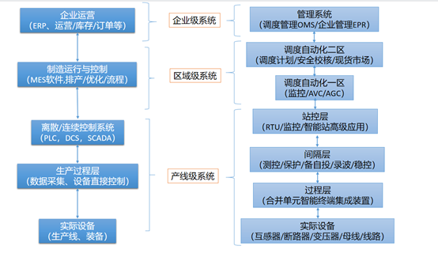

# 工业系统演化与设计

作者：邹德虎修订：2026-09-07

我开设公众号时，希望从系统层面理解电力系统，同时不失去对底层细节的认识。这两个目标并不矛盾：没有整体视角，容易把局部经验错误地推广到全局；没有实现细节，系统设计又容易变成无法验证的框图。

工业系统不是设备的简单集合。设备之间的连接、信息传递、控制权限和生产组织，共同决定系统的行为。改变这些关系，有时比改进单个部件更有效；但新的连接也可能引入新的耦合和失效路径。因此，演化不等于不断叠加功能，而是持续检查系统是否仍然适合它要完成的任务。

## 1. 分层的目的，是管理不同尺度的责任

制造业系统常需要协调物理生产、现场控制、生产运行管理和企业经营。ISA-95围绕企业与制造控制功能之间的集成，提供活动、信息和接口的模型。[1] 电力系统也存在设备控制、厂站协调、调度运行和经营管理等不同层面的工作。

*上图保留原文的概念性对照，用于说明分层思路，不是标准之间的一一对应关系，也不是完整的网络安全分区图。*

需要特别区分：ISA-95侧重企业与制造控制集成；IEC 61850覆盖电力自动化的信息模型、工程描述与通信服务等；IEC 61970中的CIM为相关应用提供共同的信息语义。[1][2][3] 它们的对象和范围不同，不能仅凭图上的位置，把几套标准当成同一套层级划分。

分层并不是规定所有数据都必须向上集中。快速控制通常需要在接近对象的位置完成，上层再进行协调、计划和优化。具体部署仍取决于时延、可靠性、通信条件、安全边界和维护能力。

互联网系统也有复杂的分层、数据一致性和可用性问题，工业系统则还要直接面对物理过程和安全后果。可以借鉴成熟的软件工程和运维方法，但需要重新核对实时性、故障行为和设备寿命等约束，而不是把一种行业架构直接复制到另一种行业。

## 2. 软件定义，不等于硬件不再重要

软件使规则和策略更容易修改，这是工业系统演化的重要机会。例如，PLC可以在硬件能力范围内改变控制逻辑，调度应用可以利用更广范围的信息辅助协调，巡检系统可以把传感、图像和任务管理联系起来。

但“保护已经完全由软件实现”是不准确的。数字式保护的判据与逻辑主要由软件或固件实现，模拟前端、采样、供电、开入开出和跳闸回路仍然是关键环节。软件越深入地参与控制，越需要明确它与硬件之间的时序和失效边界。

软件定义网络的英文缩写是SDN，而不是“软件定义通信”。其核心思路包括控制与转发的解耦；控制逻辑可以在逻辑上集中，同时在物理上采用分布式或冗余部署。不能把它理解成所有控制都必须交给一台服务器。

我更倾向于把“软件定义”看成一种设计取向：把变化较快的策略与相对稳定的机制适当分离，以降低变更影响。但软件复制成本较低，不代表工业软件修改没有成本。测试、停机窗口、兼容性、安全审查和现场培训，都可能决定一次更新能否实施。

同样，敏捷与硬件工程并非天然冲突。可逆的试验可以快速迭代，昂贵或难以逆转的决策则需要更充分的前期论证。管理方法应根据风险与变更成本选择，而不是贴上“敏捷”或“传统”的标签就作出判断。

## 3. 规划与运行协同，首先需要模型和数据衔接

在设计阶段使用仿真，可以较早发现容量、控制、接口或异常工况方面的问题。这通常有助于减少后期返工，但前提是模型能够表达相应问题，参数和假设也足以支持判断。仿真提前开展，不意味着实物验证可以取消。

对于电网，规划与运行的数字化协同不应被写成一个“即将开始”的笼统趋势。更具体的问题是：规划模型与运行模型怎样共享设备身份和可信参数，已建资产与拟建方案怎样区分，运行反馈怎样回到规划，规划情景又怎样进入运行校核。

两类模型也不必完全相同。运行模型需要反映实际设备和当前方式；规划模型还要描述未来投产、负荷增长、资源变化和多种不确定情景。统一基础数据，不等于混用不同时间状态，更不等于用一个模型解决所有时间尺度的问题。

数字孪生的价值也应由具体任务检验。三维显示可以帮助理解空间关系，但并不自动提供有效的控制、故障分析或优化能力。应说明数据怎样更新、模型怎样校准、误差怎样评估，以及结果将支持什么决策。

## 4. 工业企业的能源问题，不能脱离生产过程

我过去主要服务电网调度客户，也接触过工业企业的内部供电系统。这些经历让我认识到：相同的电气设备，在不同业务中承担的角色可能很不一样。

电网企业关注广域的电力输送和供电服务；工业企业则还要同时考虑工艺连续性、产品质量、设备启停、库存和生产计划。企业的电气人员往往需要与工艺、机械、仪控和生产管理团队共同解决问题。不能仅凭班组规模或岗位设置，判断他们对系统的重要程度。

例如，一次电压暂降是否造成停产，取决于外部电网扰动，也取决于内部设备耐受能力、接线方式、控制逻辑和生产工艺。只分析外部电网，或者只更换一台所谓“治理设备”，都可能没有抓住问题的完整边界。

因此，向工业企业提供服务，首先应弄清它真正担心的损失：是电费，是停产，是良品率，是设备寿命，还是能源与环境约束。不同目标对应不同的模型和实施方案。

综合能源服务的范围可以包含电、热、冷、气等多种能源的协调，不只是电力监控或节能改造。ESG通常指Environmental、Social and Governance，即环境、社会和治理，但是否采用某项技术，仍需落实到可测量的能源、排放、风险或经营效果，而不是停留在概念层面。

## 5. 商业可行性不能从宣传热度推出来

某项改造有技术收益，不代表在所有企业都具有经济性；一个领域暂时没有大量项目，也不能反过来证明它没有价值。投资约束、风险分担、用户获取成本、计量条件和组织能力，都可能影响推广。

我建议在讨论收益前，先明确基线和边界。节省的电量是否按相近产量、产品结构和环境条件比较？需求响应收益是否同时计入了生产机会成本？设备采购价之外，是否还包含维护、停机、改造和退役费用？

对服务商而言，个性化需求与规模化交付之间存在张力。完全定制可能难以维护，完全标准化又可能忽略工艺差异。较可行的设计，是让通用数据模型、设备模型和计算服务保持稳定，把企业特有的约束、流程与交互放到可配置或可扩展的部分。

固定传感器、摄像头、移动机器人和人工巡视也是如此。设备是否固定，只是选型的一项条件，还要比较覆盖范围、遮挡、测量任务、环境适应性、可达性和维护成本，不能宣布某一种方案始终更便宜或更有效。

## 6. 技术重点：从可信数据到可执行方案

### 6.1 数据采集与质量管理

关口计量能够支持结算，却不一定足以解释企业内部的扰动和能效。需要根据任务选择测点、采样与记录方式，并管理时间同步、测量精度、缺失数据和设备标识。

通信选型也应分清层次：光纤是传输介质，RS-485是电气接口标准，CAN涉及总线通信机制，不能把它们当作同一层面的完整替代方案。工业现场还需要考虑电磁干扰、接地与隔离、距离、带宽、冗余和故障诊断。

### 6.2 与问题相匹配的仿真和优化

正常潮流、短路电流、保护配合、电压暂降、谐波和控制相互作用，所需模型并不相同。电动机、电力电子设备、电加热设备以及备用电源，应按研究目标选择适当的细节。

正常工况的模型验证通过，也不代表异常工况自然可信。UPS和备用电源是否可用、切换是否成功、保护是否配合、重要控制电源是否受影响，都需要与任务匹配的场景校核。这里讨论的是能力要求，不针对某个产品的具体缺陷。

与MES等生产系统结合时，还应把产量、质量、启停时间、库存、交货期和设备寿命等约束纳入，而不是只优化电费。电气模型与工艺模型的协同，需要双方专业人员共同确认。

### 6.3 与电网和市场的交互

企业可以根据自身条件研究需求响应、储能调度或虚拟电厂等参与方式。技术可调节能力、并网条件、市场准入、计量结算和实际收益是不同的问题，必须分别验证。不能把潜在收入直接写成确定收益，也不能为了局部收益牺牲生产安全。

### 6.4 综合诊断与持续运维

工具给出数据和候选方案，专业判断则需要连接电力、工艺和经营目标。实施后还应持续检查效果与副作用，把运行反馈用于模型和方案修正。

AI、云平台和容器编排可以是有用工具，在某些任务中也可能很关键；是否采用，应由需求和验证结果决定。任何技术名称都不能替代对可靠性、实时性、维护能力和安全边界的说明。涉及OT的设计，还需考虑其特有的性能和安全约束。[4]

## 7. 演化能力，来自清晰接口和可追溯变更

一个系统要长期发展，需要允许局部改变，又不能让每次改变都迫使全系统重新开始。设备接口、数据语义、模型版本和测试用例，是控制变更影响的重要基础。

组织管理也应形成反馈：谁提出需求，谁负责总体技术取舍，谁审查接口，谁确认实施效果，谁维护异常记录。PDCA等方法可以帮助组织改进，但只有当检查结果真正影响后续决策时，才构成有效闭环。

**工业系统演化的目标，不是让系统看起来更复杂、更数字化，而是在理解物理过程和业务约束的基础上，使它更适用、更可维护，也更能够承受未来的变化。**

## 参考资料与修订说明

[1] ISA. [ISA-95：Enterprise-Control System Integration](https://www.isa.org/standards-and-publications/isa-standards/isa-95-standard)，官方范围、功能层次与接口说明。

[2] IEC. [IEC 61850官方技术介绍](https://iec61850.dvl.iec.ch/)，关于信息模型、SCL、通信服务和互操作性的范围。

[3] IEC. [IEC 61970-301:2020+AMD1:2022，CIM基础模型](https://webstore.iec.ch/en/publication/74467)，官方公开范围说明。

[4] NIST. [SP 800-82 Rev. 3: Guide to Operational Technology Security](https://csrc.nist.gov/pubs/sp/800/82/r3/final)，官方摘要与发布信息。

2026年修订：明确分层图只是概念对照，修正SDN、ESG和通信层次的表述；更新规划运行协同与软件定义的适用边界；删除可识别客户、地点、人员和服务经历的负面细节，将讨论转向一般性需求、约束与验证方法。
