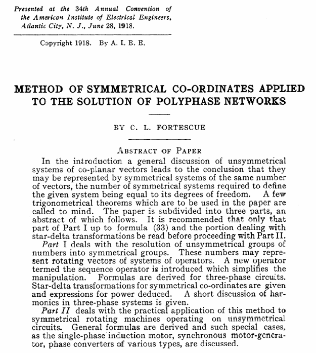
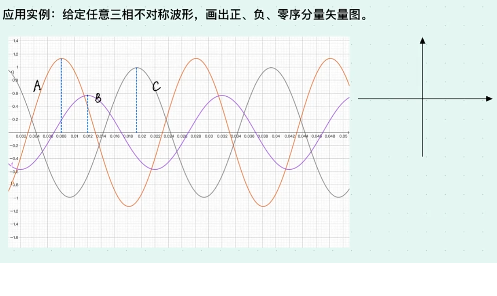
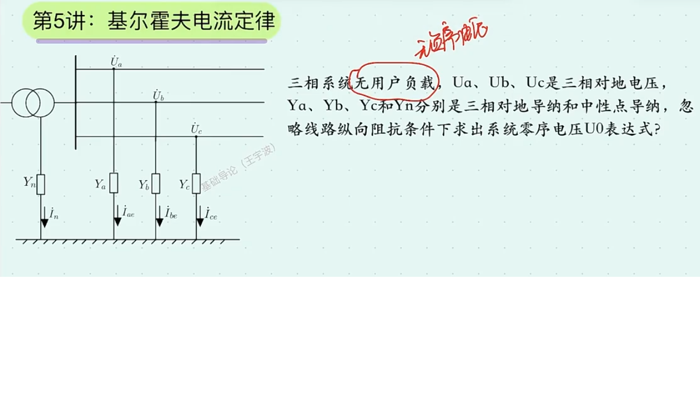
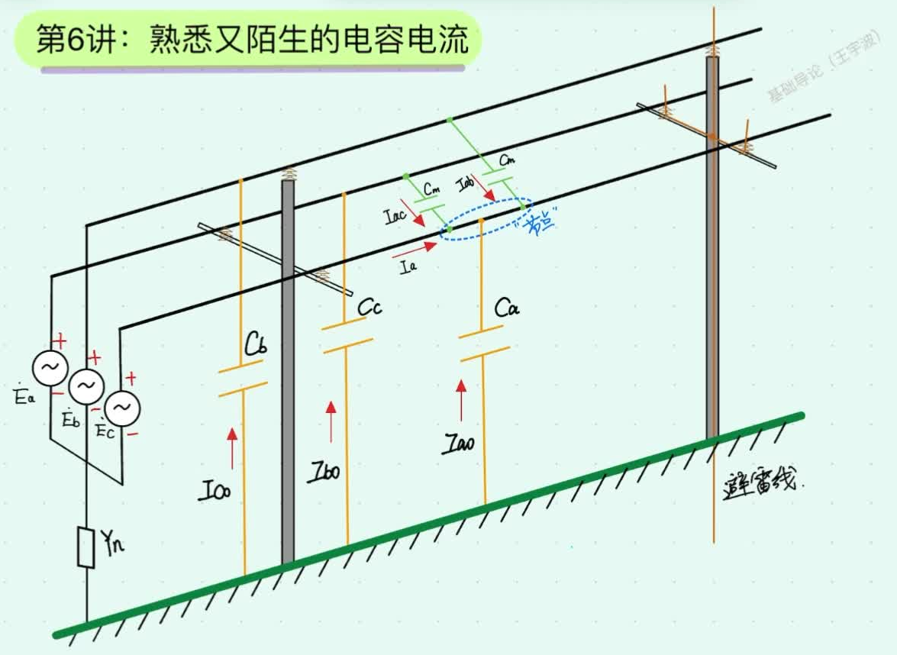
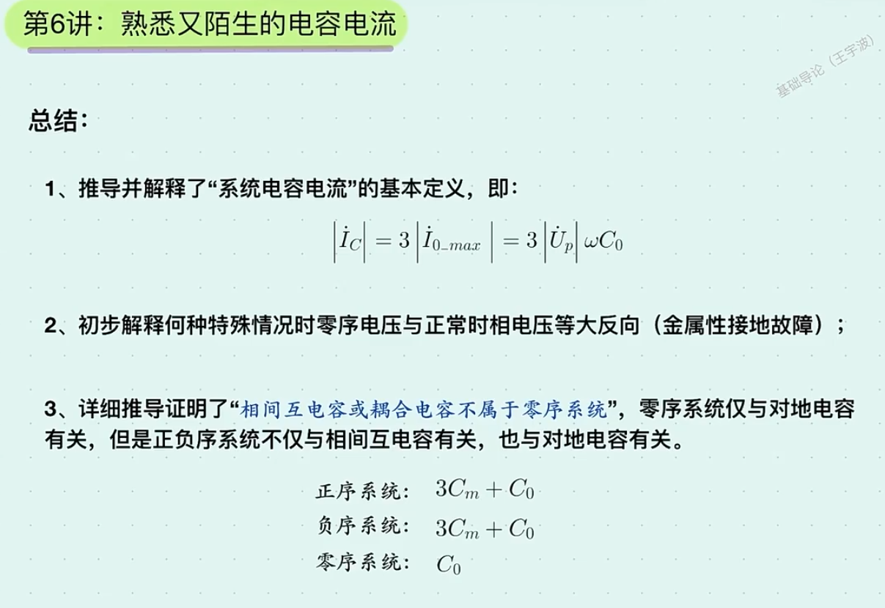
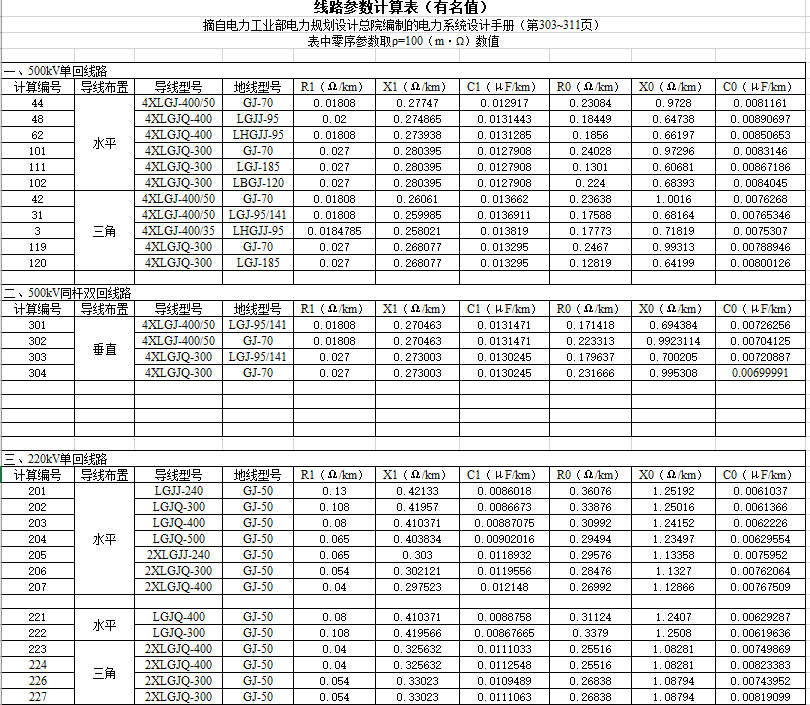

# 深入理解对称分量法

作者：邹德虎更新时间：2026-03-26

对称分量法是电力系统分析理论的基石，也是电力系统继电保护工作者每天都在使用的基本工具。深入研究对称分量法的来龙去脉，并发现已有模型的局限性，这对于专业工程师来说是有必要的。

本文包括以下部分：

1.  介绍对称分量法的原始论文
2.  用矩阵的思路给出对称分量法的主要表达式
3.  推荐一个视频课程《电力系统接地故障保护基础导论》（王宇波主讲）
4.  针对这个课程前几讲的部分例题，给出我不同的解决思路（优先使用向量化和复数）。这可以与这个课程的讲解方法互相对照，加深对对称分量法的理解
5.  具体针对某公司说明书，指出一个针对对称分量法的典型错误理解。

本文可能不是很容易阅读，感兴趣的读者建议在纸上自己推导一遍。

## 1 对称分量法：历史回顾

1918 年 6 月 28 日，《应用于多相网络解法的对称坐标法》(Method of Symmetrical Co-Ordinates Applied to the Solution of Polyphase Networks) 在美国电气工程师学会 (American Institute of the Electrical Engineers) 在新泽西州大西洋城 (Atlantic City, NJ, USA) 举行的第 34 届年会上发表。演讲结束后进行了一场讨论会，六位著名的专家就 Fortescue 贡献的不同方面进行了讨论。这篇文章和讨论后来发表在 AIEE Transactions上，并成为电气工程师的里程碑。

对称分量法的变换始于 Fortescue 在 1913 年开始的研究，该研究涉及铁路电气化应用中不平衡条件下感应电动机的运行。Slepian 参与了一些讨论，Slepian 还建议负序和正序之间的比率是“表示线路不平衡程度的更好量”。随着时间的推移，对称分量方法的重要性迅速增长，以至于设备参数（针对发电机、线路、变压器等）开始以序分量的形式提供。

论文的截图如下，总共有100多页：

题目和摘要翻译如下：

    对称坐标法在多相网络解决方法中的应用

    作者：C. L. FORTESCUE

    引言部分对非对称共面矢量系统进行了一般性讨论，得出的结论是：它们可以用相同数量矢量的对称系统来表示，定义给定系统所需的对称系统的数量等于其自由度。回顾了一些将在论文中使用的三角定理。论文分为三个部分，建议在继续阅读第二部分之前，只阅读第一部分至公式（33）以及处理星-三角变换的部分。

    第一部分讨论将非对称数组分解为对称数组。这些数字可以代表旋转矢量或算子系统。引入了一个称为序列算子的新算子，它简化了操作。推导了三相电路的公式。给出了对称坐标的星-三角变换以及功率表达式。对三相系统中的谐波进行了简短的讨论。

    第二部分处理这种对称坐标法在多相电路实际应用的问题。推导出了一般公式和一些特殊情况的电路。讨论了不同类型的相位变压器。

要注意这已经是100多年的论文了。电力系统同等地位的经典论文，还包括Park变换，以及Dommel的电磁暂态仿真开山之作，等等。我特别翻译了该论文附录中记录的同时代学者与作者Fortescue的部分讨论内容（略去了纯技术推导的部分）。这些讨论，即使在百年后的今天看来，依然有参考价值。后续我打算写公众号文章，论述工程师应该如何学习、研究和应用电力系统涉及到的数学工具。

以下是这篇论文的部分审稿意见和评论：

    数学和工程在各自的领域内都有其支持者和批评者。对于某些工程师而言，数学家是一个从某处开始推导出一系列结论的抽象人物；而另一方面，一个极端实用主义者可能完全依赖经验，并对他无法理解的数学不屑一顾。我们都知道，真正有价值的观点是这两者的结合，即理论与实践相辅相成。

    提到具有数学性和解释性特点的论文及其与工程的关系，让我想起了我接触到的第一篇学会论文。这篇论文出现在《Electrical World》的页面中。当时我正在试验交流电，与那些仅比我多懂一点的人一起工作，许多事情对我来说仍然是神秘的。后来，William Stanley 先生的一篇关于“交流现象”的论文发表了，解开了困扰所有接触交流电的人的一个神秘现象，即电流与电压不同相位的单相现象。Stanley 先生画了一些三角形并进行了解释，这让我有了一个新的起点。我能够看懂数学解释与物理现象之间的关系，并真正理解了交流电的工作原理。稍后，我接触到了多相系统，这成为研究不平衡多相系统的基础。

    这篇论文是什么？当你阅读这样的论文时，可能会认为它是由数学家写的，引导读者一步步深入公式、推导，甚至让人困惑。现在，为了说明我的观点，我想强调一点：这并不是数学家的产物，而是工程师的工作。Fortescue 先生的研究并不是从理论数学的角度进行的，而是作为一个工程师，面对不平衡多相系统的问题提出的解决方案。也许是某种传输问题或机械设备的问题，这些问题需要新的工具来解决。

    因此，在研究这些问题时，Fortescue 先生发现现有的数学工具不足以解决这些问题，于是着手开发新的工具来完成工作。他的工作方式与许多工程师相似，他们首先通过实验获得直觉，然后转向数学分析，最后又回到实验中验证。这种理论与实践的交替结合，构成了工程师的工作方法，也是开创性工作的本质。我认为，这篇论文并不是一位理论数学家的作品，而是一个实用工程师的成果，他为自己开发了一种新工具，并将其贡献给了他人。

    J. Slepian
    在过去的18个月里，我有幸与Fortescue先生保持密切联系，并就本文中体现的思想进行了许多有趣的讨论。由于我花了很长时间来思考和消化这些想法，我想我可以被允许在这里详细阐述我的观点。

    本文所给出的方法起源于在不平衡条件下考虑平衡感应电机的运行。利用这里提出的“坐标系”，可以以一种美妙的简单方式给出这些电机的理论。我认为，可以肯定地说，这种方法的实用性几乎完全局限于旋转感应电机的情况。以这种方式处理纯静态设备并没有显示出任何简化。然而，当人们考虑到几乎每一个实际的交流电路至少包含一个旋转电机（即发电机）时，这种方法的广泛应用就显得尤为重要。

    这里我补充一点，对称分量法原始论文主要讨论的是电机，并没有展开讨论线路的不对称故障问题。所以该学者认为"没有处理纯静态设备"。对称分量法的生命力非常强，已经发展100多年了。

    Charles L. Fortescue(作者回复)

    我认为这篇论文相当简单。数学部分并不难理解，只要有耐心，任何人都能看懂。我承认，方程式的表达可能显得繁琐，但这几乎是无法避免的。问题的本质使得方程的表达变得繁杂。

    Karapetoff 教授在讨论中使用了“刺激”一词。我想说的是，在这样的论文中，必然会有许多刺激灵感的来源。正如我在引言中指出的那样，许多想法并不是新的。关于对称分量三相系统的概念已经被更多或更少地使用过，但从未系统地提出过，我认为对称运算符的概念是新的。

    Steinmetz 博士和 Karapetoff 教授的讨论可以称为互补的讨论。Steinmetz 博士从实用的角度讨论了本文，认为该系统具有实际应用的潜力，并将在这方面大有用途。Karapetoff 教授则从理论角度指出了n相系统的可能性。对我来说，深入探讨纯理论问题会让我感到无比的愉悦。这是一个非常迷人且前景广阔的领域，但我觉得在这篇论文中需要一些实际的理由来支持这些内容的提出。理论部分已经过于冗长，因此我认为通过实际的例子来说明是必要的。

    我认为仅仅展示数学解法并不足以为论文提供正当理由，但它必须还要有一个好的实际应用。我觉得如果只是深入讨论这一有趣主题的所有理论分支，可能会让人感到费解。人们可能会问：“他到底在讨论什么？为什么要用这些费力的东西折磨我们，却不给我们一个合理的解释？”因此，我认为论文的呈现应该尽量简洁明了，为此，我省略了许多本应该在这里的解释。

## 2 对称分量法的矩阵表达

对称分量法的本质，不只是“把三相量拆成零序、正序、负序”这么一句话，而是：**利用三相系统在循环置换下的对称性，把三维复向量空间中的一个特定基底找出来，使得许多原本耦合的问题在新基底下变成对角化或近似对角化的问题。**

设三相相量列向量为

$$
V^{abc}=
\begin{bmatrix}
V_a\\
V_b\\
V_c
\end{bmatrix}
$$

定义旋转算子

$$
a=e^{j120^\circ}=-\frac{1}{2}+j\frac{\sqrt{3}}{2},\qquad
1+a+a^2=0,\qquad a^3=1
$$

则从序分量到相量的变换可写成

$$
V^{abc}=T V^{012}
$$

其中

$$
T=
\begin{bmatrix}
1 & 1 & 1\\
1 & a^2 & a\\
1 & a & a^2
\end{bmatrix}
$$

反变换为

$$
V^{012}=T^{-1}V^{abc}
$$

其中

$$
T^{-1}=\frac{1}{3}
\begin{bmatrix}
1 & 1 & 1\\
1 & a & a^2\\
1 & a^2 & a
\end{bmatrix}
$$

于是序分量明确定义为

$$
\begin{bmatrix}
V_0\\
V_1\\
V_2
\end{bmatrix}=
\frac{1}{3}
\begin{bmatrix}
1 & 1 & 1\\
1 & a & a^2\\
1 & a^2 & a
\end{bmatrix}
\begin{bmatrix}
V_a\\
V_b\\
V_c
\end{bmatrix}
$$

这套矩阵表达有两个直接优点。

第一，所有三相电压、电流、阻抗、导纳关系都可以统一写成矩阵相似变换。例如，对阻抗矩阵有

$$
V^{abc}=Z^{abc}I^{abc}
$$

代入 $V^{abc}=T V^{012}$、$I^{abc}=T I^{012}$，得到

$$
V^{012}=T^{-1}Z^{abc}T I^{012}
$$

因此

$$
\boxed{Z^{012}=T^{-1}Z^{abc}T}
$$

同理，对于导纳矩阵也有

$$
\boxed{Y^{012}=T^{-1}Y^{abc}T}
$$

第二，这一写法能够直接看出“什么时候能解耦、什么时候不能解耦”。

### 2.1 三相对称元件为什么能严格解耦

若某元件在 abc 坐标下可写成

$$
Z^{abc}=
\begin{bmatrix}
Z_s & Z_m & Z_m\\
Z_m & Z_s & Z_m\\
Z_m & Z_m & Z_s
\end{bmatrix}
$$

则经过序变换后有

$$
Z^{012}=
\begin{bmatrix}
Z_s+2Z_m & 0 & 0\\
0 & Z_s-Z_m & 0\\
0 & 0 & Z_s-Z_m
\end{bmatrix}
$$

即

$$
Z_0=Z_s+2Z_m,\qquad Z_1=Z_2=Z_s-Z_m
$$

这正是教科书里最常见的结论。更重要的是，它告诉我们：**正序、负序、零序之所以能分开分析，不是因为三序是“天生独立”的，而是因为元件矩阵具有特定对称结构。**

### 2.2 三相不对称元件为什么会产生序间耦合

若忽略相间耦合、但三相参数不同，则可写成

$$
Y^{abc}=
\begin{bmatrix}
Y_A & 0 & 0\\
0 & Y_B & 0\\
0 & 0 & Y_C
\end{bmatrix}
$$

变换到序坐标后，有

$$
Y^{012}=
\begin{bmatrix}
Y_s & Y_m & Y_n\\
Y_n & Y_s & Y_m\\
Y_m & Y_n & Y_s
\end{bmatrix}
$$

其中

$$
Y_s=\frac{Y_A+Y_B+Y_C}{3}
$$

$$
Y_m=\frac{Y_A+a^2Y_B+aY_C}{3}
$$

$$
Y_n=\frac{Y_A+aY_B+a^2Y_C}{3}
$$

只要 $Y_A,Y_B,Y_C$ 不相等，$Y_m$、$Y_n$ 就不会同时为零。于是即使电源只提供正序电压，元件本身的不对称也会把正序量“转换”出零序和负序分量。这一点在工程上非常重要，因为很多现场现象不是故障导致的，而是参数不对称、测量误差、非全相运行、互感器误差等因素导致的。

从数学上说，对称分量法就是把循环对称系统对角化；从工程上说，它则是一种识别“序间是否解耦”的工具。

## 3 推荐课程：《电力系统接地故障保护基础导论》

王宇波老师是一位经验丰富的配电网接地保护专家，他将多年的工程实践经验系统化整理为理论，并推出了《电力系统接地故障保护基础导论》视频课程。该课程深入挖掘并应用了对称分量法，特别是针对实际问题进行了深入的探讨，弥补了教科书的不足。课程还对复合序网理论进行了扩展，使其能够应用于配电网接地保护的各种工况，包括中性点经消弧线圈接地、不接地、直接接地、经（高低）阻抗接地等。

课程中有一些观点，是我以前有过初步认识但没有仔细推导的。例如，对于中性点不接地或经消弧线圈接地的配电网，单相接地故障电流与线路对地电容密切相关；在这类问题中，如果把对地电容完全忽略，可能得到与工程实际明显不符的结论。需要强调的是，教材是否忽略对地电容取决于所讨论的问题和采用的简化假设：在某些序网推导中可以作近似，但在配电网接地故障分析中往往需要显式考虑。至于虚拟中性点、接地变压器、消弧线圈、母线互感器等现场设备与序网理论怎样结合，也是这门课程中我认为很有价值的部分。

下面是这门课程的部分文案，仅供参考。我不能100%宣称这个课程准确无误、完全合理，何况我也没学完。但可以肯定的说，这门课程有相当多的合理成分与参考价值。

这门课程的关键点是对于线路电容电流的深入讨论。我这里补充几点我个人看法：

1.  电容的存在是普遍性的，只要是电力系统的分析，很难不考虑电容电流。即使是稳态和潮流计算，线路对地电容的影响也完全不可忽略。比如说，线路自然功率的计算；为什么超高压、特高压运行需要并联电抗；线路热备用的时候，为什么还会有电流，而且并不算很小。早在十几年前，我设计主站区域备自投系统的时候，其无电流判据就考虑了躲过热备用的电容电流值，避免把备用线路错判断成正常运行状态（主要判据当然还是开关刀闸遥信，这个是辅助判据）。哪怕是空载的母线，在拉开刀闸的时候，都还会拉出电弧出来，这个电弧本质是静电，但也是母线电容所蓄积的电荷。
2.  在有些场合，电容对于电力系统的分析计算的某些处理起到关键作用。比如说，中国电科院系统所PSModel刘文焯团队前段时间在中国电机工程学报发表的论文《电力系统电磁暂态仿真中异步电动机的机-网解耦模型》，就是利用异步电动机的补偿电容，再结合定子电感，构成贝杰龙模型，在电磁暂态仿真的数值求解层面，实现电动机与主网的天然解耦，提高数值稳定性。同步发电机虽然找不到专门的电容器设备，但是经过主变连接母线后，对地电容也是显著的。这样在发电机升压变压器的高压侧，我认为也可以实现类似的解耦。
3.  还有个例子，CPU的散热功率，可以通过电容-电阻串联电路模型，推导出来。我自己以前的文章《计算机系统之旅》介绍过，推导过程就不再引用。

## 4 例题解析：加深理解对称分量法

下面不再沿用尺规作图或纯口算的思路，而是尽量统一到“复数 + 矩阵”的表达上。这样做的好处是：推导更短，编程实现也更直接。

### 4.1 例题一：三相波形的三序分量计算

这是课程第 3 讲的截图：

对这类问题，关键是先把三相波形都还原成相量，再直接做序变换。若三相相量已经写成

$$
V^{abc}=
\begin{bmatrix}
V_a\\
V_b\\
V_c
\end{bmatrix}
$$

则三序分量就是

$$
V^{012}=T^{-1}V^{abc}
$$

例如，若从录波中读出三相有效值和相位，可直接代入矩阵公式计算。与其在图上反复作图，不如把“有效值 + 相位”先写成复数相量，再一次性完成序分解。这样不仅更适合程序实现，也更容易推广到自动化分析工具。

### 4.2 例题二：相位测量误差导致的零序电流

这一点在工程上非常常见。假设真实三相电流本来是严格对称的正序电流，但 A 相相位测量多了一个小误差 $\theta_A$。令

$$
\begin{aligned}
I_a &= I e^{j(\theta+\theta_A)} \\
I_b &= I e^{j(\theta-\frac{2\pi}{3})} \\
I_c &= I e^{j(\theta+\frac{2\pi}{3})}
\end{aligned}
$$

则零序电流应按定义写成

$$
I_0=\frac{I_a+I_b+I_c}{3}
$$

代入后得到

$$
\begin{aligned}
I_0
&=\frac{I e^{j(\theta+\theta_A)}+I e^{j(\theta-\frac{2\pi}{3})}+I e^{j(\theta+\frac{2\pi}{3})}}{3}\\
&=\frac{I e^{j\theta}(e^{j\theta_A}-1)}{3}
\end{aligned}
$$

当 $\theta_A$ 很小时，利用 $e^{j\theta_A}\approx 1+j\theta_A$，得

$$
\boxed{I_0 \approx \frac{j\theta_A}{3} I e^{j\theta}}
$$

这个结论非常有用：

1.  仅仅一个相位测量误差，就足以“凭空”产生零序电流；
2.  其幅值与误差角成正比；
3.  其相位相对于原正序电流大约偏移 $90^\circ$；
4.  若三相都存在不同的相位误差，则零序、负序都可能被测出来。

这里特别需要指出，零序定义里那个 $\frac{1}{3}$ 不能遗漏。漏掉这个系数，结论在数量级上就会出现系统性偏差。

### 4.3 例题三：不对称导纳如何把正序量耦合成零序量

这是课程第 5 讲涉及的核心思想之一。其本质并不在某个具体电路，而在于：**只要元件三相不对称，序间耦合就不可避免。**

对三相不对称但相间不耦合的并联支路，若有

$$
Y^{abc}=
\begin{bmatrix}
Y_A & 0 & 0\\
0 & Y_B & 0\\
0 & 0 & Y_C
\end{bmatrix}
$$

则其序域表达为

$$
Y^{012}=
\begin{bmatrix}
Y_s & Y_m & Y_n\\
Y_n & Y_s & Y_m\\
Y_m & Y_n & Y_s
\end{bmatrix}
$$

若电源只施加正序电压，即

$$
V^{012}=
\begin{bmatrix}
0\\
V_1\\
0
\end{bmatrix}
$$

则支路电流为

$$
I^{012}=Y^{012}V^{012}=
\begin{bmatrix}
Y_m V_1\\
Y_s V_1\\
Y_n V_1
\end{bmatrix}
$$

于是立刻得到：

$$
\boxed{I_0=Y_m V_1,\qquad I_2=Y_n V_1}
$$

这已经足够说明问题：**哪怕系统外部没有零序电源、没有负序电源，只要支路本身不对称，就会把正序量耦合成零序和负序电流。**

具体到课程里的接地问题，还要进一步联立接地支路、零序通道以及边界条件，才能求出零序电压 $V_0$ 的具体值。但逻辑主干就是上面这个耦合关系。把这一点看明白，后续很多配电网接地故障问题都会顺很多。

### 4.4 例题四：三相耦合电容的序参数

这是课程第 6 讲中非常关键、也最容易被说明书写乱的一部分。

先给出更严谨的节点电容矩阵写法。对一组三相对地、相间均对称的耦合电容，abc 坐标下的节点导纳矩阵可写成

$$
Y^{abc}=j\omega
\begin{bmatrix}
C_s & -C_m & -C_m\\
-C_m & C_s & -C_m\\
-C_m & -C_m & C_s
\end{bmatrix}
$$

这里：

- $C_s$ 不是“某一相单独对地电容”，而是节点矩阵主对角元对应的系数；
- $C_m$ 为相间耦合带来的互系数，进入节点矩阵时带负号。

对该矩阵做对称分量变换：

$$
Y^{012}=T^{-1}Y^{abc}T
=j\omega
\begin{bmatrix}
C_s-2C_m & 0 & 0\\
0 & C_s+C_m & 0\\
0 & 0 & C_s+C_m
\end{bmatrix}
$$

因此序电容满足

$$
\boxed{C_0=C_s-2C_m,\qquad C_1=C_2=C_s+C_m}
$$

若进一步把 $C_g=C_s-2C_m$ 记作等效零序对地电容，则也可以把 abc 节点矩阵改写为

$$
Y^{abc}=j\omega
\begin{bmatrix}
C_g+2C_m & -C_m & -C_m\\
-C_m & C_g+2C_m & -C_m\\
-C_m & -C_m & C_g+2C_m
\end{bmatrix}
$$

此时就有

$$
C_0=C_g,\qquad C_1=C_2=C_g+3C_m
$$

两种写法在数学上完全等价，只是记号不同。关键结论没有变：**正序、负序电容通常大于零序电容；零序电容并不包含全部相间耦合项的“直接叠加”。**

把这里的记号和符号关系理顺后，很多说明书里的歧义就会自动暴露出来。

## 5 典型错误分析

### 5.1 一个常见错误：把节点电容矩阵、互电容和序电容混为一谈

国内一些说明书在介绍三相耦合对地电容时，经常把下面几类对象混在一起：

1.  物理意义上的相间互电容；
2.  abc 节点方程中的电容矩阵系数；
3.  序网络中的 $C_0$、$C_1$、$C_2$。

这三者并不是同一个东西。若这一点不先分清，公式很容易写错，进而在软件实现中造成系统性误差。

一个正确且足够通用的写法是：若 abc 节点导纳矩阵写成

$$
Y^{abc}=j\omega
\begin{bmatrix}
C_s & -C_m & -C_m\\
-C_m & C_s & -C_m\\
-C_m & -C_m & C_s
\end{bmatrix}
$$

则序电容应满足

$$
C_0=C_s-2C_m,\qquad C_1=C_2=C_s+C_m
$$

反过来，若已知序电容，则有

$$
\boxed{C_s=\frac{C_0+2C_1}{3},\qquad C_m=\frac{C_1-C_0}{3}}
$$

这个反算公式很重要，因为它直接说明：当线路参数满足常见的工程事实 $C_1>C_0$ 时，$C_m$ 应为正值；而节点矩阵里的非对角元则应为 $-C_m$，即负值。很多错误恰恰出在这里——把“互电容为正”与“节点矩阵非对角元为正”误当成同一件事。

### 5.2 为什么这种错误很严重

电容元件和电感元件最大的不同在于：对电容而言，软件实现往往直接从**节点电导/电纳矩阵**入手，而不是从“串联阻抗”入手。若把节点矩阵写错，后面序变换、故障计算、谐振分析、接地电流估算都会一起偏掉。

更具体地说，若某说明书同时声称：

- abc 电容矩阵主对角元、非对角元都按“同号互加”处理；
- 又给出 $C_s=\frac{1}{3}(C_0+C_1)$、$C_m=\frac{1}{3}(C_0-C_1)$ 一类关系；
- 但现场线路参数又普遍满足 $C_1>C_0$，

那么三者之间往往彼此不兼容。此时问题不在于“某个符号抄错了”，而在于建模对象本身没有分清：到底是在写物理电容系数、节点方程系数，还是在写序参数。

### 5.3 更稳妥的判断方法

遇到这类说明书时，我建议至少做三步交叉检查：

1.  **看物理趋势是否合理**：架空线路通常满足正序电容大于零序电容，即 $C_1>C_0$；

 2. **看节点矩阵是否满足与建模对象一致的结构和物理约束**：例如对称性、互易性、行和关系，以及在给定参考条件下的正定/半正定或被动性。严格对角占优可以是某些矩阵的有用性质，但不是节点导纳、电容等矩阵普遍必须满足的必要条件； 3. **看序变换前后是否互相可逆**：用 $T^{-1}Y^{abc}T$ 正变换，再反推回去，看是否自洽。

### 5.4 结论

对称分量法最容易让人产生一种错觉：只要会写变换矩阵，就算“学会了”。其实真正的难点往往在更前面——**你到底把什么对象写成了矩阵。**

若对象本身没有定义清楚，后面的序变换无论多熟练，都只是在把错误更漂亮地变换一遍。相反，只要把“物理电容”“节点矩阵”“序参数”三层对象分清楚，很多所谓复杂问题会立刻变得简单，很多说明书中的错误也会一眼看出来。
