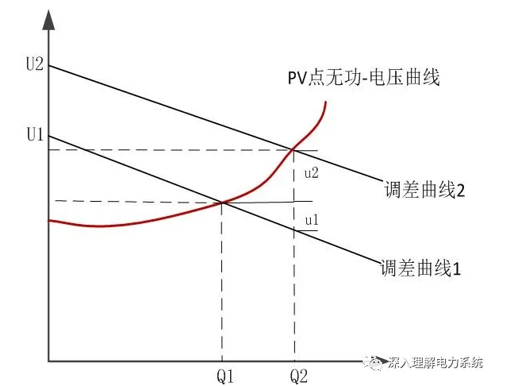
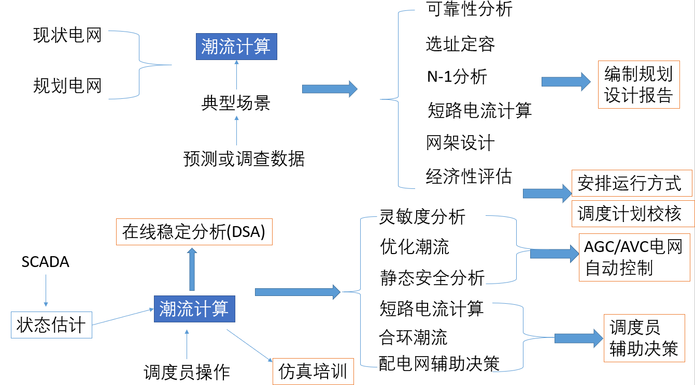
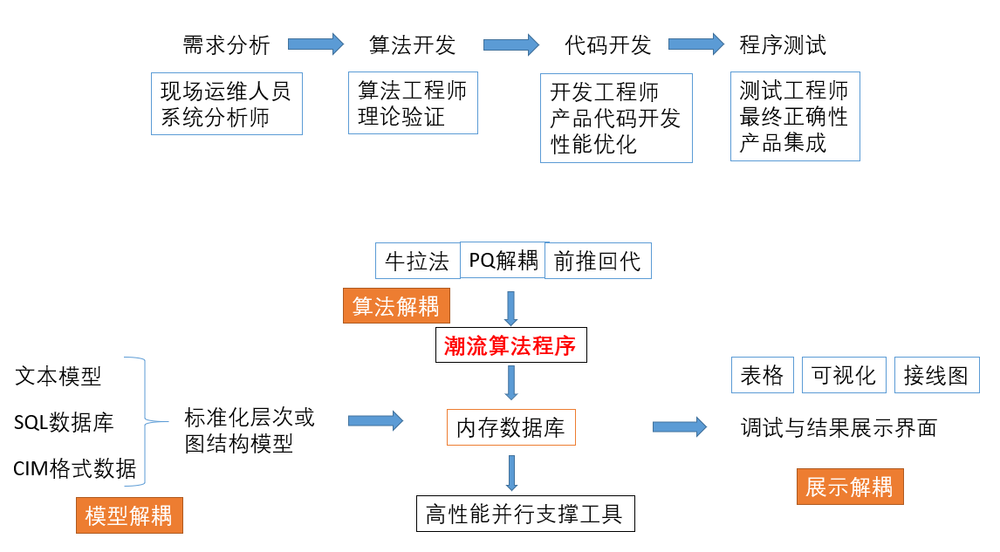

# 深入理解潮流计算

<div class="article-meta" style="margin:-4px 0 24px;color:#667085;font-size:.9rem;display:flex;gap:8px 18px;flex-wrap:wrap;"><span>作者：邹德虎</span><span>更新时间：2026-03-26</span></div>
潮流计算是电力系统分析中最基础的算法，本文尽量从工程实践出发，谈一谈我对潮流计算的理解。正如我之前说过的，掌握潮流计算，最有效的手段是自己独立编程实现，用自己的程序简单模拟电力系统的运行。无论是课本、论文，还是本文，都只能让你少走弯路。正所谓“纸上得来终觉浅,绝知此事要躬行”。

## 1 潮流计算的定位

我们知道，电力系统潮流计算，在数学上就是求解非线性方程组。这里的非线性是从哪里来的？在电路中，如果阻抗采用复数形式，仅有电压电流，那么电力系统是线性的。主要的非线性来源于功率量测。功率量测具有特殊性，首先，对于测控装置来说，功率可以比较容易得到完整的复数形式（即$P+jQ$），仅通过本地的电压电流相位差就可以分开有功和无功，同时得到复功率的幅值和相角，这对于求解复数形式的非线性方程组是必须的。电压和电流就不行，毕竟PMU只能覆盖有限的输电网节点。要求PMU全覆盖是不现实的，不仅是因为PMU装置本身的成本，而且调度中心无法承担海量PMU数据的存储、传输带宽等成本。另外一方面，电费计量、电力市场结算等，最重要的依据依然是功率量测。这就是经济基础的巨大推动作用。

潮流计算的应用，主要有以下几点：

1.  对于在线应用来说，获取当前运行状态，包括电网各母线节点的电压幅值和相角，以及各支路的功率分布、网络的功率损耗等，基于潮流可进一步分析灵敏度、N-1安全等深入的信息
2.  对于离线应用来说，可以通过潮流设定电力系统预想的状态，这是仿真、培训的基础
3.  对于规划来说，潮流计算是现状电网评估和多种规划方案量化分析的重要依据。

## 2 潮流计算中的节点类型

电力系统潮流计算一般把节点分为3类，分别为PQ、PV，还有平衡节点。下面分别结合真实的设备来展开论述。

### 2.1 PQ节点

电力系统大多数节点都是PQ节点，所谓PQ节点，就是给定节点注入功率。实际上，电力系统超过一半的节点是“零注入”的，这些节点的特点是流入母线的功率等于流出母线的功率，除此以外，没有发电机和负荷。也就是说，注入功率总和严格为0。对于完整电力系统来说，发电机经过升压变，进入输电网，然后层层降压，进入配电网，再输送给用户。中间经过的大多数节点，都是起到联络或转运的作用。当然，如果建模范围有限，例如省调，也可把变压器高压侧等值为负荷。

零注入节点对于状态估计计算还有另外的意义，由于严格为0，可以构成等式约束，也可以构成量测精度极其高的虚拟量测。

有许多节点没有有功的生产或消耗，但是连接有电容器或电抗器，这类节点严格的来说，是有功零注入，但是潮流计算往往把容抗器并入导纳矩阵的对角元上去，所以在数学上仍然可以是完全的零注入。但是连接SVC、STACOM等电力电子设备就没有这么简单的处理了，此时的PQ节点注入功率是一个变量，在迭代过程中可能不断发生变化。其变化规律由该设备自身规定。

对于负荷来说，其功率一般设置为恒定的数值。但是负荷功率也可考虑受到频率、电压的影响。这样PQ节点注入功率就不再是常数，这样做可以提高潮流计算的收敛性，也可以增加结果的合理性。

### 2.2 PV节点

在常规的商业用电力系统计算软件中，可选择将某台发电机设置为PV节点，然后程序内部将发电机连接的节点设置为PV节点。PV节点在此处体现的是发电机励磁系统控制机端电压的能力。

励磁控制的首要目标是控制电压在给定值，其稳态增益常常超过100p.u.。由于发电机总是与升压变压器构成一个整体（又叫发变组）。其控制目标常常是变压器高压侧，这就是所谓的“PV控高端”，而不是直接控制发电机出口。控高端的做法也是最近十几年才广泛应用的，其实现十分简单，就是输入的机端电压测量信号扣除在变压器电抗上的压降，该压降可以用电流和电抗参数算出来，也可以有别的方式（注意大部分情况并不是直接测量高压侧电压）。为了使无功功率可以在并列发电机之间稳定分配，此种补偿必须形成调差特性，也就是说，不是正好100%的补偿，否则发电机无功分配会不稳定。在我国，迫使发电机实际电压比参考电压低时，称为正调差；反之则为负调差，负调差主要是抵消变压器压降，但不能超过变压器压降，负调差有助于发挥发电机对于系统的无功支撑作用。这里所说的调差只在机端，反映到高压侧，仍然是正调差的（正调差简单来说就是向下倾斜的曲线）。

对于潮流计算来说，PV控高端不需要考虑这么多细节，只是PV移植到了高压侧。算完之后，还需要把多余的无功功率分配回发电机机端。但是，在同一个发电厂设置过多的PV节点确实可以使收敛性下降，这是因为潮流计算不可能精细到可以考虑调差特性。此时可以考虑减少PV节点数量。

励磁系统的控制能力是有限的，因此，当PV节点发出或吸收的无功超出限值时，该节点将由PV节点转换为PQ节点。励磁系统的限制主要体现在：过励限制、欠励限制、VHZ限制等，此处不再展开。励磁系统的限制在中长期动态仿真中更加需要详细考虑。

不是所有的发电机励磁都运行在控电压的状态，对于地方上的小型发电机，更多的是跟随系统。系统对于小型发电机往往没有什么控制需求，此时发电机可能处于保证功率因数恒定运行，此时潮流计算可以把这类发电机设置为PQ节点。

对于地区电网来说，没有那么多的发电机，其主要电能都是从500kV电网输送过来的。连接500kV电网的主力发电机，由于建模范围的关系，没有在模型中。这时候可以认为500kV母线的电压保持恒定，把该母线定为PV节点。对于配电网来说，可把主网母线定为PV节点或平衡节点。另外，负荷节点如果有工作在恒电压模式的SVC或者SVG也可认为是PV节点 。

### 2.3 平衡节点

平衡节点有两层含义：其电压参考角度为0，其它母线电压角度都以该节点为参考。另外，该节点不给定注入功率，而是给定电压，起到电压支撑的作用（潮流计算可以不用设置PV节点）。这两层含义不是必然联系在一起的，不可混为一谈。

在商业用电力系统软件中，平衡节点往往设置为功率最大的发电机节点。由于该节点功率未给定，由系统算出来。但实际上该节点发电机是有明确的功率值的，这两者的差异，我们称为不平衡功率。为了更合理分析，发展了动态潮流计算方法，把不平衡功率引起系统频率变化，而系统频率变化又会引起负荷变化、发电机功率变化（一次调频），然后不平衡功率值又会发生变化。这是一个动态过程。

使用状态估计数据时，不平衡功率往往很小。但是人工设置断面，或进行故障模拟，不平衡功率往往变得很大。因此，要想使潮流计算贴近实际，尤其是提高仿真精度，动态潮流技术是必然要采用的。

### 2.4 考虑发电机调节

下面再稍微展开一下与同步发电机相关的问题。

发电机励磁系统是十分复杂的，与稳定性也极其相关，但在潮流计算里面可暂不考虑。下面我用简单的发电机动态模型说明为什么负荷无功减少，会引起系统电压的抬升。考虑下面的同步发电机三阶模型：


$$
T'_{d0}\frac{dE'_q}{dt} = E_{fd}-E'_q-(x_d-x'_d)I_d
$$


负荷无功减少，则$I_d$减小，这一点很容易从向量图画出来。假设发电机励磁不控制，则暂态电势$E'_q$升高，附近节点的电压值抬升了。

对于电网来说，假设电抗远远大于电阻，则电压降落主要与无功传输有关。假设负荷无功消耗下降，甚至倒送无功，则末端电压抬升。

从以上两点都可以说明（叠加），在不考虑励磁电压控制的情况下，全系统无功充裕，则系统电压高；反之则系统电压低。

再下面是一个思考题：已知某发电机的参数和运行情况，如果要求发电机输出的无功增加某个数值，那么励磁参考电压应怎么设置？下面分别从设备的角度和系统的角度，联合讲解发电机稳态调压的细节。

现代发电机的励磁系统，其励磁电压参考值往往需要考虑主变的电抗，因此会增加一个修正值。这样，反映在主变高压侧，会形成正的调差特性。调差特性的存在，有助于发电机输出无功的分配；负调差还有助于电压调整效果。调差特性曲线可以近似用倾斜的直线来描述。

在潮流计算中，可以假定主变高压侧为PV节点，改变PV节点的设置电压，计算一次潮流，可以计算出从主变高压侧注入系统的无功值。计算很多次潮流，可以绘制该PV节点的无功-电压曲线。该曲线是向右上的，因为PV点的设置电压越高，其注入系统的无功出力更多。

下面把PV节点无功-电压曲线和调差特性曲线合并画在一张图内。



如图所示假定发电机初始发出的无功为Q1，设置的励磁参考电压为U1，则实际运行点为调差曲线1与PV点无功-电压曲线交汇点上。

假定发电机励磁参考电压由U1增加至U2，则调差曲线变更为2，与PV点无功-电压曲线的交汇点完全变了，由图中可以看到，无功出力由Q1增加到Q2。

那么，无功出力由Q1增加到Q2的过程中，励磁参考电压也同时由U1增加至U2，该电压差值有两个部分组成：1）u2，可以近似等于无功差值乘以PV点无功-电压曲线的斜率；2）u1，等于无功差值乘以调差曲线的斜率再乘以-1.

下面为几点讨论：

1.  PV节点的无功-电压曲线，必须假定全网其它量都不变，变化的只有该发电机高压侧的电压及其无功出力，相当于等值为单机无穷大系统。在真实的系统中，由于系统负荷与运行方式随时变化，因此该曲线也实时处于动态变化中。

2.  调差曲线是可以整定的，属于发电厂内的设备问题；但是PV节点的无功-电压曲线，是单个的发电厂无法干预的，属于系统问题。因此，电压调整的全过程，是发电设备与系统共同作用的结果。

3.  如果发电机没有调差特性，那么调差曲线是水平的。相同的励磁参考电压增加值，增发的无功会变少。因此，调差特性更好的起到了支持系统无功的作用。

### 2.5 核心方程与牛顿迭代的本质

前面讨论了节点类型，下面把潮流计算的数学骨架明确写出来。设节点导纳矩阵为


$$
Y=G+jB
$$


对任一非平衡节点 $i$，令 $\theta_{ij}=\theta_i-\theta_j$，则节点注入有功、无功方程为


$$
P_i = V_i \sum_{j=1}^{N} V_j \left(G_{ij}\cos\theta_{ij}+B_{ij}\sin\theta_{ij}\right)
$$


$$
Q_i = V_i \sum_{j=1}^{N} V_j \left(G_{ij}\sin\theta_{ij}-B_{ij}\cos\theta_{ij}\right)
$$


牛顿潮流的本质，就是围绕当前迭代点线性化这些非线性方程，构造不平衡量


$$
\Delta P_i=P_i^{\mathrm{spec}}-P_i^{\mathrm{calc}},\qquad
\Delta Q_i=Q_i^{\mathrm{spec}}-Q_i^{\mathrm{calc}}
$$


然后求解线性校正方程


$$
\begin{bmatrix}
\Delta P\\
\Delta Q
\end{bmatrix}=
J
\begin{bmatrix}
\Delta \theta\\
\Delta V
\end{bmatrix}
$$


其中 $J$ 为雅可比矩阵。工程实现中最重要的经验之一是：**永远是解线性方程组，而不是显式去算 $J^{-1}$。** 对大规模电网而言，程序性能和数值稳定性主要取决于稀疏矩阵存储、重排序和因子分解，而不是公式本身是否会写。

把这一点看清楚以后，潮流、状态估计、最优潮流乃至很多参数辨识问题，在数值计算层面的共性就会非常明显。

## 3 潮流计算中的矩阵

不同的潮流计算程序是有不同层次的。

第一层次，是初学者水平。特点是把教科书中的公式亦步亦趋的写入程序，基于已有的框架（MATLAB或者Python）。没有考虑到性能优化、以及考虑工业需求的软件设计。这一层次的潮流计算程序可能只有几百行，当然，对于初学者来说，最大的工作量可能是雅可比矩阵的形成，很繁琐，容易出错。

第二层次，是工业级的水平。这一层次的程序必须考虑到工业现场部署潮流计算程序，对于性能和功能的需求极高。因此需要采用许多技术措施，例如稀疏矩阵的处理（包括压缩存储、节点排序、高性能的因子分解计算等）。这一层次的潮流计算程序可能有几千行甚至上万行。

第三层次，是基于现代软件技术的水平。在程序实现时，优先将矩阵计算交给高性能库专门实现。常规的应用编程的主要作用相当于一个中介，把应用问题转化为高性能库所能处理的问题，同时在设计上更便于软件维护。在设计上，充分发挥现代编程特性对于传统设计模式的改造（例如C++中的Lambda/function简化模块间的耦合）。这一层次的程序，对于外行人来说，似乎实现的功能也差不多，但是从本质上已经是天壤之别了。

从第一层次到第三层次，其实是一个否定-之否定的过程。大部分所谓的“高手”，实际上是停留在了第二层次。以我的工作经验，停留在第二层次，软件开发维护的效率非常低。电力系统分析的理论真的有那么复杂吗？理论上一两个人能搞定的事情，常常需要十人以上的团队才能维护。另一方面，第二层次号称是“工业级”的，但是跟第三层次程序的比起来，差距可能超出大部分人的预计。

实现第三层次的编程，非常强调“矩阵思维”。教科书上的推导虽然是基于矩阵的，但是大部分人未必真正的理解。他们需要一个实例，按照循环把矩阵中的每个元素推导出来。在程序实现过程中，大家都习惯写出大量的循环语句，而不是直接对矩阵进行操作。

下面列举一个实例。牛顿法潮流计算，雅克比矩阵的形成非常重要。常规上都是循环求解雅克比矩阵的元素。但是康奈尔大学的MATPOWER软件形成雅克比矩阵非常有参考价值，直接用矩阵运算求出复数形式的雅克比矩阵：

``` MATLAB
dS_dVm = diagV * conj(Ybus * diagVnorm) + conj(diagIbus) * diagVnorm

dS_dVa = 1j * diagV * conj(diagIbus - Ybus * diagV)
```

dS_dVm是复数功率向量对电压幅值向量；dS_dVa是复数功率向量对电压角度向量。 我原本以为，这种求解方法与常规方法在数学上是等效的。没想到经过实测，收敛性也大幅度提高了。可见基于矩阵的推导的确抓住了问题的本质。（补充一点：如果采用GPU加速，由于并行的粒度要求非常小，完全基于矩阵操作可能不太适用，需要更加细粒度的并行化处理。但整体框架基于矩阵设计是没有任何问题的）

基于矩阵的计算，一方面可以调用最优秀的计算机科学家编写的高性能矩阵库；在对问题本身的理解上，也更本质，而且矩阵方面有大量的数学工具可以用（想想张贤达老师的书那么厚）。所以，潮流计算无论是从理论研究角度，还是从工程实用的角度，矩阵都是不可以忽略的。

我的好友程天石博士，对于电力系统潮流中的矩阵，有更深入的论述和举例。前段时间他公开了基于Rust的开源潮流程序，也在我的公众号发布。建议大家可以仔细阅读学习。

## 4 潮流算法的扩展

我们知道，牛顿-拉夫逊算法是潮流计算的基本算法，为了完成特殊的需求，有必要开发各种特定的算法。因为篇幅所限，本文仅介绍快速分解法、直流潮流法、动态潮流、配电网潮流（本文我提到的潮流算法，我自己都用C++实现过）。

### 4.1 快速分解法

牛顿-拉夫逊算法，每一步迭代都需要重新矩阵分解，比较费时。因此有学者根据电力系统的物理特点，对潮流模型进行了简化。关键的简化有两个要点：高压系统中，有功与相位，无功与电压幅值的关系更大，因此矩阵直接可以分解；另外，迭代过程中，雅克比矩阵的数值变化不大，干脆可以用常数矩阵代替。

具体的快速分解法格式，有BX型和XB型。这两种在算法流程上是相同的，但是在矩阵形成上有所不同。《高等电力网络》一书介绍了快速分解法的收敛机理，有兴趣可以深入研究。

实际的潮流算法商业软件，有可能是先用快速分解法迭代几步获得更好的初值，再转牛顿法迭代至收敛，有较好的效果。

快速分解法是非常体现工程思维方式的算法，仅从数学本身很难有这样的简化，但是我们从电力系统的物理规律出发，可以对很多算法的边界条件、求解过程等各个方面提高效果，这种思维方式绝不仅限于潮流计算。

### 4.2 直流潮流法

很多应用场合并不太关心潮流的精确解，例如传统的静态安全分析需要一个“初筛”过程；或者规划电网不要求非常精确的潮流，更关心有功的分布；或者安全约束机组组合只能建立线性潮流模型（形成混合整数线性规划模型），等等。直流潮流法就有用武之地了。直流潮流法的理论很简单，极容易看懂，本文不再赘述。

我在大概2014左右那会，对直流潮流法进行了扩展，使其可以部分考虑无功电压特性，也已经写好可以工作的C++代码了。只不过中国电科院已经发表了类似的工作，这部分工作就完全放弃了，现在自然就更没有时间去弄了。其实我当时观察到了很多有趣的现象，这种扩展算法可能可以用于潮流辅助调试。

### 4.3 动态潮流

潮流计算是基于“断面”的，是一个静态的算法。那么能不能扩展为可以反映时域动态过程的算法呢？答案是肯定的，这就是动态潮流算法。

常规潮流中，系统不平衡功率通常由平衡节点在数学上吸收。若进一步引入统一系统频率并考虑频率动态，则需要区分不同时间尺度：功率突变后的最初阶段，机组惯性决定转子加速度和惯性功率响应；随后调速器一次调频、负荷频率特性以及更慢的二次调频逐步参与。因此，不能把所有机组的功率变化简单固定为按惯性时间常数分配。若采用简化的动态潮流或准稳态频率模型，应明确所采用的时间尺度和频率响应模型。这类模型通常还假定系统保持同步、用统一频率描述全网，因此它不是完整的机电暂态模型。

节点功率方程如下：


$$
P_i - \alpha_iP_{ACC}-\sum_{j=1}^{N} V_i V_j (G_{ij} \cos \theta_{ij} + B_{ij} \sin \theta_{ij}) = 0
$$


其中$P_{ACC}$指的是系统总加速功率，前面的系数$\alpha_i$是分配系数。如果是非发电机节点，那么分配系数为0。求出考虑不平衡功率分配的稳态潮流后，可以更新系统总不平衡功率，然后求出当前时步的系统频率。然后系统频率又会影响发电机的动力输出、负荷大小。这里构成循环迭代。

动态潮流的步长可设定为0.1s左右，以适应低频减负荷装置的仿真需求。

对于发电机的动态潮流模型，除了发电机本体（转子、绕组）没有建模，发电机的动力系统部分，可以完全做到与中长期动态模型一致。例如火力发电模型中包括锅炉、机炉协调控制(CCS)、调速器、汽轮机。

发电机的动态潮流模型中的励磁部分，也可以进行简化建模，自并励励磁的快速调节肯定无法建模，但可以考虑发电机过励和低励限制模型，以及定子过流保护等，通过PV和PQ节点转换的方式，这样动态潮流可以反映中长期电压动态过程。在动态潮流中，还需建立负荷、分布式发电的模型。如果仿真时间达到分钟级别，还需建立AGC和AVC的模型。

2015年底，我分析了华东电网锦苏及宾金特高压直流闭锁后的动态数据，证明动态潮流的数学模型可以近似描述直流闭锁后的物理过程，仿真频率曲线与WAMS系统导出的PMU数据非常一致。

这样看来，机电暂态仿真就处于比较尴尬的位置了。如果我们不需要考虑振荡，只需要分析整体的频率特性（也包括部分电压特性），动态潮流就可以做到。如果我们需要振荡曲线，那就直接可以使用全电磁暂态仿真。考虑到机电暂态仿真相当大的成本是用在发电机动态参数的辨识和管理上，这些参数可用于电磁暂态仿真，所以我觉得动态潮流的地位可能可以提升、机电暂态仿真的地位会下降。当然，需要指出的是，功角稳定性的定量评估（例如EEAC算法），仍然是基于机电暂态仿真模型的。

### 4.4 配电网潮流

配电网与输电网主要的不同有以下几点：1）辐射状供电，没有或者极少有环网的存在；2）不满足电抗远远大于电阻的假设；3）很多情况下需要三相潮流，而不是仅考虑正序潮流。因此，配电网潮流有专门的算法。下面列举几种常见的配电网潮流算法。

1）前推回代方法，这是教科书里面很多手算潮流的方法。我们如果用计算机实现前推回代方法，最好的办法仍然是用矩阵思维，把前推过程和回代过程用矩阵的整体乘法来操作；2）隐式Zbus高斯法，这种方法其实是直接把导纳矩阵作为潮流迭代的系数矩阵，而不是用雅克比矩阵。OpenDSS软件就是采用这种方法。

## 5 潮流计算的调试

我十几年前刚到南瑞工作的时候，需要飞全国各地支持各个电网的DTS反事故演习，调试准备潮流断面是重要工作之一。除此之外，对于稳定分析工作来说，一个好的初始断面是很重要的。潮流的调试，研究的人很少，但确实占用很多工作量，下面我列举一些经验。

1.  对于大电网，先调试骨干电网的潮流，再逐渐加入周边的电网。比如说对于一个省级电网，先把500kV部分的潮流调收敛、具有一定鲁棒性。再逐步加入各个220kV电网分区。也就是说，调试潮流的维护人员，也需要站在调度员及其方式人员的立场上，对这个电网的结构特点有清晰的认识。

2.  如果不收敛，可从迭代信息中查看发散或者不收敛的位置，在这位置附近可能有参数偏差、方式不合理等情况。此外，检查有功是否存在严重不平衡，或者通道输送功率已经超过理论上限。线路参数、变压器参数填写错误，负荷和出力填写不合理，导致输电通道阻塞，也可能导致潮流不收敛。

3.  一定功率储备的发电厂和有一定无功功率电源支撑的变电站母线可设为PV节点，PV节点应全网均匀，减少无功大范围流动，PV节点电压设置值应该要合理。无功配置不合理，导致无法满足无功区域平衡的原则，是潮流不收敛的主要原因。

4.  潮流收敛后，还需要进一步调试，提高潮流结果的合理性。调整潮流时，避免一次性过大的调整。例如在调整过程中，负荷、发电、联络线功率等可能会有较大的变化，这种情况如果一次性调整较大，可能会引起潮流不收敛，应采用逐步调整的方法。需要根据平衡机出力或提前计算区域有功不平衡量，当不平衡功率超过平衡机的出力调整范围，调整发电出力，分摊不平衡功率。偏离额定值较多的节点，应重新调整无功补偿、机端电压、变压器分接头，使节点电压在合理的范围之内，这样使节点电压更合理，同时可以进一步提高潮流的收敛性，为后续潮流调整奠定较好的基础。调整的时候优先调整电压等级高的越限严重的节点。

5.  检查发电机的有功无功出力。发电机的有功无功出力应该在发电机的实际能力范围之内，如果超过其能力范围，是不合理的，特别需要检查平衡机的出力。

近几年，有将人工智能算法应用于潮流调试的工作，这是很好的方向。信息技术和人工智能的发展，就应该把人的经验固定沉淀下来，人就可以解放去做更有创造力的工作。

## 6 最简单的两节点潮流

下面考虑最简单的两节点潮流，加以分析推导，可以起到温故知新的作用。两节点功率可以表示为下面的公式：


$$
P = \left( \frac{U_a U_b}{Z} \cos \delta - \frac{U_b^2}{Z} \right) \cos \theta + \frac{U_a U_b}{Z} \sin \delta \sin \theta
$$


$$
Q = \left( \frac{U_a U_b}{Z} \cos \delta - \frac{U_b^2}{Z} \right) \sin \theta - \frac{U_a U_b}{Z} \sin \delta \cos \theta
$$


上面的式子中，$\delta$指的是两条母线电压的角度差；$\theta$指的是阻抗角；$Z$指的是阻抗值。

如果电抗远大于电阻，则简化为：


$$
P \approx \frac{U_a U_b}{X} \sin \delta
$$


$$
Q \approx \frac{U_b (U_a \cos \delta -U_b)}{X}
$$


如果电阻远大于电抗，则简化为：


$$
P \approx \frac{U_b (U_a \cos \delta  -U_b)}{R}
$$


$$
Q \approx -\frac{U_a U_b}{R} \sin \delta
$$


这种情况就需要辨别了，如果不加分辨的把输电网结论应用到配电网，会引起一些误解。比如说，配电网分布式电源的存在，使得末端电压偏高。这种电压偏高主要是由于有功功率倒送引起的。如果照搬输电网的那一套，完全指望安装电抗器吸收无功（或者是变流器吸收无功），显然难以取得预期的效果。

一般而言，110kV及其以上电网，可以认为电抗远大于电阻。35kV和10kV配电网，可以认为电抗和电阻处于同一数量级。对于低压配电网，那就是电阻远大于电抗了。

还有个案例，周荣光教授《电力系统理论精析》中写了可以思考的一件事：”某教师在水电厂实现，发现该厂经长距离输电线，输送大量无功功率到某电力系统，而该系统电压水平很低，于是他建议发电厂只要减少输送的无功功率，就可以立即抬升电力系统的电压水平“。

正如周教授所言，这位年轻教师是典型的只见树木不见森林，把有边界条件的结论不加分析的推广至整体系统，闹了笑话。假设系统电压不变，减少输送的无功，则系统整体电压水平更加下降了，此时电源电压必须进一步下降，这是在危险的边缘操作（从之前的公式中不难看出问题在哪）。通过减少无功提高电压的前提是，受端系统必须有足够的无功支撑。

通过两节点潮流模型，还可以加强对电压稳定性的理解。下面我们假设$a$侧连接理想电压源，$b$侧连接负荷，这就是最简单的供电模型。为了使推导简化，我们假设电抗远大于电阻，同时令：


$$
k = \frac{U_b}{ U_a}
$$


则有：


$$
\frac{Q X}{ U_a^2} + k^2 = k  \cos \delta
$$


$$
\frac{P X}{ U_a^2}  = k  \sin \delta
$$


汇总得到：


$$
k^4 + k^2 (2\frac{Q X}{ U_a^2}-1) + \frac{P^2+Q^2}{ U_a^4} X^2 = 0
$$


把$k^2$当成一个变量，则这个是简单的一元二次方程，很容易根据中学数学的知识得到$k$的最小值，如下：


$$
k= \sqrt{\frac{1}{ 2}(1-\frac{2QX}{U_a^2})}
$$


通过一系列变换（这里省略），可以通过下面两个式子得到$U_a$和$U_b$的临界值，如下：


$$
\frac{U_a^2}{X}=2Q+2\sqrt{P^2+Q^2}
$$


$$
\frac{U_b^2}{X}=\sqrt{P^2+Q^2}
$$


假设我们把$U_a$当成输电网电压，$U_b$当成配电网电压，显然可以通过方式计算得到等值电抗，再根据实际SCADA采集的电压值，实时计算电压稳定裕度。另外，我们通常说的短路容量，指的是与电压实时值无关，只与方式有关的静态值。而与电压稳定相关的容量值$U_b^2/X$，可以理解为“动态短路容量”。因此，电压稳定裕度也可以用动态短路比来表达，进一步的讨论就不再展开，很多复杂的电力系统电压稳定问题都可以用极简模型来说明原理。当然，上述的推导没有考虑负荷的动态特性，是比较粗糙的。但在很多场合（尤其是参数不那么准确的配电网）是够用了。

## 7 潮流计算的工业应用

首先是潮流的应用场景，如下图所示：



潮流计算主要有两个主流应用：

1）用于规划等离线应用，这里潮流是用于对现状电网的分析，以及规划设计方案的计算验证，潮流（也包括其它计算结果）是编制规划设计报告的重要依据；

2）用于在线应用，最常见的就是用于能量管理系统的调度运行控制。潮流可以取自状态估计断面，调度员可以用潮流计算进行各种预想操作，并作为培训仿真（DTS）的来源数据。其中来源于状态估计的实时潮流断面，可应用于后续的各种分析，例如静态安全分析、灵敏度分析，以及稳定分析（DSA）。这些网络分析的信息，可用于自动控制（例如AGC、AVC），也可用于辅助决策、智能决策等应用。

还有的潮流计算是介于离线应用和在线应用之间的，包括电网安排运行方式，这是周期性的滚动工作过程，例如夏滚计算、冬滚计算和年方式计算。运行方式的安排包括电网分区和结构安排、电力电量平衡、稳定分析和自动装置，以及应急预案编制，等等。还有个应用是调度计划（现货电力市场），例如日前计划是在实际运行方式发生之前决定未来1天的电网运行。

以上是工业级潮流计算程序的主要应用场景。实际上，照着教科书编写潮流程序是很简单的事情，每一个学电力系统的学生都可以编写出来。工业级潮流程序和普通的潮流程序有哪些区别呢？下面的表格可以参考。

|          |                                        工业级潮流程序                                        |                学校级潮流程序                |
|:--------:|:--------------------------------------------------------------------------------------------:|:--------------------------------------------:|
|   模型   | 考虑各种模型，包括HVDC、UPFC、DG等，以及模型相应的控制能力，例如发电机控制能力不足时由PV转PQ | 仅考虑经典的发电机、负荷、线路和变压器等设备 |
|   算法   |       考虑高性能和高可靠性，例如节点重排序、稀疏矩阵分解、高性能计算、算法鲁棒性处理等       |             仅仅复现教科书的公式             |
| 调试工具 |             完善的调试工具，甚至引入AI技术辅助调试收敛性和潮流的合理性，调试日志             |         调试仅依靠开发者自行终端打印         |
| 界面展示 |                完善的可视化展示，包括图表、曲线、地理和电气接线图、色彩渲染等                |              展示效果类似Excel               |
| 开发人员 |                                   团队开发，资深工程师带队                                   |                  研究生开发                  |
| 软件工程 |             完善的需求分析、开发流程、测试、现场消缺流程、代码版本管理、项目管理             |               没有正规管理体系               |

下面列举几个我比较熟悉的工业级潮流程序：

1.  南瑞D5000调度控制系统中的潮流计算程序，由南瑞电网分公司研发，覆盖了中国大部分的调度中心。这个程序已经有了30多年的历史，早期是Fortran 77编写的，后来已改造成C++代码。
2.  中国电科院系统所研发的PSASP和PSD-BPA，前者广泛应用于调度中心的方式计算（也包括高校、设计院等），后者广泛应用于经研院或者设计院。
3.  天大求实公司开发的电网规划计算机辅助决策系统（CNP），比较多的应用于城市配电网规划。
4.  几个应用广泛的开源潮流计算程序，包括：MatPower，康奈尔大学开发，基于MATLAB，具有较高的性能，学术界广泛应用；pandapower，卡塞尔大学开发，基于python；OpenDSS，美国电科院（EPRI）开发，对配电网的分析比较细致，广泛应用于配电网科学研究。

对于工业级潮流程序的开发组织和架构，我设计了一张图可以参考，如下：



其中关键技术要点如下：

1.  对于模型，首先要适应不同的录入方式。例如，基于文本的BPA格式或者CIM/E格式；或者基于图模一体化人机界面而建立的SQL数据库格式。但不管怎样，潮流程序不能绑定于某种特定的格式，如果绑定等于缩小应用范围。
2.  不管模型录入的格式如何，潮流计算内部所用的数据结构应该需要保证高性能，比如说很多单位用层次型数据结构，以及最近很火的基于图的数据结构，这些数据结构都是有效的。举个简单的例子，分析某条线路主保护或者断路器拒动，需要知道上级设备的后备保护情况，这个时候需要根据电网拓扑结构以最快速度找到上级设备，而不是通过很多for循环慢慢重新搜索。
3.  潮流计算需要基于高性能的底层支撑工具，这里的底层可以指的是高性能计算，例如Intel芯片最快的矩阵计算库是MKL；AMD芯片最快的矩阵计算库是ACML，也可考虑采用OpenMP工具并行计算；也可以指的是云平台，基于分布式计算（包括MPI工具），具体怎么处理需要根据应用需求来定。
4.  潮流的核心算法不应绑定为某种固定算法，而是像设计模式中的算法模式那样，可以灵活切换。毕竟潮流计算的应用场合太多了，很多配电网的需求和输电网的需求是非常不一样的。
5.  在潮流结果的展示方面，需要保证不同展示方式的解耦，这里可以考虑可视化技术，在潮流结果进一步挖掘、渲染方面取得好的效果。

在潮流计算的算法方面，教科书的重点是牛顿-拉夫逊算法，我也认为这是最重要、最正统的潮流算法。当然，工业级潮流程序中的牛顿-拉夫逊算法，可以通过实用化算法提供给牛顿-拉夫逊法更好的初值，形成混合算法。例如使用前次潮流计算收敛结果，或者前几步用高斯法或PQ解耦法。

除了牛顿-拉夫逊算法，根据需求的不同，还有很多其它潮流算法，下面的表格列举了部分：

|  其它潮流算法  |                                                            原理                                                             |                     应用场合                     |
|:--------------:|:---------------------------------------------------------------------------------------------------------------------------:|:------------------------------------------------:|
|    PQ解耦法    |                    避免每次迭代都形成雅克比矩阵，有功/无功解耦，形成两个常数B矩阵，分为：XB形式和 BX形式                    | 输电网中提高计算效率；提供牛顿法初值；灵敏度分析 |
|   前推回代法   | 回代：从末端往源头计算，更新电流或者功率流；前推：从给定的源节点出发往下游，更新各节点电压(V-I-BFC，更新过程等效为矩阵乘法) |               辐射状馈线的潮流计算               |
| 隐式Zbus高斯法 |                                  不使用雅克比矩阵，而是迭代过程中直接采用部分节点导纳矩阵                                   |        配电网潮流计算，OpenDSS使用该算法         |
|   改进牛顿法   |                 假定：相邻节点电压差小；没有接地支路. 直接由导纳矩阵形成迭代系数矩阵，与隐式Zbus高斯法类似                  |                  配电网潮流计算                  |
|    三相潮流    |                                           考虑三相的不对称，分为相分量和序分量法                                            |                  配电网潮流计算                  |
|    动态潮流    |                                   潮流过程考虑频率变化，计入一次调频、AGC、低频减载设备等                                   |            大电网潮流计算、离网微电网            |
|    概率潮流    |                                            计入不确定因素，特别是可再生能源发电                                             |            大电网、主动配电网、微电网            |
|    连续潮流    |                                   不断改变潮流模型中的特定参数对电压影响，绘制连续的曲线                                    |                 静态电压稳定分析                 |
|    优化潮流    |                                         在潮流模型基础上增加优化目标，变成优化问题                                          |     调度计划、安全约束调度、AVC自动电压控制      |

潮流计算还和许多其它应用有密切的联系，下面分别论述一下。

1.  潮流计算与状态估计。两者的数学描述非常一致，但潮流计算本质上是解方程组，而状态估计是解最小二乘问题。潮流计算可以为状态估计提供实验室测试环境，状态估计可以为潮流计算提供“熟数据”实时断面。后面有机会我会详细论述电力系统状态估计。
2.  潮流计算与静态安全分析。实际上静态安全分析是很多个预想故障下的潮流计算结果汇总，但是在具体实现方面，可能会采用各种技巧。例如局部因子化，或者GPU加速计算。
3.  潮流计算与短路电流计算。实际上，短路电流计算有两类，一类是以"三相交流系统短路电流计算GB/T15544.1-2023"（IEC60909）标准为代表，本质是短路电流的估算，算出最大短路电流和最小短路电流，分别用于断路器遮断容量校核和保护整定，这类是不依赖潮流的；另一类叫做基于潮流的短路电流计算（叠加法），这种可以用于仿真计算。顺便提一句，不依赖潮流的短路电流计算，并不意味保护分析可以忽略负荷电流，否则对单相接地等的处理会发生问题。
4.  潮流计算与机电暂态仿真。潮流计算为机电暂态仿真提供初始值，例如发电机的状态量如功角、各种电势，其初始值都可以基于潮流计算结果求出。此外，如果机电暂态仿真采用机-网交替迭代，潮流计算也提供网络部分的导纳矩阵。当然，为了提高数值稳定性，这里的导纳矩阵合并了一些动态元件的固定导纳，不是完全一致的。
5.  潮流计算与电磁暂态仿真。虽然很多电磁暂态仿真的启动是从0启动的（例如PSCAD），但是现在很多大电网的全电磁仿真，则需要考虑电磁暂态从潮流启动，这样可以减少很大的调试工作量，例如大量的电动机开始旋转会带来极大冲击，这对于调试来说是不必要的工作量，毕竟仿真的重点并不是带大量电动机的电网黑启动（实际上电网黑启动的流程跟电磁暂态仿真从0启动是完全不同的）。
