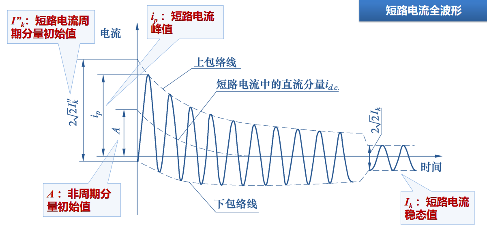
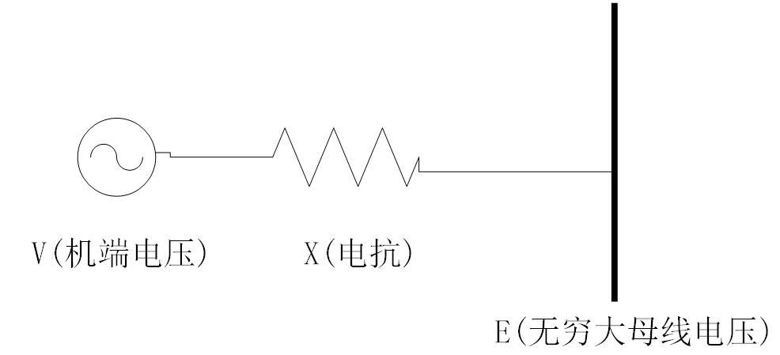

# 短路与短路比

作者：邹德虎更新时间：2026-03-25

本文并不试图系统讲完短路电流计算或短路比理论，而是从几个最常见、最容易混淆的物理问题切入：什么叫“短路电流”、为什么短路计算不能直接沿用潮流模型、短路容量与电压变化有什么关系，以及短路比究竟反映了什么。

## 1 “短路电流”到底指什么

工程上经常说某个母线“三相短路电流是 31.5 kA”，这句话默认指的并不是任意时刻的瞬时电流，而通常是**故障后周期分量初值的有效值**。对保护整定、开关开断能力校核、设备热稳定与动稳定分析而言，这个量最有代表性。

一个最简单的等值模型是戴维南电源经等值阻抗向故障点送电。若故障在某一相位角发生，短路电流可分为：

1.  **周期分量**：由系统等值阻抗决定，是保护整定最关心的量；
2.  **直流偏移分量**：与故障初相角有关，会指数衰减；
3.  **冲击电流峰值**：由周期分量和直流偏移共同决定，是动稳定与开关机械强度校核更关注的量。

因此，同一个系统、同一个故障位置，周期分量初值是确定的；而波形瞬时峰值则与故障发生时刻有关，不一定唯一。这也是为什么现场录波曲线不可能与电磁暂态仿真波形逐点完全一致，但周期分量初值仍然是最稳定、最值得用于工程校核的指标。

## 2 短路计算为什么不能直接拿潮流导纳矩阵来用

这是一个非常实用的问题。很多初学者会自然地认为：既然潮流计算也有导纳矩阵，短路计算是不是直接把同一套 $Y$ 矩阵拿来用就可以？答案是否定的。原因在于两者的模型假设并不相同。

### 2.1 潮流模型包含了稳态控制结果

潮流中的 PV 节点，本质上是把发电机励磁系统的稳态调压能力等效进来了；PQ 节点则往往对应“定功率注入/吸收”的稳态假设。这些都已经隐含了控制结果。

### 2.2 短路计算关心的是故障初期的电磁过程

短路电流计算关注的是故障后极短时间内的响应，一般以几周波为主。在这个时间尺度上，许多慢得多的控制过程尚未充分建立，因此经典短路模型通常要做如下简化：

- 发电机用次暂态电势和次暂态电抗表示；
- 忽略励磁、调速等慢控制对故障初期电流的影响；
- 负荷不再按恒功率处理，而需改为等值阻抗；
- 必要时考虑感应电动机的短时反馈电流。

所以，短路计算并不是“把潮流再算一遍”，而是**在故障初期时间尺度上重构网络模型之后，再做代数求解。**

## 3 结构变化问题不止是“短路”

从更抽象的角度看，短路电流计算其实属于一类“网络结构突变问题”。单相接地、两相短路、断线、断路器合环、并联电容器投切，都可以归结为：**网络拓扑或边界条件突然变化后，电力系统会出现一个以电磁量为主导的短时响应。**

这也是为什么很多工程问题在数学骨架上非常相似。比如断路器合环校验，本质上也是比较两个节点合闸前的电压差，通过等值网络求出合闸后电流。如果其目的主要是校核保护误动和设备电流冲击，那么关注的关键量仍然首先是周期分量，而不是把问题一开始就做成昂贵的全电磁暂态仿真。

## 4 母线投切电容器时，为什么可以用短路容量快算电压变化

这个问题表面上看与短路电流无关，实际上非常相关。因为短路容量描述的正是母线“看向系统”的强弱程度。

设某母线额定电压为 $U_N$，看向系统的等值电抗为 $X_{\mathrm{th}}$，则其短路容量近似为

$$
S_{sc} \approx \frac{U_N^2}{X_{\mathrm{th}}}
$$

若在该母线投入一组无功为 $\Delta Q_c$ 的并联电容器，在小扰动、强系统、忽略电阻的条件下，母线电压变化量可近似写成

$$
\Delta U \;(\mathrm{pu}) \approx \frac{\Delta Q_c}{S_{sc}}
$$

这个公式非常有工程价值。它说明：

- 同样容量的电容器，在强系统母线上的电压效果较小；
- 在弱系统母线上的电压效果会明显放大；
- 短路容量不仅决定故障电流水平，也决定母线电压对无功扰动的敏感程度。

因此，短路容量绝不仅仅是“故障分析参数”，它也是很多运行快算公式里的核心系统强度指标。

## 5 短路比究竟是什么

“短路比”这个术语在不同场合其实有不同含义，至少要区分两类：

1.  **同步电机本体的短路比**：是传统电机学里的参数，反映电机自身励磁与同步电抗特性；
2.  **并网点的短路比（SCR, short-circuit ratio）**：是电网强弱指标，常用于新能源并网、HVDC、FACTS 等场景。

本文主要讨论第二类。其最常见定义为：

$$
SCR = \frac{S_{sc}}{P_N}
$$

其中 $S_{sc}$ 为并网点短路容量，$P_N$ 为并网电源额定有功容量或额定送出功率。它本质上衡量的是：**系统给你提供的电压支撑和同步“刚度”，相对于你自己要送出的功率，到底够不够强。**

## 6 一个最简单的两节点模型：为什么短路比越小越难并网

考虑最简单的并网模型：

电源侧等值电势为 $E\angle\delta$，经电抗 $X$ 接入强网 $V\angle 0$。若忽略电阻，则送端有功功率满足

$$
P = \frac{EV}{X}\sin\delta
$$

这已经足够说明很多问题。

### 6.1 若电源具有较强的电压控制能力

若可把 $V$ 近似看成恒定、且 $E \approx V$，则最大送出有功近似为

$$
P_{\max} \approx \frac{EV}{X} \approx \frac{V^2}{X} \approx S_{sc}
$$

从这个极简模型看，要使运行点存在，至少需要

$$
SCR = \frac{S_{sc}}{P_N} \gtrsim 1
$$

这对应的是“电压源特征较强”的情形。同步发电机、强励磁支撑的构网型控制，都更接近这一侧。

### 6.2 若并网装置主要以“锁相 + 送有功”为主，且并网点无功接近 0

对受端（并网点）无功写成

$$
Q = \frac{V(E\cos\delta - V)}{X}
$$

若近似取 $Q \approx 0$，则有

$$
V = E\cos\delta
$$

代回有功式：

$$
P = \frac{EV}{X}\sin\delta
  = \frac{E^2}{X}\sin\delta \cos\delta
  = \frac{E^2}{2X}\sin 2\delta
$$

故最大有功为

$$
P_{\max} = \frac{E^2}{2X}
$$

此时阈值就上移到

$$
SCR \gtrsim 2
$$

这给出了一个很有启发意义的结论：**同样的并网电抗下，若装置缺少足够强的电压支撑能力，而更多表现为“依赖外部电网相位与电压”的控制方式，则对短路比的要求会明显提高。**

## 7 如何理解“1”和“2”之间的差异

上面的两个阈值并不是规范值，而是两个极端简化模型给出的**物理下界直觉**：

- 接近理想电压源时，阈值更接近 1；
- 接近纯跟随、纯送有功、无功支撑弱时，阈值更接近 2。

实际新能源场站、储能变流器、柔直换流器的控制模式往往介于两者之间，还叠加了 PLL、限流、无功控制、电流环带宽、弱网振荡等因素。因此真实工程问题绝不能只靠这两个数字判断。但它们非常适合建立一个基本直觉：**短路比不是神秘指标，它本质上是系统同步刚度与送出功率之比。**

## 8 关于工程应用的几点判断

第一，短路比高并不自动等于“绝对稳定”。它只是说明并网点电网较强，很多问题更容易被控制住；但控制器参数、线路补偿、并列运行方式、相互作用模态等仍然可能带来失稳。

第二，短路比低也不等于“一定不能运行”。如果控制策略更强、构网能力更好、局部无功支撑充分、运行点更保守，低短路比场景仍可能稳定。但分析成本和调试成本会显著上升。

第三，短路比最适合做**第一层筛查指标**。真正要下工程结论，仍应进一步做小信号分析、电磁暂态仿真和现场试验验证。

## 9 结语

短路电流、短路容量、短路比，看似是三个不同概念，其实都围绕同一个核心：系统的等值阻抗与系统强度。

- 短路电流告诉我们故障初期电磁量会有多大；
- 短路容量告诉我们母线“看向系统”有多硬；
- 短路比则进一步告诉我们，这种系统强度相对于并网电源的送出能力是否足够。

把这三者放在同一框架下理解，很多现场经验就会变得清晰：为什么弱网更容易电压大幅波动，为什么相同容量的补偿装置在不同母线效果差异很大，为什么新能源装置在低短路比场景下更容易出现控制困难。这些问题的根子，往往都不在“算法花样不够多”，而在于系统本身到底强还是弱。
