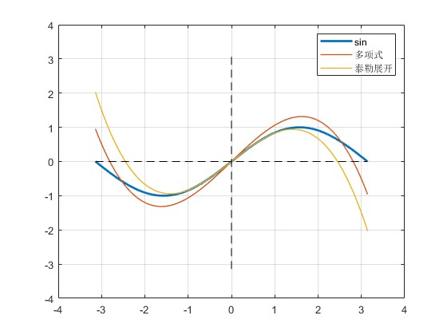

# 计算机中的基础数学函数

<div class="article-meta" style="margin:-4px 0 24px;color:#667085;font-size:.9rem;display:flex;gap:8px 18px;flex-wrap:wrap;"><span>作者：邹德虎</span><span>更新时间：2026-03-25</span></div>
计算机是怎样计算三角函数、对数、指数等基础数学函数的？这是一个重要的基础问题，但是容易被忽视，因为这个问题过于底层了。

我关注这一问题，主要源于10多年前开始编写工业级的C++潮流程序，使用C++标准库中的复数库，当时进行了相当多的性能测试。C++标准库中的复数很多操作都涉及到三角函数，例如直角坐标与极坐标的转换。C++标准库是没有三角函数代码的，同时C++复数库性能非常高。当时我误认为三角函数是由硬件指令集实现，实际上是不对的。后来我研究了计算机底层技术，才了解具体的细节。

浮点计算确实有很多是硬件指令集实现的。例如，在x86 架构上，SSE（Streaming SIMD Extensions） 和 AVX（Advanced Vector Extensions） 指令集提供了浮点计算能力，可以处理很多常用的浮点运算，如加法、减法、乘法、除法、平方根、倒数等。但是像三角函数、对数这样的复杂函数大多数情况下仍然是软件实现的。对于大多数应用软件，其实调用的是C标准库中的数学函数。

在介绍这些数学函数的实现之前，有必要先了解浮点数的格式。这是理解计算机如何计算复杂数学函数的基础。本文将介绍浮点数的表示，然后讨论两个示例代码：一个是 C 标准库中的正弦函数实现；另一个是著名的“雷神之锤”游戏中的快速求倒数平方根代码。

## 浮点数格式

IEEE 754-1985统一了当时分散的浮点数表示与运算规则，是现代数值计算的重要基础。标准形成过程由产业界和学术界共同推动，William Kahan 等人在舍入、异常值和可移植浮点语义方面发挥了重要作用；Intel 8087等处理器也与这一标准化进程密切相关，但不能简单概括为“主要由Intel推动”。下面以单精度浮点数为例，IEEE-754规定单精度浮点数是32bits ，分为三个部分：

1.  符号位（Sign bit）：1 位，用来表示数值的正负。0 表示正数；1 表示负数
2.  指数（Exponent）：用于存储浮点数的指数部分，经过偏移处理。单精度：8 位；双精度：11 位
3.  尾数（Mantissa ）：用于存储浮点数的小数部分。单精度：23 位（实际表示 24 位，其中最高位默认为 1） 双精度：52 位（实际表示 53 位，其中最高位默认为 1）

浮点数的公式是：


$$
V=(-1)^S \times M \times 2^E
$$


式中：$S$是符号位；$M$是尾数；$E$是偏移后的指数

最常见的浮点数是3.14，下面用这个数来说明单精度浮点数的二进制组织。

3.14 的近似二进制表示为：


$$
3.14 \approx 11.0010001111011_2
$$


我们要采用科学计数法，则有：


$$
3.14 \approx 1.10010001111011_2 \times 2^1
$$


上式中：

1.  尾数是$1.10010001111011_2$。规范化表示中的尾数部分省略前导的1，取其余的部分作为尾数，取到 23 位：$10010001111010111000011$
2.  指数是$1$，考虑到IEEE-754单精度浮点数的指数位采用偏移表示（biased exponent），对单精度浮点数，指数的偏移值（bias）为 $127$。计算偏移后的指数：$1+127=128$，对应的二进制为：$128=10000000_2$
3.  浮点数3.14 是正数，所以符号位为0

综上可得： IEEE-754 单精度浮点数（3.14）有以下三个部分：

符号位($0$);指数($10000000$);尾数($10010001111010111000011$),最终表示为：

    符号位（1 位）| 指数位（8 位）| 尾数位（23 位）
    0             | 10000000    | 10010001111010111000011

对于上面的 IEEE-754 单精度浮点数，如果按实际32位表示精确回算，可得到约 $3.140000104904175$，与十进制 $3.14$ 的差约为 $1.05\times10^{-7}$。这类表示误差是浮点数值计算需要考虑的基本误差来源之一。

## C标准库中的正弦函数代码

我下载了早期的glibc库(glibc-2.0.1)，数学函数的实现位于 sysdeps/ieee754 目录下。这些函数包含大量的宏和平台相关的优化。下面是经过简化和注释的正弦函数内核代码 \_\_kernel_sin：

``` C++
/* __kernel_sin(x, y, iy)
 *
 * 计算正弦函数，适用于 [-π/4, π/4] 区间。
 * 输入参数：
 *   x  - 主值，满足 |x| ≤ π/4
 *   y  - 尾数校正项，当 iy=0 时，y 被忽略
 *   iy - 指示 y 是否为 0，iy=0 表示 y 为 0
 *
 * 算法：
 * 1. 当 x 足够小（|x| < 2^-27）时，直接返回 x。
 * 2. 使用 13 次多项式来近似计算 sin(x)：
 *      sin(x) ≈ x + S1*x^3 + S2*x^5 + ... + S6*x^13
 *    其中系数 S1 至 S6 是预先计算好的常数。
 * 3. 考虑到 y 的影响，进行校正：
 *      sin(x + y) ≈ sin(x) + (1 - x^2/2) * y
 */

// 将GET_HIGH_WORD宏替换成C++函数
inline uint32_t GetHighWord(double x)
{
    uint64_t int_rep; std::memcpy(&int_rep, &x, sizeof(int_rep)); // 读取位模式；避免违反严格别名规则
    return static_cast<uint32_t>(int_rep >> 32); // 提取高32位
}

const double half = 5.00000000000000000000e-01; /* 0x3FE00000, 0x00000000 */
const double S1 = -1.66666666666666324348e-01; /* 0xBFC55555, 0x55555549 */
const double S2 = 8.33333333332248946124e-03; /* 0x3F811111, 0x1110F8A6 */
const double S3 = -1.98412698298579493134e-04; /* 0xBF2A01A0, 0x19C161D5 */
const double S4 = 2.75573137070700676789e-06; /* 0x3EC71DE3, 0x57B1FE7D */
const double S5 = -2.50507602534068634195e-08; /* 0xBE5AE5E6, 0x8A2B9CEB */
const double S6 = 1.58969099521155010221e-10; /* 0x3DE5D93A, 0x5ACFD57C */

double __kernel_sin(double x, double y, int iy)
{
    double z, r, v;
    uint32_t ix = GetHighWord(x); // 获取浮点数的高位部分
    ix &= 0x7fffffff; // 屏蔽符号位，只保留绝对值

    // 如果x非常小(|x| < 2**-27)，直接返回x
    if (ix < 0x3e400000) {
        if (static_cast<int>(x) == 0)
            return x; // 生成不精确
    }

    z = x * x; // z = x^2
    v = z * x; // v = x^3
    r = S2 + z * (S3 + z * (S4 + z * (S5 + z * S6))); // 计算高阶多项式部分

    if (iy == 0) {
        return x + v * (S1 + z * r); // 如果y=0，直接返回近似的sin(x)
    } else {
        return x - ((z * (half * y - v * r) - y) - v * S1); // 如果y非零，进行进一步的修正计算
    }
}
```

函数用于计算输入值的正弦值。对输入范围有要求，是\[−π/4,π/4\]，其它范围的数据可经过简单的变换之后，再调用\_\_kernel_sin函数。这个函数主要使用多项式逼近算法来计算。

输入参数：x是输入角度（以弧度为单位）；y是尾数部分，如果 iy = 0，则 y 完全忽略；iy：iy = 0 表示 y 为 0，否则表示 y 非零。

下面是$y$的讨论，$y$是非常非常小的数值，主要补偿浮点数精度限制引发的舍入误差。比如$x$非常接近π/2或者π，这时候可以用$y$来微调结果。$y$可能是$10^{-6}$到$10^{-10}$这个区间。对于大多数应用来说，直接使用$x$就足够精确了，可以不用考虑$y$。

$y$的修正公式如下，代码中是采用泰勒展开公式：


$$
\begin{aligned}
\sin(x+y) &\approx \sin(x) +\cos(x)y \\
          &\approx \sin(x) +(1-\frac{x^2}{2})y
\end{aligned}
$$


下面的讨论不再考虑$y$的影响。

代码中对正弦函数的计算，本质上是多项式，采用递归计算，如果展开，得到：


$$
\sin(x) \approx x+S_1x^3+S_2x^5+S_3x^7+S_4x^9+S_5x^{11}+S_6x^{13}
$$


这个多项式类似于泰勒展开，但它并不是直接使用泰勒展开式，而是对系数进行了优化和调整。比如说，系数$S_1$和泰勒展开的$-1/6$是接近的，但并不完全相同。

下面详细讨论：为什么不直接使用泰勒展开？

1.  泰勒级数的收敛速度在远离展开点时会变得很慢。
2.  高阶的泰勒展开式在数值计算中容易因为浮点数精度的限制而导致误差积累，特别是远离展开点。优化后的系数能在更大范围内保持数值稳定，不会像高阶泰勒展开那样容易出现数值溢出或精度丢失的问题。
3.  通过优化系数，可以用较低的多项式阶数达到与泰勒展开高阶相同的精度。这大大减少了计算量，使得算法在硬件上运行得更快。

泰勒展开是最容易想到的算法，可以认为是一种“兜底”算法，但在绝大多数情况下都不是最优的。我在多个不同的场合看到电力系统的专家学者，进行理论推导时，直接使用泰勒展开，而忽略背后的某些问题。对于常微分方程（ODE）数值求解方法，其实理论上也可以用泰勒展开，但人们还是使用龙格库塔（Runge-Kutta） 等数值积分算法，因为泰勒展开在高阶项中容易引起数值不稳定或效率问题。而多项式逼近（如切比雪夫多项式）和数值积分方法（如龙格库塔）经过数值分析优化，能在相同精度下减少计算量，并保持数值稳定性。

上面的代码中给出了具体的常数，但没有给出推导过程。如果我来做，肯定是用最小二乘法“暴力破解”。好在有本书给出了理论上非常漂亮的推导过程（当然实际实现还是很繁琐）。这本书也是非常值得推荐的，就是：《线性代数应该这样学（第4版）》（Sheldon Axler 著； 吴俊达、何阳 译），这本书是从线性空间的角度讲解线性代数，与数学专业的“高等代数”课程基本是同层次的。

这本书的第6章内积空间的6.63例子，就是讨论利用线性代数来逼近正弦函数，要求逼近的多项式次数不超过 5。总体思路是定义内积空间，然后选择基底，根据线性代数的正交性原理，可以将多项式展开为一组正交基的线性组合。如果选择的基底函数是正交的，则系数可以通过内积（这里的内积定义为定积分）直接算出来。总体来看，这个例子是将泛函分析的思路用于有限维空间，而且只给出思路、结果，没给出具体的推导过程。这本书总结如下：“线性代数帮助我们找到了正弦函数的新的逼近方法，这个方法改进了我们在微积分中学过的方法！”

由于参考书没有具体的推导，我把问题抛给了ChatGPT:"用次数不高于5的实系数多项式来逼近正弦函数，逼近的范围在区间\[-π,π\] 上"。 ChatGPT o1-preview是当前最强大的AI，它竟然思考了长达87秒才得到答案。答案的推导非常繁杂，我这里就不展示了。步骤1是构建正交基；步骤2是计算投影系数，实际上是定积分计算；步骤3是构造最终的逼近多项式。最后的结果如下：


$$
\sin(x) \approx \frac{12x}{\pi^2}-\frac{15x^3}{\pi^4}
$$


用MATLAB绘制多项式、泰勒展开和$\sin$函数的曲线，可以看到，多项式确实比同阶的泰勒展开效果要好（注意我们只用到3阶展开，而之前的代码展开到了13阶）。



顺便补充一下，计算多项式系数，最优的做法应该是采用切比雪夫多项式逼近。但这本线性代数教材给的例子是比较有趣的。

## 快速求倒平方根代码

Quake III Arena 源码公开后，快速倒平方根算法因 `0x5f3759df` 这个“魔数”而广为人知。需要说明的是，这种思想并非由Quake团队凭空首创，其更早的算法来源和人员贡献有较复杂的历史。它的价值主要在于展示了IEEE 754位级表示、初值构造和Newton迭代如何结合；在现代处理器和编译器上，是否仍有性能优势必须重新benchmark。下面保留经典代码作为历史案例：

``` C
float Q_rsqrt( float number )
{
 long i;
 float x2, y;
 const float threehalfs = 1.5F;
 x2 = number * 0.5F;
 y = number;
 memcpy(&i, &y, sizeof(y)); // 读取位模式；原始写法依赖类型别名技巧
 i = 0x5f3759df - ( i >> 1 ); // magic number
 memcpy(&y, &i, sizeof(y));
 y = y * ( threehalfs - ( x2 * y * y ) ); // 1st iteration
 // 2nd iteration, this can be removed
 // y = y * ( threehalfs - ( x2 * y * y ) );
 return y;
}
```

对于图形学、游戏来说，快速求倒平方根是很有必要的，在3D游戏中，向量（如位置、速度、力等）需要进行归一化操作，目的是将向量缩放为单位向量（长度为1），保持其方向不变。单位向量用于很多计算场景，例如物体运动、光照计算。归一化操作的公式分母其实就是向量范数，也就是平方根。

例如3D情况下，这个系数就是：


$$
k = \frac{1}{\sqrt{x^2+y^2+z^2}}
$$


现代处理器提供专门的硬件指令来计算平方根和倒平方根，例如：x86架构上，使用 SSE、AVX 指令集提供了专门的 sqrtps（对向量的平方根计算）和 rsqrtps（对向量的倒平方根计算）指令。这些指令直接利用硬件的能力来处理平方根运算，精度和性能都非常优异。也就是说，“雷神之锤”这样的代码现在已经不用了，但CPU硬件和微代码设计层面，还是借鉴了这段代码的思想。

下面是逐行分析：

``` C
 i = * ( long * ) &y; // evil floating point bit level hacking
```

这一行是位级浮点数操作。它通过强制转换，将 y 的浮点数位模式直接转换为 long 类型的整数。

``` C
  i = 0x5f3759df - ( i >> 1 ); // what the fuck?
```

是代码中神奇的部分。0x5f3759df 是一个神秘的常数，它是用于倒平方根的魔法数。该行代码通过移位和减法操作，对浮点数的位模式进行了修改。i \>\> 1 相当于将浮点数的位模式“除以2”，然后用魔法数进行减法，这种操作利用浮点数的IEEE 754标准表示方式，给出了倒平方根的一个初步近似值。

``` C
   y = * ( float * ) &i;
```

修改后的整数位模式重新转换回浮点数。

``` C
    y = y * ( threehalfs - ( x2 * y * y ) ); // 1st iteration
```

这里开始进入牛顿迭代法的一次迭代，用来进一步优化倒平方根的初步近似值。 注释掉的代码显示了第二次迭代，可以进一步提高精度。

这里的牛顿迭代法相对来说是好理解的，我们令：


$$
f(y)=\frac{1}{y^2}-x
$$


则$y$的迭代公式如下：


$$
y_{n+1}=y_{n}-\frac{f(y_{n})}{f'(y_{n})}=\frac{3}{2}y_{n}-\frac{1}{2}xy^3_{n}
$$


这个迭代公式就是代码实现。

下面的问题是神秘的常数是从哪来的？这是最难以理解的。这需要与计算机的IEEE-754格式关联起来。 浮点数的公式是：


$$
X=(-1)^S \times M \times 2^E = (-1)^S \times (1+m) \times 2^{E'-127}
$$


我们考虑正数，忽略$S$，定义定点数表达$I$，则有：


$$
I(X) =E'<<23 + M_{bits} = 2^{23}(E'+m)
$$


我们假设$I(X)$与$\log_2{X}$是存在某种线性关系，事实上存在：


$$
\log_2{X} =E'-127+\log_2(1+m)\approx E'-127 +m
$$


则有：


$$
I(X) \approx  C\log_2{X} +K
$$


其中有：$C=2^{23}$，$K=127\times2^{23}$

同时有：


$$
\log_2{\frac{1}{\sqrt{X}}} =-\frac{1}{2} \log_2{X}
$$


则假设$I(X)$与$I(\frac{1}{\sqrt{X}})$也存在某种线性关系，有：


$$
\text{I}(\frac{1}{\sqrt{X}}) =-\frac{1}{2} \text{I}(X) + \frac{3}{2}K = -\frac{1}{2} \text{I}(X) + A
$$


用大量的试验，再采用最小二乘法，可得：$A=0x5f3759df$，也就是代码里面出现的神秘数字。实际上，这个数可以用数学直接推导出来，但推导出来数字的效果反而不如经验值。这也可以给我们不少启发，在工程实践中，理论和经验都很重要。

## 附录

C标准库对于对数等其它数学函数的计算也是非常精妙的（也是类似于泰勒展开的形式，但系数经过了优化调整），本文不再阐述，感兴趣的读者可以进一步探究。另外，类似于MATLAB这样的大型数值计算软件，可能会使用自己开发的算法来实现数学函数，而不是直接调用C库。
