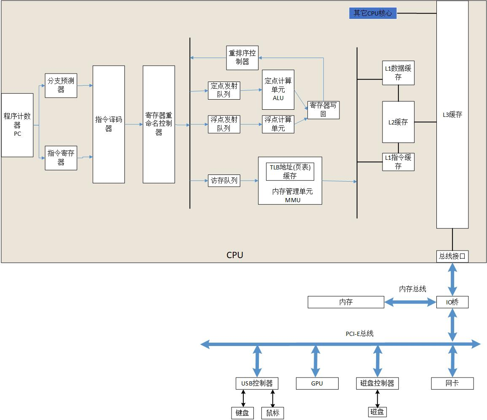
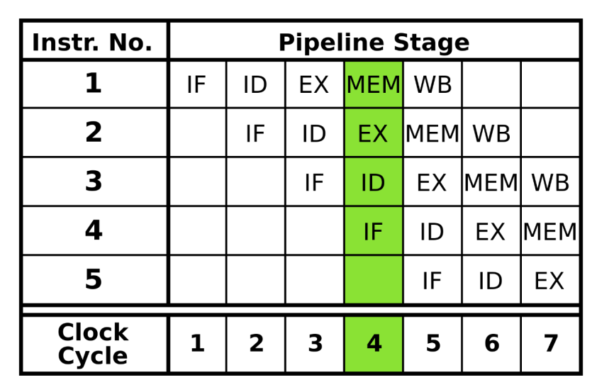
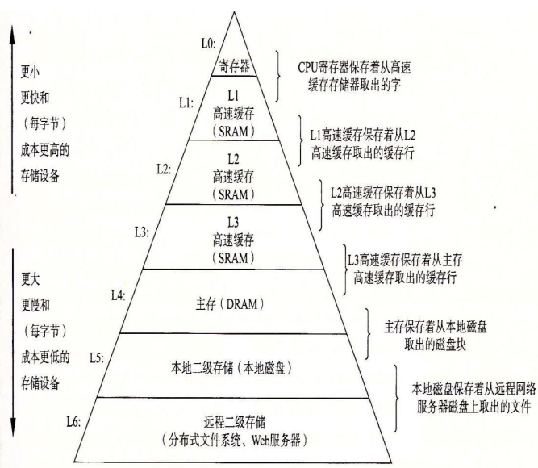
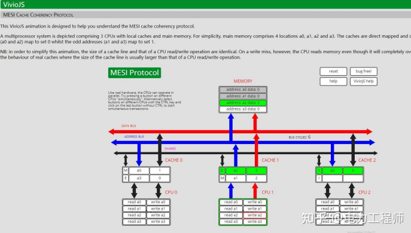
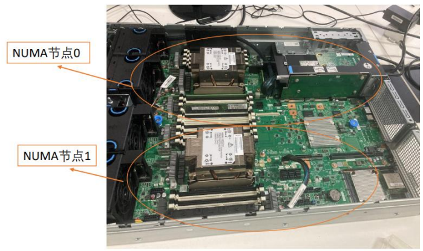

# 计算机系统之旅

作者：邹德虎更新时间：2026-03-25

本文用极简的方式论述计算机系统，所以叫做“计算机系统之旅”，同时在涉及某些底层特性时，以应用程序开发者的角度来说明系统级编程的若干注意事项。本文可以为计算机专业工程师提供查阅的索引，也可以作为其它专业工程师的科普材料（特别是电气工程师）。

本公众号的主题是电力系统，有种说法是电力系统是人类制造的最大系统。那么计算机系统就是人类制造的最精细的系统了。因此，电力系统和计算机系统两个领域其实有很多可以相互借鉴的地方。本人也长期致力于促进电力系统自动化和数字化的发展。

关于计算机系统架构，我画了如下的图：

这张图上半部分是CPU的内部结构，下半部分是IO总线和外部设备。

## 1 处理器体系结构

首先讨论CPU和算盘的不同。它们都能计算，但算盘的指令是外部输入的，而CPU的指令是预先存储的，因此计算机可以编程和编译成机器码，但算盘不能；其次是主频不同，算盘和机械式计算机的主频最多只有10Hz，但是CPU采用微电子技术，主频可以高达数GHz，性能差距非常大。

为什么CPU主频可以如此之高？主要是使用晶体振荡器，利用石英晶体的压电效应来产生稳定的振荡频率，但这个频率相对较低，例如数MHz的范围。因此，CPU使用锁相环(PLL)跟踪晶体振荡器，同时使用振荡器产生更高且稳定的频率。新能源发电其实也大量使用锁相环(PLL)，原理相似但目的不同。

下面讨论CPU功耗，假定晶体管简化成包含电阻、电容的开关电路。接入直流电源时，电容器开始充电。在这个过程中，电容器两端的电压逐渐上升，而电阻上的电压逐渐下降，直到电容器完全充电。这个过程中，若把导通通道简化为电阻 \(R\)，则一次由 0 充电到 \(V\) 的过程中，电阻耗散的能量为：

$$
I(t) = \frac{V}{R} e^{-\frac{t}{RC}}
$$

$$
E_R = R\int_0^\infty I^2(t)\,dt = \frac{1}{2}CV^2
$$

这里的积分到无穷大是RC指数响应的精确数学结果，并不是因为时间常数很小而“近似忽略误差”。对于CMOS电路，更常用的动态功耗近似式为：

$$
P_{\mathrm{dynamic}} \approx \alpha C_{\mathrm{eff}} V^2 f
$$

其中 $\alpha$ 是开关活动因子，$C_{\mathrm{eff}}$ 是等效被充放电电容，$f$ 是时钟或等效切换频率。这个公式说明动态功耗对电压近似呈平方关系、对活动率和频率近似呈线性关系，但实际处理器还存在静态泄漏功耗、短路功耗以及电源管理等因素，因此不能仅凭一个简化式推断整颗CPU的总功耗。 CPU的工作原理，其实就是反复的执行以下过程：1）取指阶段：CPU从内存中取出指令，存放到指令寄存器中。2）译码阶段：控制单元对指令进行解析，确定需要执行的操作。3）执行阶段：ALU根据控制单元的指示执行算术或逻辑运算。4）访存阶段：若操作需要访问内存，则在这一阶段进行。5）写回阶段：将运算结果写回到指定位置。 为了提高性能，现代的CPU总是采用流水线，一个简单的示意图如下：

(IF：读取指令，ID：指令解码，EX：执行，MEM：存储器访问，WB：写回寄存器)

当然实际的CPU流水线要复杂的多，要考虑运行过程中降低流水线阻塞，从而引入乱序执行、分支预测等技术。分支预测是预测程序中的分支（如if-else语句）如何执行，以减少等待分支解析的时间。现代CPU建立重排序缓冲区，用于维护程序的原始执行顺序，确保结果的正确性。相当于有调度器的存在了，只不过和进程调度相比，是纯粹由硬件实现的。乱序执行允许处理器在执行指令时不受原始程序顺序的限制，根据指令之间的依赖关系和可用资源动态调整执行顺序。这种策略旨在最大限度地减少由于等待数据或资源而导致的空闲处理器周期，从而进一步提高指令吞吐量。乱序执行在流水线中，将译码后的指令放入一个名为“指令窗口”的缓冲区，等待被执行。指令窗口会根据指令之间的依赖关系动态调度指令，优先执行无依赖关系的指令。

对于性能敏感的应用，需要考虑提高分支预测的正确性。首先是避免复杂的控制流，尽量避免深层嵌套的条件语句和循环，而是使用更直接的逻辑。其次是使用循环展开，当然很多编译器的高选项可以自动循环展开。然后是如果数据可以排序，那么对数据进行排序，使得分支预测更为容易。例如，在搜索和比较操作中，有序数据可以显著减少分支预测的错误。最后，函数调用本身是一种分支。尽可能地内联小函数可以减少分支次数，特别是在性能关键的循环中。（当然，编译器的高选项可以自动内联很多函数）。

现代CPU普遍还有SIMD技术，核心思想是在单个操作周期内，使用一条指令对一组数据执行相同的操作，从而提高数据处理的效率。很多高性能矩阵计算库都使用了SIMD技术，例如C++的Eigen库。另外，glibc的若干标准库实现也使用了SIMD技术，例如在处理字符串函数（如memcpy, strcmp, strlen等）和内存操作函数（如memset）时，glibc会利用SIMD指令（如SSE, AVX）来加快处理速度。

为了高效地利用SIMD，数据通常需要特定的内存对齐。如果一个SIMD指令一次处理四个32位的浮点数，那么理想情况下，这些数据应该在128位的边界上对齐。对齐的数据访问有助于更高效地使用缓存。在某些情况下，编译器可能会添加填充以确保对齐。

前段时间同事分析计算C++程序，考虑时钟频率、循环次数和操作，计算出的时间比实测时间长很多。问题出在：没有考虑流水线对CPU吞吐量的倍增，以及可能的编译器SIMD优化。

对于复杂的指令，CPU可能拆分成微指令执行，微指令是一种在处理器内部用于实现指令集架构的底层控制信号，并不能在汇编的层次表现出来（也就是说，讨论RISC和CISC的区别已经没有多大意义）。对于很多浮点计算，可能由专用的硬件模块（如浮点单元FPU或者定点运算单元）来实现。但是对于三角函数、对数函数等复杂函数，现代CPU更倾向于软件实现。例如正弦函数，现代libm/glibc通常采用参数约简、多项式或有理逼近，并结合平台特定优化实现；在部分架构和版本中会使用汇编或SIMD指令，但不能概括为“glibc的正弦函数就是由汇编语言实现”。

## 2 存储器体系结构

存储器体系结构最重要的概念大约是“存储山”和局部性原理。存储山示意图如下：

(图片来源于《深入理解电力系统》)

对于程序来说，打交道最多的存储是内存。在内存之上是缓存，提高缓存的命中率将以数量级的优势提升程序性能。缓存优化主要通过“局部性原理”，包括：1）时间局部性，当一个对象由内存加载到缓存后，我们希望后续还有更多的对这个对象的访问，这样命中的访问比在内存中快得多。2）空间局部性，缓存有一定容量大小，对象加载到缓存后，附近的对象大概率也加载进来。因此访问对象尽可能不要大幅度跳跃。

对于缓存的利用，可能是最能拉开计算机系统专家与普通程序员差距的地方。比如说高性能的BLAS实现通常采用分块（block partitioning）策略来优化缓存利用率。在分块矩阵乘法中，矩阵被划分为较小的子矩阵或块。这些块的大小通常选择以使得至少一部分的块能够完全载入L1或L2缓存。然后，矩阵乘法在这些较小的块上执行，从而减少了对主内存的访问次数。

现代通用CPU通常具有多级缓存，但具体层数、容量和共享方式取决于微架构。常见设计中L1通常为每核私有，L2可能私有也可能按簇共享，末级缓存则可能由多个核心共享；不能把“L1/L2私有、L3全芯片共享”作为所有CPU的固定结构。L1和L2，L2和L3之间，为了保证快速性，多采用Crossbar电路。但CPU内部如果核心数众多，核心与核心之间可以采用Ring环形网络，也可以采用Mesh网络。CPU核心的缓存一致性通常采用MESI协议或其扩展如MOESI和MESIF协议，但应用程序仍需要内存屏障和锁保证一致性。

保证多核CPU缓存一致性的MESI协议学起来非常抽象，但是如果有可视化的工具，结合自己的操作，理解起来就非常容易。下面是可视化的MESI协议模拟网站，虽然很简单，但互动性非常强，可以通过鼠标点击模拟。（网址为：[https://www.scss.tcd.ie/Jeremy.Jones/VivioJS/caches/MESIHelp.htm）](https://www.scss.tcd.ie/Jeremy.Jones/VivioJS/caches/MESIHelp.htm%EF%BC%89)

对于缓存一致性问题，在编程时应注意：

1.  在多线程程序中，要意识到缓存行对齐和伪共享的问题。伪共享发生在多个线程访问相同缓存行（一般是64字节）中的不同数据时，可能导致性能下降。我们在设计多线程数据结构时，可以有意插入无用的占位字节，这样避免缓存行冲突；

2.  多线程同步数据应该特别小心。大多数现代编程语言和库提供了同步原语，如锁（mutexes）、信号量（semaphores）和屏障（barriers），以帮助在多线程环境中管理数据的一致性。锁的性能可能不让人满意，进入无锁编程那就更要小心为上了。需要了解内存顺序（memory order）的概念，特别是在使用原子操作时。不同的内存顺序可以提供不同程度的性能和一致性保证（ARM的一致性保证要比x86-64低）。在某些低级编程场景下，可能需要使用内存屏障（memory barriers）来强制特定的内存操作顺序，以保持缓存一致性。

3.  volatile的作用主要是指示编译器在生成汇编代码时，对标记为volatile的变量进行特殊处理：确保每次访问变量时都直接从内存读取或向内存写入，而不是使用寄存器中的缓存值。JAVA的volatile可以保证多线程编程中的原子性；但是C/C++中的volatile不能保证线程安全或原子性。（虽然在x86-64中使用C++中的volatile可以使得多线程问题降低为小概率事件，但仍是不严格的）。C++中的原子操作应该使用std::atomic。

## 3 系统IO与外部设备

计算机的输入/输出（I/O）系统是计算机硬件的重要部分，负责数据在计算机内部（如处理器和内存）与外部（如硬盘、网络、打印机等）之间的传输。以下是I/O系统的基本工作原理：

1.  设备控制器：I/O设备拥有自己的设备控制器。设备控制器的任务是将接收到的指令转化为适合特定硬件设备的信号，并管理与设备的通信。例如，硬盘驱动器控制器将操作系统发出的读取或写入指令转化为对特定硬盘扇区的操作。

2.  中断与DMA：在早期的计算机系统中，CPU直接进行I/O操作，这样会大量浪费CPU的时间。现代计算机采用中断和直接内存访问（DMA）的方式进行I/O操作。当I/O设备准备好进行数据传输时，它会发送一个中断信号给CPU，CPU会暂停当前的任务，处理I/O操作，然后再返回到被打断的任务。DMA则允许设备控制器直接与内存进行数据交换，而无需CPU介入，从而进一步提高效率。

3.  缓冲：为了解决CPU与I/O设备处理速度的不匹配问题，通常会使用缓冲。缓冲可以让CPU和I/O设备在不同的速度下进行操作。例如，当数据从一个慢速设备（如键盘）输入到一个快速设备（如内存）时，数据可能会被临时存储在一个缓冲区中，直到CPU有时间来处理这些数据。

4.  I/O编程：在程序设计中，通常会使用特定的I/O函数库来处理输入和输出。这些函数库提供了高级别的抽象，使得程序员无需关心底层的硬件细节，就可以进行数据读写。在操作系统中，I/O系统管理是重要部分，它包括设备驱动程序的管理、I/O调度以及错误处理等功能。可以说，Linux内核大多数代码都是IO设备的驱动。

对于大多数IO设备，在BIOS启动阶段，I/O设备需要进行的主要步骤：

1.  电源自检（POST）：当计算机开机时，BIOS会首先执行电源自检（Power-On Self-Test，POST）。在这个过程中，BIOS会检查计算机的硬件设备，包括CPU、内存、硬盘、显卡以及其他I/O设备，以确保它们都正常工作。

2.  设备初始化：在电源自检通过后，BIOS会初始化硬件设备。这通常涉及到设置设备的工作模式，以及为设备分配系统资源，如内存空间和I/O端口。设备检测：BIOS会检测所有连接的设备，包括PCI和PCIe设备，以及USB设备等。这些信息会被记录在系统的配置表中，并在之后被操作系统使用。

3.  启动设备选择：BIOS会根据用户设置的启动顺序，从中选择一个启动设备。这通常是一个包含了操作系统的硬盘，但也可以是一个USB驱动器，或者网络启动服务。

4.  引导加载：BIOS从启动设备中读取引导加载程序，然后将控制权交给它。引导加载程序的任务是加载操作系统内核，并开始执行它。

以上就是在BIOS启动阶段，I/O设备需要进行的主要步骤。需要注意的是，现代的计算机可能使用UEFI（统一的可扩展固件接口）替代了传统的BIOS。UEFI提供了更多的功能和更好的安全性，但其基本的工作原理与BIOS类似。

对于部分灵活的IO设备，例如鼠标、键盘、显示器等，可以实现通过PCI设备的热插拔（Hot-Plug）机制来检测新设备的连接。Linux内核通过监听PCI总线的特定信号，可以得知新设备已经连接。如果找到适配的驱动并成功加载，设备就可以开始正常工作。这个过程是完全在操作系统层面完成的，不需要BIOS的参与。

下面讨论几种典型的外部设备:

1.  GPU（图形处理单元）。最初，专门的图形处理任务由 CPU 完成。后来，随着个人计算机和视频游戏的普及，出现了专用的图形卡。GPU 最初被设计用于图形渲染，它们能够高效处理复杂的 3D 图形算法，包括光线追踪、纹理映射、几何处理等。2000年代中期，GPU 开始被用于非图形的并行计算任务，标志着 GPU 的通用计算能力（GPGPU，通用图形处理单元）。人们发现，GPU特别适合深度学习等人工智能算法的运算，GPU 的功能和应用范围进一步扩展。 GPU 拥有成百上千个小核心，能够同时处理大量的计算任务，这使得它们非常适合进行并行处理。为了利用 GPU 的并行计算能力，出现了多种 GPU 编程工具和平台，如 CUDA、OpenCL等。

2.  FPGA（现场可编程门阵列）是一种特殊类型的数字电路。最初的 FPGA 设计目的是为了提供一种灵活、可重新配置的电路，以适应快速变化的技术需求。随着电子技术的进步，FPGA 变得更加强大、更具成本效益，开始被广泛应用于各种场合。90年代和2000年代，FPGA 的使用从原型设计扩展到了生产应用，尤其在通信、信号处理和嵌入式系统领域。 FPGA 最显著的特点是其可编程性。开发者可以通过编程来配置 FPGA 的逻辑门和连接，以实现特定的电路功能。FPGA 的灵活性允许开发者在硬件层面上快速迭代设计和测试不同的配置。FPGA虽然通常具有比CPU低的主频，但它们在处理某些类型的低延时任务时更为有效。主要是纯硬件实现具有更高的并行度。这种硬件级别的执行可以避免传统CPU中的一些开销，如指令获取、解码、访存等。FPGA通常不运行操作系统，这意味着在执行任务时无需操作系统调度或上下文切换的延迟。FPGA 的编程通常比传统软件编程更复杂，需要对硬件描述语言（如 VHDL 或 Verilog）和数字电路设计有深入理解。FPGA 的编程是完全离不开EDA工具的。

3.  TPU（Tensor Processing Unit）是谷歌近年来研发的一种ASIC芯片，进行机器学习和深度学习任务。TPU针对深度学习中的矩阵乘法和累加操作进行了专门化设计，这使得它在执行这些操作时比通用GPU更高效，TPU提供了更高的吞吐量和更低的延迟，特别是在处理大规模的神经网络时。同时借鉴了FPGA的一些做法，使用了定制的低精度算术，这在保持够用的精度的同时，大大提高了计算效率。同时，TPU在每瓦特的性能表现上有显著优势，这对于大规模数据中心尤其重要。

## 4 服务器与超级计算机

服务器可能有多个CPU。CPU与CPU之间的片外连接，主流技术是Intel的QPI和新一代互连技术Ultra Path Interconnect（UPI）。QPI和UPI的设计主要用于在同一个服务器或工作站中连接处理器、内存和I/O设备，其传输距离通常在几厘米到几十厘米之间，不适合跨越服务器的连接。QPI和UPI与PCI-E的带宽属于同一数量级，但应用场合不同。UPI和QPI需要保证多CPU的缓存一致性，因此适合构建基于共享内存的超级计算机。例子：戴尔的R940服务器应用了QPI线缆，来连接双层主板。

对于大规模共享内存的超级计算机，设计需要考虑ccNUMA（Cache-Coherent Non-Uniform Memory Access）。在NUMA架构中，处理器和内存被划分为多个节点，每个节点包含一个或多个处理器和一部分本地内存。内核和应用程序考虑NUMA会得到显著的性能提升。下面是我拍摄的图片，说明NUMA概念。

对于更大规模的多节点超算集群，已经不能保证共享内存，这时候需要采用网络连接。其中最快速的连接是InfiniBand（比以太网接口的延时低）。此时应用程序编程应采用MPI等工具。但是也有超算集群用的是高性能以太网，这时候要求网卡至少应具有RDMA功能（不依赖CPU直接传输网络数据）。

## 5 操作系统

操作系统（以Linux为例）有如下主要功能：

### 1）内存管理：内核管理系统的物理和虚拟内存，包括内存分配、分页和交换。

计算机系统的应用程序采用虚拟内存，实际需要转换为实际内存。从虚拟地址转换为实际的物理地址是一个涉及硬件和软件共同协作的过程。这个过程主要由硬件（如CPU内的内存管理单元MMU、TLB等）执行，但软件（如操作系统的内存管理子系统）也扮演着关键角色。操作系统负责设置页表；处理TLB失效：当TLB中没有找到虚拟地址的映射时，操作系统会介入处理TLB失效。它会在页表中查找相应的映射，并更新TLB。

操作系统还负责更高层次的内存管理，如分配和释放内存页，处理页面置换（如页面调入/调出，从磁盘加载缺失的页面到物理内存），以及管理虚拟内存空间。

### 2）进程管理和任务调度

Linux内核负责创建和管理进程。进程是系统中运行的程序的实例。内核控制进程的创建、调度和终止。Linux内核支持抢占式多任务处理，允许多个进程几乎同时运行，提高了系统的效率和响应速度。

在应用程序编程中，应该特别注意上下文切换的开销。所谓的上下文切换指的是操作系统保存当前进程（或线程）的状态（即“上下文”），并加载另一个进程（或线程）的已保存状态的过程。

上下文包括：寄存器状态：包括程序计数器、栈指针、通用寄存器和状态寄存器等。程序状态：当前的执行状态，如程序计数器的值。内存管理信息：如页表、虚拟内存等。进程控制信息：包括进程的优先级、调度信息等。

上下文切换的成本包括：性能开销：上下文切换需要时间来保存和加载进程状态，这个过程中CPU不执行任何进程的实际计算任务。缓存失效：切换进程可能导致CPU缓存的数据不再有效，因为新的进程有不同的内存访问模式。

上下文开销的例子包括：

1.  时间片耗尽：当一个进程的时间片用完时，调度器会选择另一个进程运行。
2.  I/O请求：进程发出I/O请求后，由于I/O操作相对较慢，CPU可能会切换到另一个进程，以充分利用处理器时间。
3.  等待资源：进程等待如信号量、互斥锁等资源时，也会触发切换。
4.  高优先级进程就绪：当一个优先级更高的进程变为就绪状态时，操作系统可能会选择中断当前进程，转而执行高优先级的进程。
5.  中断处理：当处理完一个中断后，内核可能会决定切换到不同的进程。

### 3）中断与设备驱动

中断是硬件或软件发出的信号，表明需要立即注意的事件。例如：响应外部硬件事件：当硬件设备需要CPU注意时（例如，硬盘完成数据读取），它会发出硬件中断。或者由系统调用或内核操作触发（软件引起）。

设备驱动程序是内核的一部分，它们提供了操作系统与硬件设备通信的接口。Linux内核的中断处理机制确保了对硬件事件的快速响应，而设备驱动管理则提供了与各种硬件设备交互的必要接口和控制。这两个方面共同保证了Linux操作系统在硬件管理方面的高效性和灵活性。

下面从Linux内核的角度，说明IO的工作过程，通过键盘和鼠标的例子来简化解释。

1.  硬件中断：当你按下键盘的一个键或者移动鼠标时，这些设备会发送一个硬件中断给CPU。这个硬件中断是一个信号，告诉CPU有一个新的I/O事件需要处理。CPU在完成当前的指令后，会暂停其他任务，开始处理这个硬件中断。

2.  中断处理程序：Linux内核为每种硬件设备都定义了一个中断处理程序（Interrupt Handler）。这个程序的任务是读取和解析从设备发送过来的数据。例如，键盘的中断处理程序会读取被按下的键的扫描码，并将其转换为对应的字符。 设备驱动程序：中断处理程序通常是设备驱动程序的一部分。设备驱动程序是一个软件，它知道如何与特定的硬件设备进行通信。Linux内核包含了许多设备驱动程序，用来处理各种不同的硬件设备。

3.  数据缓冲：设备驱动程序通常会将数据保存在一个缓冲区中，等待用户空间的程序来读取。例如，当你在终端输入命令时，键盘驱动会将你的键入保存在一个缓冲区中，然后等待shell程序来读取和解析。

4.  用户空间程序：用户空间的程序可以通过系统调用来读取设备的数据。例如，shell程序可以调用read系统调用来读取键盘输入的数据。同样，图形用户界面程序可以读取鼠标的移动和点击事件。

5.  系统调用返回：当用户空间的程序读取完设备的数据后，系统调用会返回，程序可以继续执行其他任务。此时，如果有新的I/O事件发生，整个流程会再次重复。

以上就是从Linux内核的角度来看，键盘和鼠标等I/O设备的工作原理。

## 6 分布式计算机系统

大多数非科学计算的常规业务，并不是数据CPU密集型的，但业务本身是高并发的。这时候适用于松耦合的分布式计算机系统。分布式计算机系统，计算机之间采用普通的网线，甚至不在同一个城市。

在设计分布式计算机系统时，需要考虑许多因素以确保系统的可靠性、可扩展性和高性能。以下是一些关键因素：

1.  可扩展性：分布式系统应具有良好的可扩展性，能够在增加计算资源时保持高效的性能。这意味着系统应当能够水平扩展（添加更多节点）以应对不断增长的工作负载。
2.  容错性：分布式系统需要具备容错能力，即使在部分节点发生故障的情况下也能正常运行。这可以通过引入冗余、备份和数据复制等技术实现。
3.  数据一致性：在分布式环境中，保持数据的一致性是一个关键挑战。根据系统的需求和特点，可以选择不同的一致性模型，如强一致性、最终一致性或因果一致性等。
4.  数据分区和分片：为了实现高并发和负载均衡，分布式系统需要将数据和任务分散在多个节点上。数据分区和分片技术可以帮助实现这一目标，同时需要考虑数据访问的局部性和热点问题。
5.  负载均衡：分布式系统需要实现负载均衡，以充分利用计算资源并避免单点瓶颈。负载均衡可以在多个层面实现，如网络层、应用层或数据层等。
6.  监控和运维：分布式系统的监控和运维是确保系统稳定运行的关键。需要实施实时监控、报警、日志收集、故障排查等机制，并建立相应的运维流程和团队。
7.  可用性：设计分布式系统时，需要考虑如何保证高可用性。这可以通过引入多个数据中心、热备份、故障切换等技术实现。

分布式计算机系统关键技术之一是容器，容器可以将应用程序及其依赖项打包在一起，确保在不同的环境中保持一致性。容器可以在任何支持容器技术的系统上运行，不受底层操作系统和硬件的限制。容器技术可以简化依赖管理，将所有依赖项打包到一个隔离的环境中，避免了潜在的冲突。

容器技术是基于Linux内核的Namespaces（命名空间）、Control Groups（控制组，简称cgroups）等技术实现。命名空间是Linux内核中的一种轻量级隔离机制，它允许将系统资源划分为独立的隔离单元。cgroups是Linux内核中的另一种资源管理技术，它允许对一组进程的资源使用（如CPU、内存、磁盘I/O等）进行限制和监控。通过cgroups，可以确保容器之间的资源分配和使用是公平的，并防止某个容器消耗过多资源导致系统不稳定。

Kubernetes是一个容器编排平台，用于自动化应用程序容器的部署、扩展和管理。它适用于构建和部署微服务架构、分布式系统以及云原生应用程序。Kubernetes通过声明式配置、弹性伸缩和自动化管理简化了容器化应用程序的生命周期。

对于传统的科学计算，如果子任务的耦合程度并不是非常高，可以应用容器和Kubernetes，这种方法可能不如MPI在性能方面高效，但可以更好地利用Kubernetes的自动化管理和弹性伸缩功能。例如OpenAI公司已经使用Kubernetes训练自然语言大模型。

## 7 总结

结束本文的计算机系统的之旅，似乎可以提炼出一些共性的点或者思考结论：

1.  在计算机系统中，硬件和软件是相互依存的两个方面。无论是最简单的个人计算机还是最复杂的超级计算机，它们都需要这两个组件紧密协作，才能完成各种任务。例如，操作系统软件协调硬件资源的使用，应用软件则提供特定的功能，如文字处理、图像处理或数据库管理。即使是FPGA，似乎是纯粹的硬件，它的设计是离不开EDA软件工具的。 这一点与电力系统是一致的，硬件是电力设备和二次设备中的装置平台，同样需要软件的组织，与管理体系和经济社会连接，才可以作为整体运行。

2.  曾经由软件执行的大量计算任务，渐渐转移到专为这些任务设计的硬件上。显著的例子是图形处理单元（GPU）。最初，计算机图形主要由CPU处理，但随着图形处理要求的提高，GPU应运而生，专门用于处理复杂的图形和图像计算。这不仅极大地提高了处理效率和性能，还减轻了CPU的负担，使其可以处理其他任务。这种“硬件化”的趋势也出现在了网络处理、数据加密、音视频处理等领域。但是新的需求往往是先在软件层次实现的，直到成规模后才考虑硬件化。硬件和软件是此消彼长的过程。在过去的10多年时间，软件技术更加活跃。但是近期，乃至未来的若干时间，反而是硬件发展更快，需要软件体系迅速改变（尤其是底层基础设施），跟上硬件的发展。在电力系统方面，同样存在一次系统投资建设与二次设备（包括自动化和信息化系统）之间此消彼长的过程，不同的历史时期重点是不同的。

3.  在计算机系统的发展中，协议扮演着至关重要的角色。协议定义了不同计算机组件、系统、网络及其它设备之间交流的规则和标准。这一点对于硬件和软件的协同工作尤为重要。协议确保了来自不同制造商的组件和系统能够无缝对接和交互，从而支持了一个多样化且互操作的计算生态系统。例如，网络协议如TCP/IP为不同类型和品牌的设备之间的通信提供了标准化的方法，而数据传输协议如USB和PCI-E则确保了各种类型的硬件设备能够有效地相互连接和通信。协议制定好后，不同的厂家都可以各自精益求精的专心研发，然后组合成完整的系统。在传统上，电力系统的技术承包商竞争不激烈，因此协议的重要性显著不如计算机系统。但是未来，随着电改的深入推进，电力系统的开放性必将大幅度提升，未来的电力系统协议，以及不同技术厂商和甲方的交互，将更加显著。
