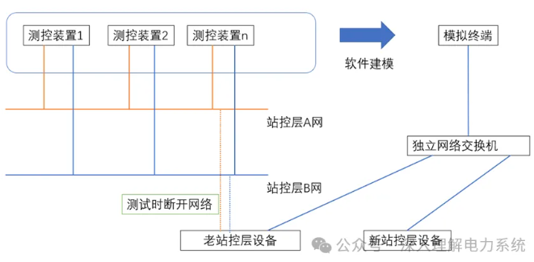

# 论电力系统仿真

作者：邹德虎更新时间：2026-03-25

说明：本文包含对仿真技术与产业格局的历史观察。涉及具体产品、平台和市场状态的表述，均应理解为原文写作阶段的观察；后续技术演进应以新的公开资料和实际测试为准。

## 1 仿真的定位

电力系统的仿真具有独特的重要性。因为，电力系统做实验的成本很高，不是想做个三相短路实验就可以去做的。要想对电力系统的规律有本质的认识，一靠观测、测量；二靠仿真。仿真是技术性和艺术性的结合，去伪存真，把本质的因果关系用数字的形式复现出来。并不是说仿真就一定要跟电力系统一模一样。比如说你需要研究分布式能源对于区域电网规划的影响，就没有必要建立特别完整的电磁暂态模型，这样工程实现代价太大，仿真只需要在你所关心的层面用数字得出客观的结论。

搞电力系统仿真的技术团队，要么处于边缘化的状态；要么处于核心的地位。前者是把仿真搞成了边缘性的工具，比如说给调度员提供反事故演习，一年也进行不了几次，而且发挥作用的空间仅限于调度中心内部；或者给科技项目写报告、写论文，报告最终也没几个人认真阅读。后者是真正的把仿真搞成了推动核心技术的支撑力量，新研发的设备到底好不好用，会不会有潜在问题在设计时候没想到；重大的规划有没有隐患点；这么多东西都需要仿真提供依据。另外，仿真模型建立过程中本身就有核心技术在里面。比如全过程动态仿真中需要建立AGC模型，本身就相当于研发了一个原型AGC，虽然这个原型AGC与现场运行的AGC有本质差别，但是多了一个技术手段，可以为实际的AGC系统提供一些有价值的参考信息。现场实际的装置或者应用，代码非常长，可能有bug隐藏在里面，不一定是容易暴露出来的，仿真在现场运行之外，多了一种技术手段。本身可以为研发提供指导。

仿真的国产化是非常重要的，如果在国外的仿真平台上搭建模型，应付常规的各项工作任务当然没有问题。但是，对于核心技术的检验和推动，必将大打折扣。我个人觉得，也许比较偏激：在国外的仿真平台上做工作，后面会逐渐过渡到全部的国产化，这应该是很快的过程。当然，学术界做研究，只要没有版权问题，用国外的仿真平台是没有问题的。

## 2 国内仿真的发展

大约从20世纪80年代左右，中国电科院汤涌等牵头从美国购买了BPA的全套代码（也包括EMTP的），从此开始电力仿真软件的国产化。与此同时，南瑞牵头从西屋公司购买了四套能量管理系统，这是调度系统的国产化。这两个事件是差不多同时期的，这也奠定了电科院和南瑞分别在仿真和调度方向的龙头地位。

南瑞曾经也试图开发自己的仿真软件，例如薛院士旗下的稳定公司开发出的FASTEST；由姚建国牵头，依托调度系统开发的DTS仿真培训（后来扩展到变电站培训等）。但是南瑞在仿真这一块的开发始终没有形成合力，没有开发成功系列化的商业产品。

下面重点还是说中国电科院的情况，当然我对南网的情况不了解，听说南网在仿真方面也做了相当多的工作，除了交直流电网仿真之外，也有很多自主研发的工作，本文就不涉及了。当时周孝信院士和汤涌是两个不同的团队，甚至都不是同一个所，后来这两个团队才合并为现在的电力系统研究所。当然，现在又有了国家电网仿真中心，这是后话。

汤涌团队主要在吸收消化BPA的基础上，推出了中国版的BPA软件，后来改称PSD软件。PSD后来有许多新的应用，例如全过程动态仿真、离线的纯电磁暂态仿真等等。这个软件最大的特色是输入数据的格式非常特别，是用非常固定格式的文本方式输入。后来虽然也开发了可视化界面，但是这个原始的数据输入格式仍然保留了下来。由于输入格式是开放的，所以非电科院的其它单位也可以开发基于BPA的附属小应用，例如南瑞继保曾经就开发过。我本人也开发过BPA文本的解析程序，把BPA的DAT/SWI文件转换为别的公司可以识别的形式。

周孝信院士团队长期推动PSASP等自主电力系统分析软件的发展，并取得重要科技成果。早期工程软件普遍更重视计算内核，图形化和图模一体化能力相对有限；后续版本逐步加强平台和界面团队建设，体现出工业软件从“算法程序”向“完整工程平台”演进的过程。

后来国内科研团队进一步把研究扩展到实时仿真，研制了具有自主知识产权的实时仿真平台，并获得国家级科技奖励。在当时的历史条件下，完成自主实时仿真平台是一项重要突破。今天再评价不同产品，不宜使用“唯一可以抗衡”或笼统的“有差距”来下结论；更合理的做法是分别比较模型库、实时步长、硬件接口、可扩展性、用户生态、工程验证和长期维护能力等维度。

国内的部分高校也开发了自主知识产权的仿真软件，例如清华大学、东南大学等。这些仿真软件可以看成对电科院仿真产品的补充，各有侧重点，比如说，高校的仿真产品可能对分布式电源高密度接入、综合能源等有独特的技术。

## 3 仿真的后续趋势

后续的国内仿真软件发展，我觉得会有以下趋势：

1.  仿真模型由离线向在线扩展。目前的仿真软件应用场合，主要还是供电局的方式计算；以及经研院、设计院的规划设计；以及电科院及研发企业的试验检测等等。虽然不能不说这些场合也是工业应用，跟纯理论研究不一样。但毕竟离真正的一线现场还有些距离，仍然是属于实验室产品。仿真的在线化，目前有以下几种方式：一是建立专用云仿真平台，至少保证电网企业的仿真工作都在线上进行，不会有数据泄露的可能。云仿真平台可以实现规划、方式计算等；二是对调度自动化系统进行功能扩展，可以直接在调度的电网模型和实时数据基础上进行仿真分析，调度的网络分析、在线安全稳定分析等都属于这一框架；三是结合数据中台等，汇集全业务数据，在此基础上开发同步的仿真分析APP。

2.  模型由传统的电力系统模型向真实环境扩展。所以仿真中需要考虑各种装置的影响、边缘侧资源与调度主站平台的互动；虚拟电厂的模型需要考虑电力市场和交易规则，甚至多个主体的博弈。另外，实际的现场通信环境远没有实验室理想，越来越多的课题将通信仿真纳入电力系统仿真中。

3.  仿真本身的商业模式可能会发展。目前，仿真更多的处于幕后，为科技项目、设备检测、规划设计等提供支撑，仿真本身并不处于前台。那么，以后随着仿真需求的多样化、细分化，及国产化的推进。我预测仿真本身可以（包括仿真装置的提供和建模技术服务等）可以独立成一个市场，虽然这个市场空间没有现在的调度或者配电那么大。其实，现在每个地市公司都有DTS仿真、变电站仿真，说不定还有配网仿真，但多半没有形成闭环，仍是孤立运行的，没有发挥最大的作用。另外，电网公司对于本系统的设备是有质量把控、检测的需求的，这都是未来可能的市场空间。

## 4 仿真驱动解决电力系统问题

最近看了西南电网的PPT报告《电网全过程动态频率仿真技术在西南电网的应用》，写得非常精彩。这是通过仿真驱动，解决电力系统控制问题的一个典型范例，有必要推广介绍下。

西南电网需要开发大量水电，为解决与华北-华中电网的弱联络问题，2019年起西南电网异步运行，主要的稳定性问题由功角稳定转变为频率稳定，因此AGC软件的重要性提高了。但是，原有的AGC软件出现了问题，甚至出现反调现象。

为了深入复现并分析问题、验证新AGC策略，西南电网与中国电科院系统所深入合作，建立了中长期动态频率仿真平台。中国电科院系统所在中长期变步长仿真方面有丰富的经验，他们深入研究Gear算法，并针对电力系统进行了专门的优化。而AGC的准确仿真，并不能简单的采用暂态仿真程序来建模，因为AGC的动态时间是比较长的。

值得注意的是，中国电科院系统所不是生产AGC的厂家，但他们的加入补全了解决问题的重要一环。

对于厂家研发人员来说，需要理解：提供产品和提供解决方案是不同的。厂家编制AGC程序，用的是成熟算法。另外提供参数接口，例如频率偏差(B)系数、PI增益系数、滤波系数。参数具体怎么设置，则交给用户凭经验整定。如果遇到现场的复杂问题，仅仅凭借经验可能束手无策。提供完整的解决方案，厂家不仅仅是研发产品，而且具备解决复杂技术问题的咨询能力。对于电力系统这个行业，仿真技术（包括建模、仿真软件编制、仿真结果分析等）是整体技术能力中的重要一环。

仿真除了作为技术支撑能力之外，对于保证研发质量和提高控制可靠性也是需要的。以AGC为例，前段时间某电网出现过主备切换时，控制指令误发，造成新能源发电损失。如果建立贴近现场的仿真测试环境，有可能减少这类事情的发生概率。不仅仅是AGC，现场运行的大量设备，例如系统侧的AVC、配电网馈线自动化与运行优化等；装置侧的大量控制保护装置，都需要保证极高的运行可靠性。

最近一段时间，很多新能源企业也加强了对仿真技术的投入力度。因为他们发现，如果光是从装置层面研发产品，并入电力系统的时候很可能会出现问题。这就要求电网技术人员和装置研发人员共同合作，去分析和解决问题。新能源企业招聘电网仿真专家，也能促进产品的研发改进。

仿真在新能源并网问题上，同样起到重要的关键支撑的作用，因为现场实际测试的代价很大，需要通知调度，进行各方面准备，现场测试不可能面面俱到。PSModel电磁暂态仿真软件最新的宣传册指出，采用新能源整站建模和厂家黑盒模型，发现了厂家模型的某些适应性问题，与厂家沟通解决了这些问题。这就是很好的案例。

最后我想指出的是，仿真不是唯一重要的技术。但在目前的阶段，仿真能力的缺失是很多电网研发单位的共性问题。另外在我看来，电力系统的最重要基础能力是仿真和运筹优化。仿真已经基本国产化了，运筹优化求解器也有必要国产化，并解决电力市场中的大量优化问题。

## 5 谈谈MATLAB仿真

### 5.1 概述

先从十几年前说起，当时我还是刚本科毕业，参加工作的小年轻，在变电站工作。当时遇到一个小问题：断路器在分合闸时，保护装置测得了瞬时的零序电流，这个其实是很简单的问题，我用MATLAB仿真的方式圆满解释了其中的机理（主要机理就是断路器分闸时，灭弧时间三相不是严格一致）。当时同事都称赞有加。可是我知道，这不是我有多厉害，厉害的是MATLAB，我只是用了这个工具而已。

下面首先介绍MATLAB的发展史，以及关于工业软件研发的有关观点和看法；然后重点剖析MATLAB中的电力系统仿真。本文所有的讨论都是个人观点，欢迎大家提出批评。

### 5.2 MATLAB的历史与工业软件研发

MATLAB最早是对Fortran编写的高性能矩阵计算库进行封装起家的。后来逐渐向各个领域扩展，实现完善的仿真功能。近年来MATLAB在自动代码生成、嵌入式等方向进展很大，由原型验证逐渐向生产控制发展。

网上关于MATLAB资料和讨论可以用“汗牛充栋”来形容，但很少有人讨论：为什么中国没有类似MATLAB这样的工业软件？毕竟，在MATLAB基础上进行技术研究和开发，相当于在别人的地基上盖房子。我们并不知道模型运算结果的内部机制，很难做出深层次的创新或真正前沿的工业设计。

MATLAB早期的功能是很弱的，也就是矩阵的封装而已，只有几十个函数。 之后，MATLAB逐渐向各个行业扩展。由于早期扩展的时候较少有竞争对手，因此获得大量利润。然后这些利润又逐渐投资新的研发，扩展到新的行业领域，从而像滚雪球似的越来越壮大。

如果想和MATLAB竞争，那就要投入大量的资金，但是Mathworks的开发资金是之前的产品受到用户欢迎，是由用户支付的。但竞争对手要从头赶上，从用户那里显然拿不到资金，只能以科技项目、吸引投资等方式筹措。这些钱与Mathworks的投资相比，简直是杯水车薪。

另外，工业领域可靠性要求非常高，用户不会轻易转换产品。如果不是某个竞争产品大幅度优越于现有产品，用户是不可能更换产品的。

但是，我们不是完全没有机会的。MATLAB追求的是通用性的解决方案。对于细分的某个领域，有可能有一些比较特殊的需求。比如说，MATLAB的优化性能不如Gurobi这样的专业优化求解器。在细分领域做深、做细，特别是贴近国内用户的特有需求，可能是发展国内工业软件唯一的路径了。

工业软件需要开发人员，然而中国目前基本上没有成功的工业软件研发团队。大部分软件开发人才都集中在互联网。工业软件研发和互联网软件研发一定是很不同的。下面初步总结一下：

1.  互联网追求高并发问题的处理，因为互联网的用户是个人和家庭，数量真的非常庞大。而工业软件的用户相对较少，比如说电网能有多少个呢？直接就能数过来（当然工业物联网也是高并发的，但是属于生产调度或管理等，不在本文讨论范围）。互联网大量的技术是处理高并发问题，例如分布式框架、分布式数据管理、基于redis的缓存、流式计算、Kafka消息中间件等等。工业软件更关注单次服务的深入、精益求精，偏向于高性能数值计算，虽然也用到并行计算技术，但与互联网行业的并发机制完全不同。例如，工业仿真考虑几百个核的超级计算机，互联网则倾向于分布式机群。

2.  互联网行业的需求是多变的，毕竟直接与人们的生活息息相关。因此在技术上，采用微服务架构、中台的技术与管理方式，界面技术也以更新换代快而著称。工业软件的需求相对稳定，更看重硬指标、是否达到核心目的，界面不一定非常重要（当然有的设计软件对可视化要求还是高的）。

3.  互联网行业的业务代码是相对简单的，复杂的是底层技术支撑。毕竟服务生活，能复杂到哪去呢？因此，互联网行业有这样的倾向：瞧不起业务代码，认为业务代码无非是增删查改。工业软件则完全反过来，真正有技术含量的是具体业务的细节，这些东西甚至是不传之谜，连论文都不发表的。而软件研发、系统架构，对于工业软件，完全是工具（或者外壳）。

目前有一种不好的倾向，工业软件企业觉得互联网行业更高大上，互联网行业流行什么，就都想用到工业软件上，也不管是否真的能解决问题。也希望高薪从互联网行业挖一些“专家”过来。但是，互联网行业的高薪，与社会大环境、历史进程、社会分工有关，并不意味着互联网行业从业者的平均水平高于传统行业从业者的平均水平，更何况技术领域不同，水土不服必然存在。

举一个简单的例子，很多工业软件公司，言必称“微服务”、“数据中台、业务中台”，仿佛这些概念都是灵丹妙药了。真的是这样吗？某公司的某些核心应用功能十多年没有进步了，应用研发人员大部分精力都在于把以前的代码改造移植到新的平台上，新的平台则完全追着互联网行业的潮流走，几年就更换一次，大家不关心真实用户的需求。

考虑到目前国内确实没什么很成功的工业软件企业，怎样建设工业软件团队，确实缺少成功案例。下面是我的一些思考。

将工业与软件结合起来，无非是两种路径，一个是计算机专业的工程师去学习工业技术，这样的团队以计算机专业工程师为主，外加少数工业领域专家。还有种思路是工业的工程师去学习计算机软件开发的知识，这样的团队以工业界为主，外加少数计算机专业工程师进行框架设计和界面开发。

哪种方法更好些呢？有人可能会说一半对一半，取个折中。实际上，工业技术和软件开发的交流成本是非常大的，是完全不同的行业和思维模式。如果一半对一半，交流成本会大到不可承受的地步，总要有所侧重的。

我本人倾向于后一种方案，是以工业专业的人去学习计算机软件开发的知识为主。一个重要原因是工业需求的复杂性，这导致开发团队的大部分人都必须理解需求，否则开发的软件是很难实用的。这一点跟互联网行业不同，因为互联网行业用户虽然是各行各业，但是需求相对简单，就算是计算机专业的人也都可以理解（比如开发外卖软件的程序员，自己也需要点外卖）。但工业软件就不同了，有的需求、算法连本行业的专家都未必能透彻理解，让计算机专业的工程师去开发就更难了。

那么，传统工业的从业者怎么去提高计算机软件开发的能力呢？我的推荐就是：认真阅读学习《深入理解计算机系统》。这是卡内基-梅隆大学的镇校之课。这本书并不好读，至少需要仔细读两遍。因为存在一个悖论：你不对计算机系统有整体的认识，很难真正学懂具体的组件（如虚拟内存、CPU指令、进程调度等）。但是，你不学懂具体的组件，对计算机系统有整体的认识是不可能的。

### 5.3 MATLAB中的电力系统仿真

MATLAB这个产品可以分为两个部分：

1）MATLAB本体，包括人机界面、m文件编程（MATLAB语言）等。MATLAB语言本身是解释性的，但是其内部调用的库（例如MKL、LAPACK等）是经过高性能优化的。前段时间，杉树科技公司还说替代了MKL中的Pardiso函数，提高了求解大型稀疏线性方程组的性能，更好支持了优化算法求解器的国产替代，这算得上是很大突破。

编程时如果充分发挥这些高性能库的特点，就可以获得极高的性能。比如说MATLAB语言中所有的变量都是矩阵，而我们通常理解的变量，可以当成1行1列的矩阵。这种处理方式可以帮助用户树立向量化编程的思想，尽量减少循环的使用，因为矩阵计算的效率是由底层BLAS库来保证的。这一点有点类似C++/STL里面的算法，凡是STL算法能完成的操作，就不用迭代器一个个遍历操作、人工实现了。具体到电力系统，例如潮流计算求解注入功率和支路功率，究竟是通过循环来求；还是通过矩阵一次性算出，效率的差异是很大的。康奈尔大学的MatPower软件就很好体现这一特征，我后面会再写文章分析MatPower的思路。此外，MATLAB所有的变量都可以是复数，或者复数矩阵。可能是数学教育的原因，国内对复数的使用非常不习惯。即使遇到复数，也要把实部虚部或者幅值角度分开处理。实际上广泛使用复数是现代科学和现代工程的大势所趋。电力系统应该充分使用复数。

我们电力系统的主流程序所用到的稀疏矩阵算法，奠定于六七十年代，反映的是六七十年代的数学成果，包括：三种节点编号优化方法、因子表分解、稀疏向量法等。这些矩阵算法也作为电力系统研究生的教学内容，实际上是属于数学专业的，而且落后国际数值计算的前沿已经很多了。涉及到数值计算的内容，长远来看，还是应该采用领先的第三方高性能数值计算软件。MATLAB使用的底层稀疏矩阵库，都是久经考验，例如Tim Davis教授的SuiteSparse库。编写电力系统的应用，其稀疏矩阵计算部分必须采用高性能的实现。

大约10年前，为了深入研究状态估计算法，我用MATLAB语言重写了基于PQ解耦的状态估计程序。调用江苏电网数据进行计算，大约只需要0.28s，这个效率是比较出乎意料的。因为我是调用m文件的方式进行计算，没有编译可执行程序，自然也就没有编译器级别的优化，而且是在个人计算机上完成计算。这个性能可以与在服务器上运行的商业版状态估计程序竞争。这说明MATLAB的水还是比较深的。我完全不反对研究生使用MATLAB完成课题、撰写论文（前提是没有版权问题）。但是如果一个国家、整个行业都依赖国外软件，那真的应该需要反思了。

2）SIMULINK仿真，这是一个非常有竞争力的产品，涉及到各行各业的仿真。我们后文以SIMULINK仿真为主，其中SIMULINK也包括电力系统仿真。

现在全国使用MATLAB中的SIMULINK电力系统仿真来搭建模型，解决技术问题、进行科研的人，总数加起来至少超过1万人吧。电力系统建模，当然是非常有必要的，也是有技术含量的，是解决很多问题的必经之路。但是，本科生可以建模，硕士生可以建模，博士生也可以建模。中国的工程师可以建模，美国的工程师也可以建模。无非就是建立的模型好不好用，精细不精细，能否反映并指导实际的工程实践。在商业公司的仿真软件上建模，还需要考察对软件本身的学习掌握程度。但不管怎么说，建模这件事并没有真正难以逾越的难关。但是研发电力系统的工业软件，给建模的人提供一个平台，那就是完全不同维度的问题了。开发电力系统仿真软件的难度，比使用电力系统仿真软件的难度，提高了好几个数量级，这应该是毫不夸张的说法。

谈到电力系统的仿真软件，最领先的国家似乎是加拿大。加拿大有两个省的水电局的电力系统仿真做到了世界领先。分别是曼尼托巴省和魁北克省。由于高压直流输电在加拿大的开发较早,他们很早就有研发仿真软件的需求。

曼尼托巴省水电局早在20世纪70年代，就研发了最早版本的PSCAD软件。后来孵化出了RTDS公司，研发的RTDS装置在实时仿真方面做到了世界领先。曼尼托巴的技术路线，是叫做EMTP算法，就是电力系统的电感、电容等基本元件，差分化后变为电流源和电阻的并联，从而改变了电路结构，因此又叫做伴随电路法。伴随电路法是电力系统专用的，应该不能推广到别的行业，例如机器人控制等。但是这种算法的计算效率非常高，编程也相对容易。

魁北克省的仿真发展也非常早，魁北克省水电局的研究所孵化出了Opal-RTTechnologies公司，这个公司有两个拳头产品：HYPERSIM和RT-LAB。1979年到1980年，我国曾经派一个29人的团队到魁北克省水电局进修。这批团队中，有南瑞的人（当时还叫自动化所），重点考察了当时加拿大将计算机应用于电力系统调度的先进做法。这批团队中，还有后来大名鼎鼎的周孝信院士。周院士回国后，进一步推进了PSASP的研发，以及考虑研发中国自己国产的实时仿真装置（就是后来的ADPSS）。不管怎么说，ADPSS和HYPERSIM的渊源是比较深的。一直到今天，国家的电网仿真中心的数模混合仿真，依然是基于HYPERSIM做的，这个实验室光是购买硬件在环的直流极控装置，就花了几个亿，更不要说其它成本了。ADPSS还没有做到对HYPERSIM的国产替代。

这里插一句，曼尼托巴省水电局和魁北克省水电局的研究所，充其量只相当于我国的省级电科院，而且规模还比不上江苏、广东电科院，只能是中等规模的省级电科院。他们做出了世界领先的产品，我们在做什么呢？好像取得了数量多得多的科技奖励、做到了重大成果满天飞。

说到这里，还没说到MATLAB中的电力系统仿真，但之前的是背景介绍。Mathworks公司开发电力系统仿真，是与魁北克省水电局合作的，或者说就是魁北克省水电局在MTALAB这个平台基础上开发的。大约十多年前，我读过一本书，里面提到Mathworks公司也从曼尼托巴挖了一拨人开发软件，但是不确定来源的可靠性。在官方角度，Mathworks公司是与魁北克省水电局合作的。MATLAB中的电力系统仿真就目前的版本，是属于Simscape旗下，Simscape为多域物理系统提供了一个完整的建模仿真环境。SimscapeElectrical libraries划分为两个部分：分别为：通用的电气工程库，还有一个电力系统专用的SpecializedPower Systems。电力系统业内人士比较看重的是后面那个。

MATLAB中的电力系统仿真与曼尼托巴的技术路线完全不一样，走了另一条路。其技术特色是发挥MATLAB在通用仿真的优势，将电力系统的行业模型尽可能的归结到通用的数学模型上去。这个通用的数学模型其实就是控制理论教科书常谈的ABCD状态空间模型。当然，里面的细节诸多，考虑的因素诸多，比教科书复杂太多了。

状态空间模型最重要的一步是确定状态量有哪些。 状态量包含三部分：电力网络中的状态量（如电感电流、电容电压等）；一次设备中的状态量（例如发电机功角、转速、暂态电势等）；控制系统中的状态量（如某个积分环节的状态等）。状态量建模的代码工作量很大，仅以同步发电机为例，我们不谈发电机本体，仅考虑励磁设备，这里励磁就有直流励磁机、交流励磁机（包括静止和旋转、可控或不可控的整流器）、静止励磁机，附加励磁有各种PSS（电力系统稳定器），提供振荡阻尼。光励磁就要开发几十种型号的模型了。

在算法上，也需要考虑电力系统的领域特点。并不是你在课堂上学过数值分析，写一点python或者JAVA代码就可以直接用了。也不是你搞一个通用的算法，不加修改就可以直接用到电力系统了。以MATLAB电力系统仿真为例，默认是电磁暂态仿真（也可以改成机电暂态仿真，这里就不展开了）。可以采用两种算法：

1）连续系统仿真，变步长。由于电力电子装置的变化很快，采用变步长可以消除不必要的数值振荡，代价是计算效率低。MATLAB电力系统仿真默认采用ode23tb算法，也就是TR-BDF2算法，这个算法处理刚性问题是强有力的。我不知道研究MATLAB电力系统建模仿真的专业人士有几个看过TR-BDF2的原始论文。当然我并不确定ode23tb的实现是否与公开发表的TR-BDF2算法完全一致。

2）离散系统仿真，定步长，这个更适合实时仿真。但不可避免的是，怎样考虑在定步长的时候，通过插值算法消除电力电子装置动作的误差，这个是很复杂的学术问题。MATLAB电力系统建模采用两种算法的混合：Tustin算法和Backward Euler(TBE)算法。前者就等效为隐式梯形法，后者是后退欧拉法。前者的性能较好，但处理振荡会有麻烦；后者精度较低，但处理开关变位是Ok的，所以需要两者的结合。

除了基本的模型、算法研发，我们还需要考虑实时仿真、硬件在环的需求。MATLAB可以把搭建的电力系统模型自动代码生成（包括生成电力电子变流器的模型），并且转换为烧制FPGA所需的代码。在官网上，是与Speedgoat合作的。在现实中，大家用的更多的是加拿大魁北克的RT-LAB。但不管怎么说，自动代码生成到嵌入式的技术，超出了我的知识体系和理解能力的范围，也许需要很多的编译器人才，也需要懂硬件的人才，特别要有非常精通Verilog HDL的人才。我敢肯定，没有一家国内公司在这项技术上可以与Mathworks竞争。

补充1：在电力系统仿真方面，目前国内只有中国电科院一个团队的产品化比较成功，这样是不好的，不同的仿真产品互相验证是很有必要。虽然电科院BPA和PSASP形式上是两个团队，但是他们的思路已经同化，更不用说诸如直流等模型等都已经做成动态库内部共享了。因此对于大型的电力科研机构或企业来说，是有责任站出来发展国产的仿真软件的。

补充2：MATLAB光是关于电力系统仿真的文档，就有数千页。能把文档全部读完消化，那都是极其罕见的高手了。MATLAB的文档完善是很大的卖点。

补充3：关于开源仿真软件，我十几年前就用过Scilab，也用过其它的一些开源仿真软件，例如Ptolemy等。开源仿真软件的问题在于，仿真的模型库完全不齐备（用于学术研究是可以的，但用于工程实践还是严重不足），还有产品稳定性不如MATLAB。例如MATLAB的ode45算法，理论上不能解决刚性问题，但实际上效果出奇的好，其它仿真软件就没有类似的效果。我怀疑MATLAB很多基础算法，与教科书和论文上的并不完全一致，而是有许多不公开的经验在里面。还有是商业上的，你帮客户写个咨询报告使用开源软件，万一里面有bug怎么弄，责任怎么分摊，都是问题。很多人主张国产替代MATLAB必须走开源的道路，我对这一观点严重存疑。

补充4：在电力系统仿真领域，其实PSCAD、RTDS的仿真结果更受到业内人士认可。其实这也是MATLAB的特点，不可能一个软件全部包揽，在特定的行业往往都有更好的专用软件，但是MATLAB的全面性实在太强了。因此，国内发展仿真软件，可以从各个行业入手，尤其是挖掘国内行业内部的特有需求。例如电力系统领域，国内电网公司的很多通信协议与业务相关或有细则修改，不一定与IEC、IEEE的标准完全一致，国外企业不见得会愿意开发。还有是国内特有的模型，特别是配电、微网及需求侧的模型。国内发展仿真软件，没必要也没能力发展MATLAB这样的全能软件。

## 6 复杂系统的测试

前几天看了这样一篇文章《国网马鞍山供电公司：基于站控层模拟终端的变电站遥控快速验证新方案》，略有一些感慨，因为我本科毕业后的第一份工作，就是文章里写的500kV当涂变运维值班。文中说：“500kV当涂变投运时间超过18年，站内后台、总控装置等自动化设备已无法满足系统运行要求，急需进行更换改造”。我是2007年到500kV当涂变工作的，当时它还是新站而且是开关站，当涂变第一个500kV主变投运我是全程参与的。工作的时候，我们一点都不觉得技术落后，相反还觉得有那么多高大上的设备，不知道比那些220kV老站牛到哪里去了。这说明，电力系统的更新换代速度虽然比不上互联网，但基本上是以10年为周期。我们现在觉得很牛的项目，再过10多年，一定也会变成面临淘汰的技术。

在这里插一句题外话，我算是变电站现场“出身”的技术人员，虽然我以前在南瑞从事电网调度自动化系统开发（也就所谓 “系统研发”）长达10年时间。但我的“画风”跟其他从事系统平台研发的工程师很不一样。由于经常谈论现场设备、保护测控、61850等，我已经不止一次的被认为是装置研发出身了。事实上，从事系统工作的工程师（无论是甲方的调度员、方式专责，还是乙方的系统研发），具有现场一线经验是非常有益的。当时“SG186工程”尚未全面铺开，但已经开始试点类似PMS这样的信息化系统了，我当时还去参加培训，记得我对同事说：“开发这个系统的工程师肯定只懂计算机，不懂电力系统”，当然这个系统后续如何就不清楚了。系统开发，除了自身的代码质量和软件工程问题之外，最大的风险大概就是研发人员与现场的脱节。

现在的当涂变急于更换站控层监控系统，但原先的站控层通信协议为IEC-60870-103厂商私有规约。为保证新系统的遥控功能与原有系统完全一致，同时考虑变电站现场遥控测试的风险，马鞍山供电公司提出了一种简化测试思路，大致如下图所示（根据文章描述重绘了示意图）：

从图中可以看出，测试对象是硬件，但测试环节中的很大部分被建模成软件，这是一种“软件在环”。虽然我们总是希望测试的环境真实，很多人把仿真和测试混为一谈，但本例确实只有测试，没有仿真。我这里的所说的仿真指的是对电力系统（尤其是一次系统）准确的数学建模和物理过程模拟。

无独有偶，我最近又看了另一篇文章，写到：“变电站自动化系统接入调试工作是对厂站端和调度主站端进行信号传动，一旦通信通道受阻，调试工作就会受影响。在与同事的讨论中，张烨提出“把主站系统直接搬到调试现场，避开数据传输通信通道的束缚”的想法。经过反复尝试，张烨和同事将自动化主站系统高度精简集成在笔记本电脑上，成功建成“模拟主站”。调试人员使用“模拟主站”在变电站现场就能与厂站系统调试，把调试工作与通信通道建设从“串行模式”改为“并行模式”。凭借这一举措，张烨所在班组在河北南网创造了20天调试接入100座变电站的纪录，工作效率较之前提升了150%。此后，“模拟主站”迅速在河北南网全面推广应用。”

这里提到的“模拟主站”其实就是调度主站系统的前置在变电站简化建模，与500kV当涂变异曲同工的是，复杂系统是被极度简化的，但就具体的工作内容而言，这种简化又在可以接受的范围内，从而大幅度提高测试的工作效率。

我在10多年前开发了基于调度自动化系统的区域备自投应用，是在主站直接遥控110kV开关，以便在串行供电的系统中恢复供电。（由于地理条件的限制，并不是变电站之间的通信链路都能低成本的建立，但变电站与主站的通信链路是现成的）。由于我开发的应用是远程自动遥控较高电压等级的开关（稳控装置的执行环节其实都是装设在本地的），怎样进行现场测试成了当时的大难题。

我当时在广东现场工作的时候，测试过程由陈波负责（当时是广东中山供电局专家，现在跳槽到南网数研院）。具体而言，在真实变电站环境中，解开实际测控装置，连接上预置遥信遥测的测试装置，通过GPS信号保证不同变电站信号同步。测试过程中，主站应用、通信链路完全真实，但测试装置把运行中的一次设备隔离了。测试装置的预置遥信遥测是人工采用“穷举法”设置的，没有仿真。

通过以上几个案例，我们可以得到若干启发：

1.  测试和仿真是不同的产品。测试作为产品需要自己的数据库和功能界面。实时仿真可以为测试提供基础数据，但并非必须。人工设置、离线仿真、现场采集的历史数据也可以为测试提供基础数据。连续的闭环控制系统（如励磁、变流器、直流系统控制）需要实时仿真，而保护、稳控等一次性动作的设备可以脱离实时仿真。

2.  现有的测试设备（如北京博电、东大金智等公司的产品）适合单个设备测试，但对于复杂系统，特别是涉及多主体系统的交互，仍难以适应，需要研究并升级测试系统。

3.  复杂系统测试需要贯穿开发和投运的全生命周期，而不仅仅是出厂测试或入网测试，本文的例子均为现场工程调试产生的测试需求。这就是“测试驱动”。许多公司（如新能源公司）规模很大，但研发质量未能及时提升，检测环节甚至现场运行环节多次遇到问题，需要通过更闭环的测试保证产品研发质量。

关于复杂系统测试，我举一个简单的例子。当时参与调度系统开发时，为我们程序员提供了测试环境。测试环境是简化版的离线调度系统，并从前置导出了24小时断面作为模拟环境，看似很完善，但实际情况并非如此。很多开发小组在上面工作，互相干扰，常常出现某个小组的core文件或日志文件占满硬盘，且运行环境与现场系统有很大差距。

大型互联网公司通常会为每个开发团队提供独立的测试环境，以避免团队之间的相互干扰。为了尽可能接近实际生产环境，大型互联网公司会在测试环境中尽量模拟真实的生产环境，包括使用相同的配置、相同的数据规模和相同的流量模式。甚至有的互联网公司，在真实的系统中划分出部分资源进行测试。也就是说，测试成本是非常高的。

最后再谈一下仿真技术，假设我们不把仿真和测试看成同一个东西。那么，仿真就成为测试装置的“引擎”，当然仿真还有别的用处。例如规划、方式计算，等等。仿真技术的目的是在满足成本约束、需求的前提下，尽量提供接近真实的电力系统模拟，同时具有较高的工作效率。有学者提出，仿真工作者唯一的追求是“求真”，这作为学术理想当然是无疑义的，但应用于实际研发时需权衡。就算是从纯技术角度分析，如果仿真的唯一目的是不加限定的真实性，那就暗示着小步长的电磁暂态仿真算法优于其它电力系统仿真算法；而基于物理场的数值仿真优于所有电路和电力系统仿真，但每种仿真算法都有自己的适用场景。

电力系统复杂产品的开放性不断提升，例如IEC61850的发展使得变电站设备不是同一家产品；IEC61970的发展也提高了调度的开放性。测试和仿真开放性提升，将导致测试脱离固定仿真厂家（甚至算法），测试标准和算例会开源，这有助于行业的竞争和发展。
