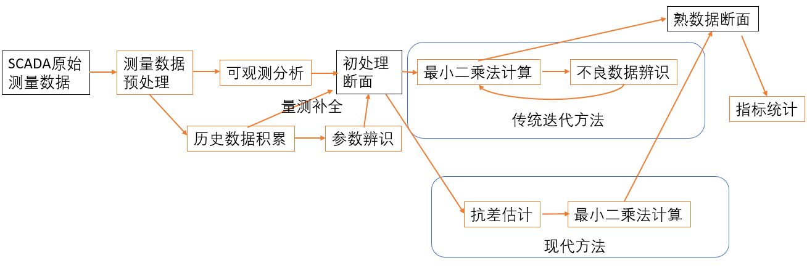
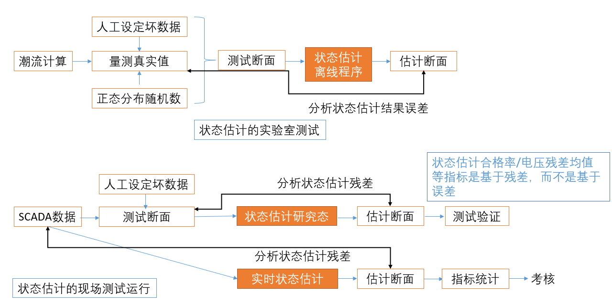

# 谈谈电力系统状态估计

作者：邹德虎更新时间：2026-03-25

状态估计是调度自动化中最典型、也最容易被低估的基础算法之一。它表面上是在“算电压和相角”，本质上却是在处理一个更深的问题：面对并不完美、不同步、带误差甚至带错误的量测，怎样恢复出一个尽可能符合物理规律、又足够稳定可用的系统运行断面。

我在现场做状态估计调试大约有十年的经验。越是在工程一线，越会意识到状态估计绝不是一个单独的最小二乘程序，而是一整套围绕数据质量、网络模型、拓扑辨识、物理约束和运行经验构成的系统工程。本文尝试把数学模型与工程实现放在同一个框架里谈清楚。

## 1 状态估计为什么重要

传统电力系统分析常说“三大计算”：潮流、短路、稳定。若从调度自动化和在线分析的视角看，状态估计完全可以被视为“第四计算”。

原因并不复杂。潮流、最优潮流、静态安全分析、断面校核、AGC/AVC 辅助分析，都需要一个可靠的当前断面作为起点。SCADA 原始遥测并不直接等于“当前断面”：它们有采集误差、时间不同步、极性错误、倍率错误、开关遥信错误以及通信中断。若不先把这些问题处理掉，后续很多高级应用都会建立在不稳定的基础上。

从更一般的角度说，几乎每个学科都有“量测 + 模型 + 估计”的问题。测绘有测量平差，经济学有计量分析，控制工程有卡尔曼滤波，电力系统则有状态估计。它不是附属算法，而是数据进入系统分析之前的“净化环节”和“统一入口”。

## 2 核心数学模型：量测方程与加权最小二乘

对交流稳态状态估计，最常见的状态向量写为

$$
x = \begin{bmatrix}
\theta_2 & \cdots & \theta_n & V_1 & \cdots & V_n
\end{bmatrix}^T
$$

其中去掉了参考母线相角。量测量可以包括母线电压、支路有功/无功、注入功率、电流幅值、PMU 量测等，统一写成

$$
z = h(x) + e
$$

这里：

- $z$ 为量测向量；
- $h(x)$ 为由网络模型给出的非线性量测函数；
- $e$ 为量测误差。

若把误差看作均值为 0、协方差矩阵为 $R$ 的随机变量，则加权最小二乘目标函数为

$$
J(x)=\frac{1}{2}\left(z-h(x)\right)^T R^{-1}\left(z-h(x)\right)
$$

这个式子表达得很清楚：误差大的量测权重低，可信度高的量测权重高。在线性化点 $x_k$ 处，有

$$
h(x)\approx h(x_k)+H_k \Delta x
$$

其中

$$
H_k=\left.\frac{\partial h}{\partial x}\right|_{x_k}
$$

于是得到标准的法方程：

$$
G_k \Delta x = H_k^T R^{-1}\left[z-h(x_k)\right]
$$

$$
G_k = H_k^T R^{-1} H_k
$$

更新公式为

$$
x_{k+1}=x_k+\Delta x
$$

这就是电力系统状态估计最核心的数学骨架。它与潮流计算的牛顿迭代非常接近，但两者并不相同：潮流是“已知注入功率求状态”，状态估计是“已知冗余量测求最符合全部量测的状态”。

这里还有两个工程上很重要的判断：

1.  $G_k$ 在参考角处理后必须可逆，否则说明系统不可观测或可观测性不足；
2.  编程实现时应当解线性方程组，而不是显式求逆矩阵。

## 3 正态分布假设为什么“并不严格正确，但仍然有用”

不少教科书默认量测误差服从正态分布，于是最小二乘就有了良好的统计解释。严格说，这个假设并不完全成立。调度中心的量测误差里不仅有随机误差，还有系统误差、遥信错误、倍率错误、设备故障、通信时延、人工录入错误等，它们显然不是简单的高斯白噪声。

但这个假设仍有工程价值，原因在于：

第一，SCADA 数据链路很长，误差来源很多，许多小误差叠加后往往“近似”服从中心极限定理意义下的分布；

第二，最小二乘至少提供了一个统一、可计算、可迭代、可与电力网络方程耦合的框架；

第三，工程上真正重要的不是“误差是否完美高斯”，而是算法在常规工况下是否稳定、对坏数据是否足够敏感、对拓扑错误是否足够鲁棒。

因此，状态估计更适合被理解为**带统计意义的工程近似模型**，而不是纯粹的概率论教科书习题。

## 4 权重到底是什么，为什么必须先做标幺化

很多现场问题其实不是“算法错了”，而是权重设置不合理。权重的本质是协方差矩阵的逆，写成单个量测就是

$$
w_i = \frac{1}{\sigma_i^2}
$$

这里最容易被忽视的一点是：**权重本身带有单位。** 电压量测、功率量测、电流量测、相角量测的物理量纲不同，若直接把原始单位下的方差拿来比较，结果往往会失真。

因此，工业实现通常会先把量测转到统一的标幺体系，再确定协方差。一个常见步骤是：

1.  根据表计精度、满刻度、历史统计等估计各类量测标准差；
2.  将量测按统一基准做标幺化；
3.  由标幺化后的标准差形成协方差矩阵 $R$；
4.  再根据现场经验对某些厂站、某类量测、某条通道做附加修正。

这样做之后，权重才真正具有可比较性。否则，“某个功率量测看起来残差大”并不一定意味着它更不可信，可能只是单位和量级本来就不同。

伪量测也应放在这个框架里理解：它不是“假的量测”，而是人为引入的先验信息，其权重通常应远小于真实高质量量测。权重给得过高，可能会把估计结果硬拉向错误先验；权重给得过低，又可能导致局部不可观测。

## 5 工业级状态估计不是一个程序，而是一条流程链

实际可用的状态估计程序，至少应包含以下环节：

1.  **拓扑处理**：依据开关、刀闸、断路器状态完成母线连接关系识别；
2.  **网络建模**：将设备参数、变压器分接头、并联补偿、电抗器、电容器等统一纳入模型；
3.  **可观测性分析**：判断哪些区域可估、哪些区域只能依赖伪量测；
4.  **坏数据处理**：识别明显错误量测或可疑量测；
5.  **状态估计本体**：迭代求解最优状态；
6.  **结果校核与发布**：判断平衡关系、越限、异常厂站、告警输出等。

下面两张图展示的是我更倾向的工程化理解：状态估计不是一个最小二乘盒子，而是完整数据链条中的中心节点。

也正因为如此，现场实用化的难度远大于学术论文里的单一估计算法。论文可以假设网络参数正确、拓扑无误、量测类型清晰、坏数据比例很低；而现场恰恰相反，最难处理的通常都不在“法方程求解”本身。

## 6 不收敛时，首先怀疑什么

状态估计不收敛，或者虽然收敛但结果明显不合理，现场往往优先检查下面几类问题。

### 6.1 参数与模型问题

- 线路或变压器参数数量级错误；
- 变压器额定电压、变比、接线方式录入错误；
- 主变分接头状态未更新；
- 新投设备未及时建模，停运设备仍留在模型中。

参数问题的典型后果，是雅可比矩阵条件数恶化、无功潮流异常、局部厂站残差持续偏大。

### 6.2 拓扑问题

- 开关遥信错误；
- 拓扑处理逻辑错误；
- 某条线路实际投运而模型认为停运，或相反；
- 母线合并/拆分状态识别错误。

在工程经验上，**拓扑错误往往比普通量测误差更致命。** 因为它不是把某个量测“拉偏一点”，而是直接把网络方程改错了。

### 6.3 量测问题

- 量测极性错误；
- 通道不刷新；
- 比率、倍率错误；
- 某厂站整站量测质量差；
- 伪量测过多，真实量测冗余不足。

其中极性错误尤其常见，也极具迷惑性。线路、变压器、负荷、发电机在符号约定上必须统一，否则算法可能“数学上收敛，物理上错误”。

## 7 坏数据与鲁棒性：不要把一切都推给最小二乘

加权最小二乘对小随机误差很有效，但对坏数据并不天然鲁棒。工程上常用的一个思路，是基于残差做检测。设估计结果为 $\hat x$，则残差为

$$
r = z-h(\hat x)
$$

在此基础上，可以构造归一化残差，对最大可疑量测做定位。虽然不同软件实现不同，但原则是一致的：**先估计，再看谁与物理规律最冲突。**

不过，需要特别提醒：坏数据检测并不能替代拓扑检查。若网络结构本身错了，残差的分布会整体异常，这时删除几个“可疑量测”通常并不能解决根本问题。

另外，随着 PMU 逐步应用，状态估计也出现了混合状态估计甚至线性状态估计的实现路径。PMU 的优势在于同步相量信息更直接，坏处在于覆盖范围、通信代价和时钟体系都有约束。它会明显改变状态估计的形态，但不会消灭状态估计。

## 8 物理约束为什么如此重要

很多状态估计的改进，本质上都在做同一件事：把物理约束更强地嵌入优化问题。

最典型的物理约束包括：

1.  零注入母线约束；
2.  通过断路器相连的等电位约束；
3.  回路相角和约束；
4.  发电机有功、无功出力能力边界；
5.  变压器档位、并联补偿投切等离散约束。

如果这些约束被忽略，算法可能会给出一个“数值上最小二乘”的结果，但并不一定是一个真正物理可实现的断面。也正因如此，状态估计从来都不是“纯数据科学问题”，而是深度依赖网络机理的工程问题。

## 9 关于在线估计量测方差

这部分内容与我和龚成明合作的专利工作关系较大。以前很多人认为，量测方差只能离线根据经验和统计给定，难以在线更新。我们的思路恰恰是：利用电力系统中的物理不变量，先估计这些约束量的波动，再把信息分摊回各类量测。

典型不变量包括：

- 母线注入功率代数和约束；
- 断路器两侧电压近似相等；
- 某些回路相角和为零；
- 某些设备内部的平衡关系。

这类方法的意义在于，它把“权重设置”从纯经验问题往“数据 + 机理”的方向推进了一步。当然，真正做到现场长期稳定实用，还需要大量历史数据、滤波、异常剔除和业务规则配合，不能把它神化为一个单独的万能算法。

## 10 结语

状态估计最容易被误解成一个公式：

$$
\min \left(z-h(x)\right)^T R^{-1}\left(z-h(x)\right)
$$

但真正难的，从来都不只是这个公式。真正的难点在于：量测从哪里来、拓扑是否可靠、参数是否正确、权重是否合理、坏数据怎么处理、哪些物理约束必须强制满足、结果如何反馈给运行人员。

因此，评价一个状态估计程序，不能只看“是否会收敛”，更要看它是否能在真实现场长期稳定工作、是否能把错误尽量挡在前面、是否能给调度员一个可信的断面。这也是为什么我始终认为：状态估计是调度自动化里最具工程含量、最值得深入打磨的基础能力之一。
